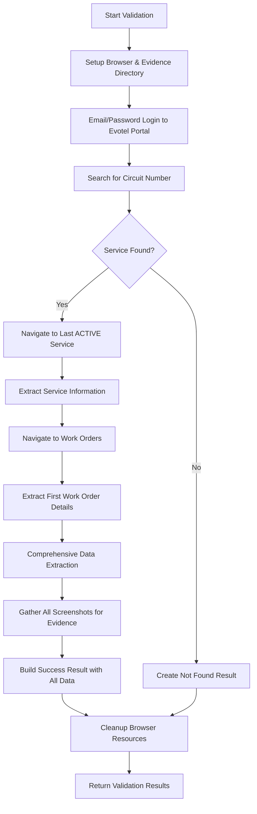
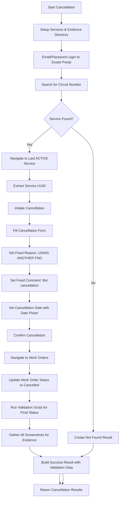

# Evotel RPA Automation Documentation

## Overview

This documentation covers the Robotic Process Automation (RPA) system for the Evotel portal, consisting of two primary automation scripts that work in sequence:

1. **Validation Script** (`validation.py`) - Service validation and comprehensive data extraction
2. **Cancellation Script** (`cancellation.py`) - Service cancellation processing with work order management

The system uses Selenium WebDriver for browser automation with email/password authentication, implementing a strategy-based architecture with comprehensive evidence collection and sophisticated service selection logic.

---

## System Architecture

### Architectural Patterns Used

1. **Strategy Pattern** - Multiple strategy interfaces (`IServiceSearchStrategy`, `ICancellationFormStrategy`, `IWorkOrderStrategy`) for different operations
2. **Service Layer Pattern** - `BrowserService` and `ScreenshotService` handle cross-cutting concerns
3. **Data Model Pattern** - Pydantic models (`ValidationResult`, `CancellationResult`) for structured data handling
4. **Factory Pattern** - `EvotelCancellationFactory` for creating automation instances with appropriate strategies
5. **Comprehensive Data Extraction** - `ComprehensiveEvotelDataExtractor` for thorough data capture
6. **Robust Input Handling** - Multiple fallback methods for form interaction
7. **Retry Pattern** - Built-in resilience using tenacity decorators for critical operations

### Key Components

- **Job-based execution** with unique job IDs for tracking and evidence collection
- **Email/password authentication** for secure portal access
- **Centralized configuration** via Config class for credentials and portal settings
- **Enhanced active service filtering** - Sophisticated logic to skip greyed-out/inactive service links
- **Strategy-based service selection** with "last active service" preference logic
- **Evidence collection system** - Screenshots and structured data for audit trails
- **Fixed cancellation parameters** - Standardized reason and comment fields
- **Work order management** - Complete work order processing and status updates
- **Service integration** - Cancellation script integrates with validation for comprehensive status

### Code Organization

```python
# Validation Module (validation.py)
class EvotelValidationAutomation:          # Main validation functionality
class ValidationRequest:                   # Pydantic input model (uses circuit_number)
class ScreenshotData, ServiceData:         # Pydantic data models
class ValidationResult:                    # Pydantic result model
class ValidationStatus, SearchResult:      # Enums

# Cancellation Module (cancellation.py)
class EvotelCancellationAutomation:        # Main cancellation functionality with strategy pattern
class CancellationRequest:                 # Pydantic input model (uses circuit_number)
class CancellationResult:                  # Pydantic result model
class CancellationStatus:                  # Enum

# Strategy Interfaces
class IServiceSearchStrategy:              # Interface for service search
class ICancellationFormStrategy:           # Interface for cancellation forms
class IWorkOrderStrategy:                  # Interface for work order management
class IErrorDetectionStrategy:             # Interface for error detection

# Strategy Implementations
class SimplifiedEvotelServiceSearchStrategy:  # Selects last ACTIVE service (filtering out greyed-out links)
class EvotelCancellationFormStrategy:      # Evotel-specific form handling with date picker
class EvotelWorkOrderStrategy:             # Work order management and status updates
class StandardErrorDetectionStrategy:      # Standard error detection

# Shared Services
class BrowserService:                      # Chrome WebDriver management
class ScreenshotService:                   # Evidence collection service
class EvotelLoginPage:                     # Email/password authentication handler

# Comprehensive Data Processing
class ComprehensiveEvotelDataExtractor:    # Thorough data extraction from Evotel pages
  - extract_complete_work_order_data():    # Extract ALL work order information
  - _extract_work_order_header():          # Header and reference extraction
  - _extract_client_details():             # Customer information extraction
  - _extract_service_details():            # Service configuration extraction
  - _extract_isp_details():                # ISP-specific information
  - _extract_ont_number_details():         # ONT device information

class RobustInputHandler:                  # Multi-method form interaction
class EvotelDataExtractor:                 # Service search and data extraction

# Configuration (config.py)
class Config:                              # Centralized settings and credentials

# Execution Interface
def execute(parameters):                   # Standard job execution entry point
```

**Note**: The Evotel implementation uses a **strategy-based approach** where validation and cancellation are separate modules. The cancellation script integrates with validation by importing and calling the validation `execute()` function, ensuring comprehensive data collection regardless of cancellation outcome.

---

## Configuration Requirements

### Environment Variables

```python
# Required configuration
EVOTEL_EMAIL = "automation@company.com"
EVOTEL_PASSWORD = "secure_password" 
EVOTEL_URL = "https://portal.evotel.com"
CHROMEDRIVER_PATH = "/path/to/chromedriver"

# Optional settings
HEADLESS = "true"  # Run in headless mode
TIMEOUT = 30       # Default timeout for operations
```

### Authentication Configuration

Evotel uses standard email/password authentication:
- **Email**: Valid email address for Evotel portal access
- **Password**: Corresponding password for the email account
- **Authentication Flow**: Standard email/password login for portal access

### Chrome Driver Requirements

- **Chrome Browser** - Latest stable version recommended
- **ChromeDriver** - Compatible version with installed Chrome
- **Network Access** - Unrestricted access to Evotel portal

### Dependencies

```python
# Core automation
selenium>=4.0.0
tenacity>=8.0.0
pydantic>=1.8.0

# Data processing
pandas>=1.3.0
python-dateutil>=2.8.0

# Utilities
pathlib
base64
json
logging
traceback
re
```

---

## Validation Automation (`validation.py`)

### Purpose
The validation script is the **first step** in the workflow that:
- Searches for services in the Evotel portal using circuit numbers
- Extracts comprehensive service and work order data
- Determines current service status and availability
- Provides foundation data for cancellation decisions

### Validation Workflow



### Parameters

| Parameter | Type | Required | Description |
|-----------|------|----------|-------------|
| `job_id` | string | Yes | Unique job identifier |
| `circuit_number` | string | Yes | Circuit number to validate (maps to Evotel serial number) |

### **Workflow Phases:**

#### **Phase 1: Setup**
**Class:** `EvotelValidationAutomation`
**Method:** `_setup_services(job_id)`

Browser initialization and evidence directory creation:
* **Chrome Driver Setup**: Uses `BrowserService` with Config-based Chrome WebDriver configuration
* **Browser Options**: Headless mode via `Config.HEADLESS`, window size 1920x1080, security configurations
* **Config-based Settings**: All browser settings controlled via Config class (not environment variables)
* **Service Initialization**: Chrome service using `Config.CHROMEDRIVER_PATH`
* **Evidence Directory**: Creates job-specific evidence directories under `/evidence/evotel_validation/job_id/`
* **Screenshot Service**: Initializes `ScreenshotService` for comprehensive evidence collection
* **Input Handler**: Initialize `RobustInputHandler` for form interaction

```python
# Browser configuration (Config-based, not environment variables)
if Config.HEADLESS:
    options.add_argument('--headless=new')

if Config.NO_SANDBOX:
    options.add_argument('--no-sandbox')
if Config.DISABLE_DEV_SHM_USAGE:
    options.add_argument('--disable-dev-shm-usage')

service = Service(executable_path=Config.CHROMEDRIVER_PATH)
```

#### **Phase 2: Email/Password Authentication**
**Class:** `EvotelLogin`
**Method:** `login(driver)`

Email/password authentication to Evotel portal with retry mechanisms:
* **Portal Navigation**: Navigate to configured `Config.EVOTEL_URL`
* **Page Load Verification**: Wait for document ready state completion
* **Email Field Entry**: Locate email field using `#Email` selector and fill using robust clicking
* **Password Field Entry**: Locate password field using `#Password` selector with secure credential handling  
* **Login Submission**: Click login button using XPath `//*[@id='loginForm']/form/div[4]/div/button`
* **Login Verification**: Wait for `/Manage/Index` navigation or check URL/title for success indicators
* **Retry Logic**: Built-in retry with tenacity decorator for authentication failures

```python
# Authentication field selectors
email_selector = "#Email"
password_selector = "#Password" 
login_button_xpath = "//*[@id='loginForm']/form/div[4]/div/button"

# Success verification
success_indicators = [
    "URL contains '/Manage/Index'",
    "URL contains '/Manage'", 
    "Page title contains 'manage'"
]
```

#### **Phase 3: Circuit Search**
**Class:** `EvotelDataExtractor`
**Method:** `search_circuit_number(circuit_number)`

Search for specific circuit using Evotel's search functionality:
* **Search Field Location**: Locate search input field using CSS selector `#SearchString`
* **Input Methods**: Use `RobustInputHandler` for reliable text entry
* **Search Submission**: Click search button and wait for results
* **Result Processing**: Check for service links in WebGrid table
* **Match Detection**: Verify search results contain matching services

```python
# Search field selectors
search_selectors = [
    "#SearchString",  # Primary search field
    "input[name='SearchString']",  # Alternative selector
]

# Search button selectors
button_selectors = [
    "#btnSearch",  # Primary search button
]
```

#### **Phase 4: Service Selection and Navigation**
**Class:** `EvotelDataExtractor`
**Method:** `extract_service_info()`

Navigate to service using enhanced active service selection strategy:
* **Service Link Detection**: Find all service links in WebGrid results table using XPath `//*[@id='WebGrid']/tbody/tr/td[3]/a`
* **Active Service Filtering**: Use `filter_active_service_links()` to exclude greyed-out/inactive services based on:
  - Invalid href validation (skip #, javascript:void(0), etc.)
  - CSS class checking for disabled/inactive indicators
  - Element enabled state verification
  - **Critical**: Inline style analysis for gray hex colors (#c0c0c0, #cccccc, etc.)
  - RGB color pattern detection for gray values
  - Computed style color analysis
  - Opacity level checking (skip if < 0.6)
* **Last Active Service Selection**: Use `navigate_to_active_service()` to select last active service (most recent active)
* **Service Navigation**: Click selected active service link and wait for service info page
* **URL Extraction**: Extract service UUID from `/Service/Info/` URL path
* **Service Verification**: Confirm successful navigation to service details

```python
# Enhanced active service filtering criteria
filtering_criteria = {
    "href_validation": "Skip links with invalid href values",
    "css_class_check": "Check for disabled/inactive/greyed-out classes", 
    "element_enabled": "Verify element is actually clickable",
    "inline_style_analysis": "Critical check for gray hex colors in style attribute",
    "rgb_pattern_detection": "Parse RGB values to detect gray colors",
    "computed_style_check": "Fallback computed color analysis",
    "opacity_threshold": "Skip elements with opacity < 0.6"
}

# Service selection strategy
{
    "strategy": "SimplifiedEvotelServiceSearchStrategy with Active Filtering",
    "selection_logic": "Select last ACTIVE service from filtered results",
    "reasoning": "Last active service is typically most recent and actionable",
    "filtering_approach": "Sophisticated multi-criteria active service detection"
}
```

#### **Phase 5: Work Order Data Extraction**
**Class:** `EvotelDataExtractor`
**Method:** `extract_work_orders()`

Navigate to work orders and extract comprehensive data:

**Work Order Navigation:**
* **Work Orders Menu**: Click work orders menu to expand dropdown
* **Link Filtering**: Filter out email links and select valid work order links
* **First Work Order Selection**: Select first (most recent) work order from dropdown
* **Work Order Page**: Navigate to work order detail page

**Comprehensive Data Extraction:**
* **Use ComprehensiveEvotelDataExtractor**: Advanced extraction of ALL work order data
* **Header Extraction**: Work order reference numbers and creation information
* **Client Details**: Customer name, area, address, email, mobile information
* **Service Details**: Service provider, product, contract, status, dates
* **ISP Details**: ISP references and provisioning information
* **ONT Details**: Verification, FSAN numbers, port information

```python
# Extracted Work Order Fields
{
    "work_order_header": {
        "main_heading": "Work order title",
        "reference_number": "Work order reference (e.g., 12345678-1)",
        "created_by": "Creation information"
    },
    "client_details": {
        "client_name": "Customer name",
        "area": "Service area",
        "address": "Service address",
        "email": "Customer email",
        "mobile": "Customer mobile number"
    },
    "service_details": {
        "service_provider": "Service provider",
        "product": "Product details",
        "contract": "Contract information",
        "service_status": "Current service status",
        "application_date": "Application date",
        "effective_date": "Service effective date"
    },
    "isp_details": {
        "reference": "ISP reference number"
    },
    "ont_number_details": {
        "verification": "Verification status",
        "fsan_number": "FSAN device number",
        "port_number": "Port assignments",
        "ports_available": "Available ports",
        "active_services": "Active service count"
    }
}
```

#### **Phase 6: Comprehensive Data Processing**
**Class:** `ComprehensiveEvotelDataExtractor`
**Method:** `extract_complete_work_order_data()`

Process raw data into structured format with completeness assessment:
* **Structured Extraction**: Organize data into logical sections
* **Reference Extraction**: Extract all reference numbers and identifiers
* **Date Processing**: Parse and standardize date formats
* **Status Analysis**: Analyze status indicators and technical identifiers
* **Completeness Scoring**: Assess extraction quality and data availability

#### **Phase 7: Evidence Collection**
**Class:** `ScreenshotService`
**Method:** `take_screenshot(driver, name)`, `get_all_screenshots()`

Screenshots and evidence generation:
* **Screenshot Management**: Automated screenshots at key workflow points
* **Base64 Encoding**: Screenshots encoded for secure transmission
* **Evidence Organization**: Structured file storage in job-specific directories
* **Metadata Collection**: Screenshot names, timestamps, paths, and descriptions

#### **Phase 8: Results Compilation**
**Class:** `EvotelValidationAutomation`
**Method:** `_create_comprehensive_success_result()`

Build comprehensive validation results:
* **Service Data Creation**: Structured service data using `ServiceData` model
* **Status Determination**: Analyze comprehensive data to determine service status
* **Details Structure**: Comprehensive details including service summary, technical details, work order summary
* **Raw Data Preservation**: Include raw extraction data for auditing
* **Completeness Assessment**: Calculate and include data completeness metrics

**Main Entry Point:**

```python
def validate_circuit_number(self, request: ValidationRequest) -> ValidationResult:
```
**Class:** `EvotelValidationAutomation`

Orchestrates all validation phases:
* **Phase Coordination**: Execute phases 1-8 in sequence with error handling
* **Resource Management**: Proper browser setup and cleanup
* **Results Compilation**: Build `ValidationResult` object with extracted data
* **Evidence Integration**: Combine screenshots and service information

**Returns:**
```python
{
    "status": "success|failure|error",
    "message": "Descriptive message",
    "details": {
        "found": bool,
        "circuit_number": str,
        "service_summary": {
            "service_provider": str,
            "product": str,
            "status": str,
            "customer": str,
            "email": str,
            "mobile": str,
            "address": str,
            "area": str
        },
        "technical_details": {
            "ont_details": dict,
            "isp_details": dict,
            "all_references": dict,
            "technical_identifiers": dict,
            "fsan_number": str,
            "verification_status": str
        },
        "work_order_summary": {
            "total_work_orders": int,
            "primary_work_order": dict,
            "primary_work_order_reference": str,
            "primary_work_order_status": str,
            "all_work_orders": list
        },
        "raw_extraction": {
            "comprehensive_extraction": dict,
            "service_info": dict,
            "extraction_metadata": dict
        },
        "data_completeness": dict,
        "extraction_metadata": {
            "extraction_timestamp": str,
            "processing_approach": str,
            "completeness_score": float,
            "total_sections_extracted": int,
            "total_sections_available": int
        }
    },
    "evidence_dir": str,
    "screenshot_data": [ScreenshotData objects]
}
```

### Usage Example

```python
from validation import execute

# Define job parameters
parameters = {
    "job_id": "EVOTEL_VAL_20250123_001", 
    "circuit_number": "48575443D9B290B1"
}

# Execute validation
result = execute(parameters)

# Check results
if result["status"] == "success":
    details = result["details"]
    if details.get("found"):
        service_summary = details["service_summary"]
        print(f"Customer: {service_summary['customer']}")
        print(f"Product: {service_summary['product']}")
        print(f"Status: {service_summary['status']}")
        print(f"Completeness: {details['extraction_metadata']['completeness_score']:.1%}")
    else:
        print("Circuit number not found")
```

---

## Cancellation Automation (`cancellation.py`)

### Purpose
The cancellation script is the **second step** in the workflow that:
- Performs service cancellation operations in Evotel portal
- Uses fixed cancellation reason and comment as per business requirements
- Handles cancellation form submission with date picker functionality
- Manages work order status updates and completion
- Always integrates with validation for comprehensive status updates

### Cancellation Workflow



### Parameters

| Parameter | Type | Required | Description |
|-----------|------|----------|-------------|
| `job_id` | string | Yes | Unique job identifier for tracking |
| `circuit_number` | string | Yes | Circuit number to be cancelled (maps to Evotel serial number) |
| `solution_id` | string | No | Solution ID for external reference (optional for Evotel) |
| `requested_date` | string | No | Cancellation date (DD/MM/YYYY format, defaults to 30 days) |

### **Fixed Cancellation Parameters:**

As per business requirements, the following values are fixed in the system:
- **Cancellation Reason**: `"USING ANOTHER FNO"`
- **Cancellation Comment**: `"Bot cancellation"`  
- **Default Notice Period**: 30 days from current date

### **Workflow Phases:**

#### **Phase 1: Setup and Authentication**
**Class:** `EvotelCancellationAutomation`
**Method:** `_setup_services(job_id)`

Service initialization using strategy pattern:
* **Browser Service**: Initialize Chrome WebDriver with production settings
* **Screenshot Service**: Setup evidence collection in `/evidence/evotel_cancellation/job_id/`
* **Strategy Configuration**: Initialize error detection, service search, cancellation form, and work order strategies
* **Email/Password Login**: Use `EvotelLoginPage` for secure portal authentication
* **Evidence Preparation**: Create job-specific directories and initialize screenshot tracking

#### **Phase 2: Service Discovery and Verification**
**Class:** `SimplifiedEvotelServiceSearchStrategy`
**Methods:** `search_service()`, `navigate_to_service()`

Search and validate service availability for cancellation:
* **Circuit Search**: Search for specific circuit using search functionality
* **Service Selection**: Use simplified strategy to select last (most recent) service
* **Service Navigation**: Navigate to service info page and extract service UUID
* **Error Detection**: Use `StandardErrorDetectionStrategy` to check for portal errors
* **Service Verification**: Confirm service exists and is accessible

```python
# Service verification checks
{
    "service_found": "Boolean - service exists in search results",
    "service_uuid": "Service UUID from URL",
    "last_service_selected": "Boolean - selected most recent service",
    "error_detected": "Boolean - portal errors detected"
}
```

#### **Phase 3: Cancellation Form Processing**
**Class:** `EvotelCancellationFormStrategy`
**Methods:** `initiate_cancellation()`, `fill_cancellation_form()`, `confirm_cancellation()`

Multi-step form completion with fixed business parameters and date picker:

**Cancellation Initiation:**
* **Cancel Service Button**: Locate and click "Cancel Service" button using multiple selectors
* **Page Navigation**: Wait for navigation to cancellation form page (`/Service/Cancel/`)
* **Form Load Verification**: Confirm cancellation form is loaded and accessible

**Form Field Population:**
```python
# Fixed form values (hardcoded in business logic)
CANCELLATION_REASON = "USING ANOTHER FNO" (dropdown selection)
CANCELLATION_COMMENT = "Bot cancellation"

# Dynamic form values  
cancellation_date = requested_date or (current_date + 30_days)

# Form field selectors
REASON_SELECTOR = "#CancellationReason"
COMMENT_SELECTOR = "#CancellationComment" 
DATE_SELECTOR = "#CancellationEffectiveDate"
CONFIRM_SELECTOR = "//input[@value='Confirm Cancellation']"
```

**Reason Selection:**
* **Dropdown Detection**: Locate cancellation reason dropdown
* **Fixed Reason**: Select "USING ANOTHER FNO" as per business requirements
* **No User Configuration**: Reason is hardcoded and cannot be changed

**Date Configuration with Date Picker:**
* **Date Field Detection**: Locate cancellation effective date field using multiple selectors
* **Date Picker Navigation**: Handle jQuery UI date picker if available
* **Date Calculation**: If no date provided, calculate 30 days from current date
* **Multiple Input Strategies**: Try date picker navigation, then direct input fallback
* **Date Format**: Handle DD/MM/YYYY format conversion and validation

```python
# Date picker navigation strategies
def _navigate_date_picker(self, driver, target_date):
    """Navigate jQuery UI date picker to select target date"""
    # Parse target date (DD/MM/YYYY)
    day, month, year = map(int, target_date.split("/"))
    
    # Navigate to correct month (simplified for 30-day window)
    next_button = driver.find_element(By.CSS_SELECTOR, "a.ui-datepicker-next > span")
    if next_button.is_displayed():
        robust_click(driver, next_button, "date picker next button")
    
    # Click target day - with fallback to 2nd row, 3rd column
    day_selectors = [
        f"//a[text()='{day}']",
        "tr:nth-of-type(2) > td:nth-of-type(3) > a"  # Fallback position
    ]

def _set_date_directly(self, driver, date_field, target_date):
    """Direct input method as fallback"""
    date_field.clear()
    date_field.send_keys(target_date)
    driver.execute_script("arguments[0].dispatchEvent(new Event('change'));", date_field)
```

**Comment Entry:**
* **Comment Field**: Locate textarea for cancellation comments
* **Fixed Comment**: Enter "Bot cancellation"
* **No Reference Addition**: Unlike other systems, Evotel uses fixed comment only

#### **Phase 4: Form Submission and Confirmation**
**Class:** `EvotelCancellationFormStrategy`
**Method:** `confirm_cancellation()`

Submit cancellation request and verify confirmation:
* **Confirm Button**: Locate and click "Confirm Cancellation" button
* **Form Submission**: Submit cancellation form and wait for processing
* **Redirect Verification**: Wait for redirect back to service info page (`/Service/Info/`)
* **Success Confirmation**: Verify cancellation was successfully submitted

#### **Phase 5: Work Order Management**
**Class:** `EvotelWorkOrderStrategy`
**Methods:** `navigate_to_work_orders()`, `update_work_order_status()`

Navigate to work orders and update status to completed:

**Work Order Navigation:**
* **Work Orders Menu**: Click work orders menu to expand dropdown
* **Link Filtering**: Filter out email links (mailto:) and identify valid work order links
* **Work Order Selection**: Select first work order using pattern matching (`^\d{8}-\d+$`)
* **Work Order Page**: Navigate to work order detail page (`/WorkOrder/Item/`)

**Status Update:**
* **Work Order Reference**: Extract work order reference from page or URL
* **Status Dropdown**: Update status to "Cancelled" using specific value ID
* **Comments Field**: Fill comments with "Bot cancellation"
* **No Notification**: Check "No user notification" checkbox
* **Submit Update**: Submit work order update and wait for success confirmation

```python
# Work order status update
STATUS_COMPLETED_VALUE = "c14c051e-d259-426f-a2b1-e869e5300bcc"
WORK_ORDER_COMMENT = "Bot cancellation"

# Work order reference extraction patterns
ref_patterns = [
    r'Ref:\s*(\d{8}-\d+)',  # From page text
    r'/WorkOrder/Item/([a-f0-9-]+)'  # From URL
]
```

#### **Phase 6: Integration with Validation**
**Integration:** Direct import and execution of validation module

**Always execute validation** after cancellation attempt:
```python
# Critical integration pattern - always runs
try:
    from automations.evotel.validation import execute as validation_execute
    validation_result = validation_execute({
        "job_id": job_id,
        "circuit_number": circuit_number
    })
    
    # COMPLETELY REPLACE details with validation data
    if "details" in validation_result and validation_result["details"]:
        results["details"] = validation_result["details"]
        logger.info("Successfully replaced details with post-cancellation validation data")
        
except Exception as validation_error:
    logger.error(f"Post-cancellation validation failed: {str(validation_error)}")
    results["details"]["validation_error"] = str(validation_error)
```

#### **Phase 7: Results Compilation**
**Class:** `EvotelCancellationAutomation`
**Method:** `cancel_service()`

Build comprehensive results with validation integration:
* **Cancellation Status**: Record cancellation submission success/failure
* **Work Order Reference**: Include generated work order reference number
* **Validation Data**: **COMPLETELY REPLACE** details with current validation data
* **Evidence Merging**: Combine cancellation and validation screenshots
* **Execution Metrics**: Include timing and performance data

#### **Phase 8: Error Handling and Recovery**
**Multiple Classes:** Comprehensive error detection and graceful degradation

Handle various failure scenarios:
* **Service Not Found**: Return appropriate not found result using `CancellationResultType.NOT_FOUND`
* **Cancellation Errors**: Handle form submission failures and portal errors
* **Work Order Errors**: Handle work order navigation and update failures
* **Authentication Issues**: Handle email/password login failures
* **Always Run Validation**: Execute validation regardless of cancellation outcome

**Main Entry Point:**

```python
def cancel_service(self, request: CancellationRequest) -> CancellationResult:
```
**Class:** `EvotelCancellationAutomation`

Orchestrates all cancellation phases using strategy pattern:
* **Strategy Initialization**: Use `EvotelCancellationFactory` to create automation with appropriate strategies
* **Phase Coordination**: Execute phases 1-8 in sequence with error handling
* **Fixed Parameters**: Apply business-mandated cancellation reason and comment
* **Date Picker Handling**: Advanced date picker navigation with fallback strategies
* **Work Order Processing**: Complete work order status management
* **Always Execute Validation**: Validation runs regardless of cancellation success/failure
* **Evidence Management**: Comprehensive screenshot collection throughout process
* **Results Compilation**: Build final result with integrated validation data

**Returns:**
```python
{
    "status": "success|failure|error",
    "message": "Descriptive status message",
    "details": {
        # Core cancellation fields
        "found": bool,
        "cancellation_submitted": bool,
        "service_found": bool,
        "is_active": bool,
        
        # Work order management
        "work_order_number": str,
        "work_order_updated": bool,
        
        # Validation data (replaces cancellation details) 
        "service_summary": dict,
        "technical_details": dict,
        "work_order_summary": dict,
        "raw_extraction": dict,
        "extraction_metadata": dict,
        
        # Fixed cancellation parameters
        "cancellation_details": {
            "reason": "USING ANOTHER FNO",
            "comment": "Bot cancellation",
            "requested_date": str,
            "submission_date": str,
            "work_order_number": str
        }
    },
    "evidence_dir": str,
    "screenshot_data": [ScreenshotData objects]
}
```

### Usage Example

```python
from cancellation import execute

# Define cancellation parameters
parameters = {
    "job_id": "EVOTEL_CXL_20250123_001",
    "circuit_number": "48575443D9B290B1", 
    "solution_id": "SOL_12345",  # Optional
    "requested_date": "31/01/2025"  # Optional - defaults to 30 days
}

# Execute cancellation
result = execute(parameters)

# Check results
if result["status"] == "success":
    details = result["details"]
    if details["cancellation_submitted"]:
        cancellation_details = details["cancellation_details"]
        print(f"Cancellation submitted. Work Order: {cancellation_details['work_order_number']}")
        print(f"Using reason: {cancellation_details['reason']}")
        print(f"Date: {cancellation_details['requested_date']}")
    # Details contains current service status from validation
    service_summary = details["service_summary"]
    print(f"Current customer: {service_summary['customer']}")
    print(f"Current status: {service_summary['status']}")
```

---

## Complete Field Extraction Reference

The Evotel validation system extracts and returns comprehensive service data across multiple categories. Below is the complete structure showing all fields that can be extracted and returned:

### Full Validation Response Structure

```json
{
    "status": "success|failure|error",
    "message": "Successfully validated circuit number 48575443D9B290B1. Found comprehensive service data with 1 work orders. Data completeness: 85%",
    "details": {
        "found": true,
        "circuit_number": "48575443D9B290B1",
        
        // Structured Service Summary
        "service_summary": {
            "service_provider": "Evotel Communications",
            "product": "Fibre 100/100 Mbps Uncapped",
            "status": "Active",
            "customer": "John Smith",
            "email": "john.smith@example.com",
            "mobile": "0821234567",
            "address": "123 Main Street, Cape Town, 8001",
            "area": "Cape Town Central"
        },
        
        // Technical Infrastructure Details
        "technical_details": {
            "ont_details": {
                "verification": "Verified",
                "fsan_number": "ALCLB12345678901",
                "port_number": "1",
                "ports_available": "1-4",
                "active_services": "1"
            },
            "isp_details": {
                "reference": "ISP_REF_12345"
            },
            "all_references": {
                "work_order_refs": ["12345678-1", "12345678-2"],
                "service_refs": ["SVC123456-1"],
                "uuids": ["550e8400-e29b-41d4-a716-446655440000"],
                "fsan_numbers": ["ALCLB12345678901"],
                "port_numbers": ["1"]
            },
            "technical_identifiers": {
                "mac_addresses": ["00:11:22:33:44:55"],
                "ip_addresses": ["192.168.1.100"],
                "circuit_numbers": ["48575443D9B290B1"],
                "service_ids": ["550E8400E29B41D4A716446655440000"]
            },
            "fsan_number": "ALCLB12345678901",
            "verification_status": "Verified"
        },
        
        // Work Order Information
        "work_order_summary": {
            "total_work_orders": 1,
            "primary_work_order": {
                "reference": "12345678-1",
                "status": "Completed",
                "isp_provisioned": "Yes",
                "scheduled_time": "2024-03-15 10:00",
                "last_comment": "Installation completed"
            },
            "primary_work_order_reference": "12345678-1",
            "primary_work_order_status": "Completed",
            "all_work_orders": [
                {
                    "work_order_index": 1,
                    "work_order_text": "12345678-1",
                    "work_order_url": "https://portal.evotel.com/WorkOrder/Item/uuid",
                    "comprehensive_details": {
                        "work_order_header": {
                            "main_heading": "Provisioning Work Order",
                            "reference_number": "12345678-1",
                            "created_by": "System Generated"
                        },
                        "client_details": {
                            "client_name": "John Smith",
                            "area": "Cape Town Central",
                            "address": "123 Main Street, Cape Town, 8001",
                            "email": "john.smith@example.com",
                            "mobile": "0821234567"
                        },
                        "service_details": {
                            "service_provider": "Evotel Communications",
                            "product": "Fibre 100/100 Mbps Uncapped",
                            "contract": "24 Month Contract",
                            "service_status": "Active",
                            "application_date": "2024-03-01",
                            "effective_date": "2024-03-15"
                        },
                        "isp_details": {
                            "reference": "ISP_REF_12345"
                        },
                        "ont_number_details": {
                            "verification": "Verified",
                            "fsan_number": "ALCLB12345678901",
                            "port_number": "1",
                            "ports_available": "1-4",
                            "active_services": "1"
                        }
                    },
                    "extraction_timestamp": "2025-01-23T14:30:22.123456",
                    "is_most_recent": true,
                    "total_links_in_dropdown": 3,
                    "processing_approach": "first_non_email_link"
                }
            ]
        },
        
        // Raw Extraction Data (for auditing)
        "raw_extraction": {
            "comprehensive_extraction": {
                "extraction_metadata": {
                    "extraction_timestamp": "2025-01-23T14:30:22.123456",
                    "page_url": "https://portal.evotel.com/WorkOrder/Item/uuid",
                    "page_title": "Work Order Details",
                    "full_page_text": "Complete page text content...",
                    "text_length": 2456
                },
                "all_references": {
                    "work_order_refs": ["12345678-1"],
                    "service_refs": ["SVC123456-1"],
                    "uuids": ["550e8400-e29b-41d4-a716-446655440000"],
                    "fsan_numbers": ["ALCLB12345678901"]
                },
                "all_dates": {
                    "iso_dates": ["2024-03-15"],
                    "formatted_dates": ["15 March 2024"],
                    "short_dates": ["15/03/2024"]
                },
                "all_status_indicators": ["Active", "Verified", "Completed"],
                "data_completeness": {
                    "has_client_details": true,
                    "has_service_details": true,
                    "has_work_order_details": true,
                    "has_isp_details": true,
                    "has_ont_number_details": true,
                    "overall_completeness_score": 0.85,
                    "total_sections": 5,
                    "successful_sections": 4
                }
            },
            "service_info": {
                "service_name": "Fibre Internet Service",
                "service_uuid": "550e8400-e29b-41d4-a716-446655440000",
                "service_url": "https://portal.evotel.com/Service/Info/uuid",
                "extraction_timestamp": "2025-01-23T14:30:20.123456"
            },
            "extraction_metadata": {
                "page_url": "https://portal.evotel.com/WorkOrder/Item/uuid",
                "page_title": "Work Order Details"
            }
        },
        
        // Data Quality Assessment
        "data_completeness": {
            "has_client_details": true,
            "has_service_details": true,
            "has_work_order_details": true,
            "has_isp_details": true,
            "has_ont_number_details": true,
            "overall_completeness_score": 0.85,
            "total_sections": 5,
            "successful_sections": 4
        },
        
        // Processing Metadata
        "extraction_metadata": {
            "extraction_timestamp": "2025-01-23T14:30:22.123456",
            "processing_approach": "evotel_comprehensive_v1.0",
            "completeness_score": 0.85,
            "total_sections_extracted": 4,
            "total_sections_available": 5
        }
    },
    
    // Evidence and Screenshots
    "evidence_dir": "/path/to/evidence/evotel_validation/EVOTEL_VAL_20250123_001",
    "screenshot_data": [
        {
            "name": "initial_state",
            "timestamp": "2025-01-23T14:30:00.123456",
            "data": "iVBORw0KGgoAAAANSUhEUgAA...",
            "path": "/evidence/initial_state_20250123_143000.png"
        },
        {
            "name": "after_login",
            "timestamp": "2025-01-23T14:30:15.234567",
            "data": "iVBORw0KGgoAAAANSUhEUgBB...",
            "path": "/evidence/after_login_20250123_143015.png"
        },
        {
            "name": "search_completed",
            "timestamp": "2025-01-23T14:30:30.345678",
            "data": "iVBORw0KGgoAAAANSUhEUgCC...",
            "path": "/evidence/search_completed_20250123_143030.png"
        },
        {
            "name": "service_info_extracted",
            "timestamp": "2025-01-23T14:30:45.456789",
            "data": "iVBORw0KGgoAAAANSUhEUgDD...",
            "path": "/evidence/service_info_extracted_20250123_143045.png"
        },
        {
            "name": "work_orders_extracted",
            "timestamp": "2025-01-23T14:31:00.567890",
            "data": "iVBORw0KGgoAAAANSUhEUgEE...",
            "path": "/evidence/work_orders_extracted_20250123_143100.png"
        }
    ],
    "execution_time": 45.67
}
```

### Not Found Response Structure

When a circuit is not found in the Evotel system:

```json
{
    "status": "success",
    "message": "Circuit number 48575443D9B290B1 not found in Evotel portal.",
    "details": {
        "found": false,
        "search_term": "48575443D9B290B1"
    },
    "evidence_dir": "/path/to/evidence/evotel_validation/EVOTEL_VAL_20250123_001",
    "screenshot_data": [
        {
            "name": "search_completed",
            "timestamp": "2025-01-23T14:30:30.345678",
            "data": "iVBORw0KGgoAAAANSUhEUgCC...",
            "path": "/evidence/search_completed_20250123_143030.png"
        }
    ],
    "execution_time": 25.43
}
```

---

## Complete Cancellation Field Reference

The Evotel cancellation system performs cancellation operations using fixed business parameters, handles work order updates, and then **automatically executes validation** to provide comprehensive, up-to-date service status.

### Full Cancellation Response Structure

```json
{
    "status": "success|failure|error",
    "message": "Successfully cancelled service 48575443D9B290B1 using enhanced selection and updated work order 12345678-1",
    "details": {
        // Cancellation-Specific Fields
        "found": true,
        "cancellation_submitted": true,
        "service_found": true,
        "is_active": true,
        
        // Work Order Management
        "work_order_number": "12345678-1",
        "work_order_updated": true,
        "confirmation_received": true,
        
        // Fixed Business Parameters
        "cancellation_reason": "USING ANOTHER FNO",
        "cancellation_comment": "Bot cancellation",
        "cancellation_details": {
            "work_order_number": "12345678-1",
            "service_uuid": "550e8400-e29b-41d4-a716-446655440000",
            "external_reference": "SOL_12345",
            "requested_date": "2025-01-31",
            "submission_date": "2025-01-23T14:31:45.123456",
            "status": "completed",
            "confirmation_received": true,
            "work_order_updated": true
        },
        
        // Complete Validation Data (post-cancellation)
        "service_summary": {
            "service_provider": "Evotel Communications",
            "product": "Fibre 100/100 Mbps Uncapped",
            "status": "Cancelled",  // Updated after cancellation
            "customer": "John Smith",
            "email": "john.smith@example.com",
            "mobile": "0821234567",
            "address": "123 Main Street, Cape Town, 8001",
            "area": "Cape Town Central"
        },
        
        "technical_details": {
            "ont_details": {
                "verification": "Verified",
                "fsan_number": "ALCLB12345678901"
            },
            "isp_details": {
                "reference": "ISP_REF_12345"
            },
            "all_references": {
                "work_order_refs": ["12345678-1"],
                "service_refs": ["SVC123456-1"]
            }
        },
        
        "work_order_summary": {
            "total_work_orders": 1,
            "primary_work_order": {
                "reference": "12345678-1",
                "status": "Completed",  // Updated to completed
                "last_comment": "Bot cancellation"  // Updated comment
            },
            "primary_work_order_reference": "12345678-1",
            "primary_work_order_status": "Completed"
        },
        
        // Raw Extraction Data (updated post-cancellation)
        "raw_extraction": {
            "comprehensive_extraction": {
                "extraction_metadata": {
                    "extraction_timestamp": "2025-01-23T14:32:00.123456"  // Post-cancellation
                }
            }
        },
        
        // Updated Extraction Metadata
        "extraction_metadata": {
            "extraction_timestamp": "2025-01-23T14:32:00.123456",  // Post-cancellation
            "processing_approach": "evotel_comprehensive_v1.0",
            "completeness_score": 0.85
        }
    },
    
    // Evidence from Both Cancellation and Validation
    "evidence_dir": "/path/to/evidence/evotel_cancellation/EVOTEL_CXL_20250123_001",
    "screenshot_data": [
        // Cancellation Process Screenshots
        {
            "name": "cancellation_initial_state",
            "timestamp": "2025-01-23T14:30:00.123456",
            "data": "iVBORw0KGgoAAAANSUhEUgAA...",
            "path": "/evidence/cancellation_initial_state_20250123_143000.png"
        },
        {
            "name": "cancellation_after_login",
            "timestamp": "2025-01-23T14:30:15.234567",
            "data": "iVBORw0KGgoAAAANSUhEUgBB...",
            "path": "/evidence/cancellation_after_login_20250123_143015.png"
        },
        {
            "name": "cancellation_search_results",
            "timestamp": "2025-01-23T14:30:30.345678",
            "data": "iVBORw0KGgoAAAANSUhEUgCC...",
            "path": "/evidence/cancellation_search_results_20250123_143030.png"
        },
        {
            "name": "cancellation_service_selected",
            "timestamp": "2025-01-23T14:30:45.456789",
            "data": "iVBORw0KGgoAAAANSUhEUgDD...",
            "path": "/evidence/cancellation_service_selected_20250123_143045.png"
        },
        {
            "name": "cancellation_form_page",
            "timestamp": "2025-01-23T14:31:00.567890",
            "data": "iVBORw0KGgoAAAANSUhEUgEE...",
            "path": "/evidence/cancellation_form_page_20250123_143100.png"
        },
        {
            "name": "cancellation_form_filled",
            "timestamp": "2025-01-23T14:31:15.678901",
            "data": "iVBORw0KGgoAAAANSUhEUgFF...",
            "path": "/evidence/cancellation_form_filled_20250123_143115.png"
        },
        {
            "name": "cancellation_confirmed",
            "timestamp": "2025-01-23T14:31:30.789012",
            "data": "iVBORw0KGgoAAAANSUhEUgGG...",
            "path": "/evidence/cancellation_confirmed_20250123_143130.png"
        },
        {
            "name": "cancellation_work_order_page",
            "timestamp": "2025-01-23T14:31:45.890123",
            "data": "iVBORw0KGgoAAAANSUhEUgHH...",
            "path": "/evidence/cancellation_work_order_page_20250123_143145.png"
        },
        {
            "name": "cancellation_work_order_updated",
            "timestamp": "2025-01-23T14:32:00.901234",
            "data": "iVBORw0KGgoAAAANSUhEUgII...",
            "path": "/evidence/cancellation_work_order_updated_20250123_143200.png"
        },
        // Validation Process Screenshots (merged from validation execution)
        {
            "name": "validation_search_completed",
            "timestamp": "2025-01-23T14:32:15.012345",
            "data": "iVBORw0KGgoAAAANSUhEUgJJ...",
            "path": "/evidence/validation_search_completed_20250123_143215.png"
        },
        {
            "name": "validation_service_details_extracted",
            "timestamp": "2025-01-23T14:32:30.123456",
            "data": "iVBORw0KGgoAAAANSUhEUgKK...",
            "path": "/evidence/validation_service_details_extracted_20250123_143230.png"
        }
    ],
    "execution_time": 145.89
}
```

### Service Not Found Response

When attempting to cancel a non-existent service:

```json
{
    "status": "failure",
    "message": "Service 48575443D9B290B1 not found in Evotel portal",
    "details": {
        // Cancellation-Specific Fields
        "found": false,
        "cancellation_submitted": false,
        "service_found": false,
        "is_active": false,
        
        // Validation data shows not found
        "circuit_number": "48575443D9B290B1",
        "search_term": "48575443D9B290B1"
    },
    "evidence_dir": "/path/to/evidence/evotel_cancellation/EVOTEL_CXL_20250123_001",
    "screenshot_data": [
        {
            "name": "cancellation_service_not_found",
            "timestamp": "2025-01-23T14:30:30.345678",
            "data": "iVBORw0KGgoAAAANSUhEUgCC...",
            "path": "/evidence/cancellation_service_not_found_20250123_143030.png"
        }
    ]
}
```

### Cancellation Field Categories and Descriptions

#### **Cancellation-Specific Fields** (Added by cancellation process)
- `cancellation_submitted` - Boolean: whether cancellation form was successfully submitted
- `service_found` - Boolean: whether service was found during cancellation attempt
- `is_active` - Boolean: whether service was active when cancellation was attempted
- `work_order_number` - String: Work order reference for the cancellation
- `work_order_updated` - Boolean: whether work order status was successfully updated
- `confirmation_received` - Boolean: whether cancellation confirmation was received

#### **Fixed Business Parameters** (Cannot be changed)
- `cancellation_reason` - Fixed: "USING ANOTHER FNO"
- `cancellation_comment` - Fixed: "Bot cancellation"
- `cancellation_details.external_reference` - Provided solution_id for tracking (optional)
- `cancellation_details.requested_date` - Provided or calculated date (30 days default)

#### **Enhanced Validation Fields** (Updated post-cancellation)
All validation fields are included with these key updates after successful cancellation:
- `service_summary.status` - May show "Cancelled" or similar
- `work_order_summary.primary_work_order.status` - Updated to "Completed"
- `work_order_summary.primary_work_order.last_comment` - Updated to "Bot cancellation"

#### **Data Integration Pattern**
The cancellation system follows this critical pattern:
1. **Perform Cancellation** - Submit cancellation form with fixed parameters and date picker
2. **Update Work Order** - Set work order status to completed with comment
3. **Execute Validation** - Run complete validation to get updated system state
4. **Replace Details** - **COMPLETELY REPLACE** cancellation details with validation data
5. **Preserve Cancellation Fields** - Keep cancellation-specific fields and work order info
6. **Merge Evidence** - Combine screenshots from both processes

---

## Evidence Collection System

Both scripts implement comprehensive evidence collection using the service layer pattern:

### Screenshot Management
**Class:** `ScreenshotService`
- **Automatic screenshots** at key workflow points with descriptive names
- **Base64 encoding** for secure transmission and storage
- **Timestamped filenames** with job ID prefixes for audit trails
- **Error state capture** for debugging failed operations
- **Evidence organization** in job-specific directory structures

### Data Files
Evidence files are stored in job-specific directories:

```
/evidence/
├── evotel_validation/
│   └── EVOTEL_VAL_20250123_001/
│       ├── initial_state_20250123_143000.png
│       ├── after_login_20250123_143015.png
│       ├── search_completed_20250123_143030.png
│       ├── service_info_extracted_20250123_143045.png
│       └── work_orders_extracted_20250123_143100.png
├── evotel_cancellation/
│   └── EVOTEL_CXL_20250123_002/
│       ├── cancellation_initial_state_20250123_143000.png
│       ├── cancellation_after_login_20250123_143015.png
│       ├── cancellation_search_results_20250123_143030.png
│       ├── cancellation_service_selected_20250123_143045.png
│       ├── cancellation_form_page_20250123_143100.png
│       ├── cancellation_form_filled_20250123_143115.png
│       ├── cancellation_confirmed_20250123_143130.png
│       ├── cancellation_work_order_page_20250123_143145.png
│       ├── cancellation_work_order_updated_20250123_143200.png
│       └── validation_complete_20250123_143215.png
```

---

## Error Handling & Retry Logic

### Retry Decorators
Both scripts use `tenacity` for robust retry mechanisms:

```python
@retry(
    stop=stop_after_attempt(3),
    wait=wait_fixed(5),
    retry=retry_if_exception_type((TimeoutException, WebDriverException))
)
def login(self, driver: webdriver.Chrome) -> bool:
    # Email/password login implementation with automatic retry
```

### Error Categories
1. **Email/Password Authentication Errors** - Invalid credentials, portal unavailable
2. **Portal Access Errors** - Service unavailable, network connectivity, session timeouts  
3. **Element Interaction Errors** - Dynamic content loading, element not found, click intercepted
4. **Data Extraction Errors** - Missing fields, portal layout changes, work order navigation issues
5. **Form Submission Errors** - Validation failures, date picker issues, modal dialog problems
6. **Service State Errors** - Service not found, already cancelled, work order conflicts
7. **Date Picker Errors** - jQuery UI navigation failures, date field detection issues
8. **Work Order Errors** - Work order navigation failures, status update issues

### Evotel-Specific Error Handling
- **Email/Password Failures**: Automatic retry with credential validation
- **Date Picker Issues**: Fallback from date picker navigation to direct input
- **Work Order Conflicts**: Graceful handling of work order navigation and status updates
- **Service Selection**: Robust service selection using "last service" strategy
- **Fixed Parameters**: No validation needed for hardcoded cancellation reason/comment

### Graceful Degradation
- Scripts continue processing even if non-critical steps fail
- **Always attempt validation** at the end regardless of cancellation outcome
- Comprehensive error logging with stack traces and job context
- Evidence collection continues regardless of operation success/failure
- Multiple fallback strategies for form interaction and element detection

---

## Strategy Pattern Implementation

### Strategy Interfaces

The Evotel system uses strategy pattern for modular, testable automation:

```python
# Core Strategy Interfaces
class IServiceSearchStrategy(ABC):
    @abstractmethod
    def search_service(self, driver, circuit_number) -> bool
    
    @abstractmethod  
    def navigate_to_service(self, driver) -> Optional[str]

class ICancellationFormStrategy(ABC):
    @abstractmethod
    def initiate_cancellation(self, driver) -> bool
    
    @abstractmethod
    def fill_cancellation_form(self, driver, reason, comment) -> bool
    
    @abstractmethod
    def confirm_cancellation(self, driver) -> bool

class IWorkOrderStrategy(ABC):
    @abstractmethod
    def navigate_to_work_orders(self, driver) -> bool
    
    @abstractmethod
    def update_work_order_status(self, driver, comment) -> Optional[str]
```

### Strategy Implementations

#### **SimplifiedEvotelServiceSearchStrategy**
**Purpose:** Select the last ACTIVE service from search results with sophisticated filtering
**Logic:** "Last active service is typically most recent/actionable"
**Enhanced Filtering Behavior:**
- Search for circuit number using `#SearchString` field
- Find all service links in WebGrid results table using XPath `//*[@id='WebGrid']/tbody/tr/td[3]/a`
- **CRITICAL ENHANCEMENT**: Filter out greyed-out/inactive links using multi-criteria analysis:
  - Invalid href detection (skip #, javascript:void(0), etc.)
  - CSS class checking for disabled indicators
  - **Inline style analysis** for gray hex colors (#c0c0c0, #cccccc, etc.)
  - RGB pattern detection for gray color values
  - Computed style color analysis as fallback
  - Opacity level verification (< 0.6 considered inactive)
- Select the last service from filtered active services (most recent active)
- Navigate to service info page and extract UUID

#### **EvotelCancellationFormStrategy**
**Purpose:** Handle Evotel-specific cancellation forms with date picker
**Features:**
- Fixed reason selection: "USING ANOTHER FNO"
- Fixed comment: "Bot cancellation"
- Advanced date picker navigation with jQuery UI support
- Fallback to direct date input if picker fails
- 30-day default cancellation notice period

#### **EvotelWorkOrderStrategy**
**Purpose:** Manage work order navigation and status updates
**Behavior:**
- Navigate to work orders dropdown menu
- Filter out email links (mailto:)
- Select first valid work order
- Update status to "Completed" with specific UUID
- Add "Bot cancellation" comment
- Check "No user notification" option

### Factory Pattern

```python
class EvotelCancellationFactory:
    @staticmethod
    def create_automation(config: Config) -> EvotelCancellationAutomation:
        """Create Evotel cancellation automation with appropriate strategies"""
        return EvotelCancellationAutomation(
            config=config,
            error_detection_strategy=StandardErrorDetectionStrategy(),
            service_search_strategy=SimplifiedEvotelServiceSearchStrategy(),
            cancellation_form_strategy=EvotelCancellationFormStrategy(),
            work_order_strategy=EvotelWorkOrderStrategy()
        )
```

---

## Integration Patterns

### Job Queue System
Both scripts are designed for integration with job queue systems:

```python
# Execute function interface
def execute(parameters):
    job_id = parameters.get("job_id")
    circuit_number = parameters.get("circuit_number")
    solution_id = parameters.get("solution_id")  # For cancellation (optional)
    requested_date = parameters.get("requested_date")  # For cancellation (optional)
    # ... process job
    return results
```

### Validation-Cancellation Integration
Cancellation script integrates with validation for comprehensive data:

```python
# In cancellation.py execute function - ALWAYS runs
try:
    from automations.evotel.validation import execute as validation_execute
    validation_result = validation_execute({
        "job_id": job_id,
        "circuit_number": circuit_number
    })
    
    # COMPLETELY REPLACE details with validation data
    if "details" in validation_result and validation_result["details"]:
        results["details"] = validation_result["details"]
        logger.info("Successfully replaced details with post-cancellation validation data")
        
        # Merge validation screenshots
        if "screenshot_data" in validation_result:
            existing_screenshots = results.get("screenshot_data", [])
            validation_screenshots = validation_result["screenshot_data"]
            results["screenshot_data"] = existing_screenshots + validation_screenshots
        
except Exception as validation_error:
    logger.error(f"Post-cancellation validation failed: {str(validation_error)}")
    results["details"]["validation_error"] = str(validation_error)
```

---

## Security & Compliance

### Data Protection

- **Email/Password Security** - Secure credential storage via environment variables
- **Evidence Encryption** - Base64 encoded screenshot data for secure transmission
- **PII Handling** - Secure processing of customer information from Evotel portal
- **Audit Trails** - Complete operation logging with job-based evidence collection
- **Fixed Parameters** - Business-mandated cancellation reasons prevent unauthorized variations

### Best Practices

- **Access Control** - Restricted access to Evotel automation credentials
- **Evidence Retention** - Configurable retention periods for screenshots in job directories
- **Error Logging** - Sanitized logs without sensitive customer information
- **Fixed Parameters** - Business-mandated cancellation reasons prevent unauthorized variations
- **Compliance Monitoring** - Regular audits of automation activities through evidence trails

---

## Troubleshooting

### Common Issues

#### Email/Password Authentication Failures
- **Symptoms**: "Login failed" errors, timeout on authentication
- **Solutions**: Verify email/password credentials, check portal availability, confirm URL configuration
- **Evotel Specific**: Portal may have specific session timeout requirements

#### Element Not Found
- **Symptoms**: `TimeoutException` or `NoSuchElementException`
- **Solutions**: Check Evotel portal selectors, increase timeouts, verify page loading
- **Evotel Specific**: Portal uses dynamic content requiring robust wait strategies

#### Date Picker Navigation Failed
```
Error: Could not navigate date picker to target date
Symptoms: Date picker opens but target date not selected
Solution: Portal date picker structure changed - update date picker navigation logic
Debug: Check for jQuery UI version changes or calendar component updates
Fallback: Use direct date input method as backup
```

#### Active Service Filtering Failed
```
Error: No active service links found
Symptoms: filter_active_service_links() returns empty list despite services in search results
Solution: Portal may have changed styling for inactive services - update gray color detection
Debug: Check inline styles of service links, verify gray hex color patterns
Check: Review CSS classes and computed styles for new inactive indicators
```

#### Service Selection Failed
```
Error: No service links found in search results  
Symptoms: Search completes but SimplifiedEvotelServiceSearchStrategy finds no services
Solution: Check WebGrid selectors and search result structure
Debug: Verify circuit_number search term and result table format
Enhanced: Ensure active service filtering criteria are not too restrictive
```

#### Work Order Navigation Failed
```
Error: No valid work order links found
Symptoms: Work orders menu opens but no links detected
Solution: Check work order link filtering logic and email link detection
Debug: Review work order dropdown structure and link patterns
```

#### Date Input Field Detection Failed
```  
Error: Could not find cancellation effective date field
Symptoms: TimeoutException when locating date field in cancellation form
Solution: Portal may have changed date field structure - update date field selectors
Debug: Review cancellation form structure and date field attributes
```

### Debug Mode
Enable debug mode by setting:
```python
HEADLESS = "false"  # Show browser for debugging
logging.basicConfig(level=logging.DEBUG)
```

### Evidence Review
Always review evidence files after job completion:
- Check screenshots for unexpected portal states
- Verify service data extraction accuracy  
- Confirm cancellation submission and work order updates
- Review validation integration results
- Validate date picker interactions and form submissions

---

## Best Practices

### Job Execution
1. **Always run validation first** to understand current service state
2. **Only run cancellation** if validation indicates service exists and is cancellable  
3. **Check validation results** integrated into cancellation response for final status
4. **Use fixed parameters** - cancellation reason and comment are business-mandated
5. **Handle date picker** - use fallback strategies for date field interaction

### Error Handling
1. **Capture screenshots** on errors for debugging failed operations
2. **Log comprehensive error details** including authentication and portal interaction failures
3. **Continue processing** where possible with robust fallback strategies
4. **Handle work order conflicts** with graceful navigation and status update recovery

### Evidence Collection
1. **Collect evidence** regardless of success/failure for audit compliance
2. **Use descriptive screenshot names** for easy identification in investigations
3. **Store structured data** for orchestrator consumption and reporting
4. **Maintain job-based organization** for easy evidence retrieval

### Browser Management
1. **Use headless mode** for production environments via `HEADLESS` environment variable
2. **Configure appropriate timeouts** for Evotel's dynamic content loading
3. **Clean up resources** using BrowserService cleanup in finally blocks
4. **Handle authentication timing** with proper retry mechanisms

---

## Evotel-Specific Considerations

### Portal Characteristics
- **Email/Password Authentication**: Standard credential-based authentication
- **Fixed Business Rules**: Cancellation reason ("USING ANOTHER FNO") and comment ("Bot cancellation") cannot be customized
- **Dynamic Content**: Portal requires robust wait strategies for page loading
- **Date Picker Workflow**: jQuery UI date picker with fallback to direct input
- **Work Order Management**: Complete work order status lifecycle management

### Search Behavior  
- **Circuit Number Search**: Search functionality using `#SearchString` field
- **Service Selection**: Sophisticated "last service" selection strategy
- **WebGrid Results**: Tabular search results with service links

### UI Interactions
- **Service Navigation**: Search, select last service, navigate to service info
- **Cancellation Flow**: Navigate to cancellation page, fill form with date picker, confirm
- **Work Order Flow**: Navigate to work orders, select first work order, update status
- **Fixed Parameters**: Hardcoded "USING ANOTHER FNO" reason and "Bot cancellation" comment
- **Date Handling**: 30-day default notice period with DD/MM/YYYY format and jQuery UI date picker

### Data Extraction Patterns
- **Service Extraction**: Basic service information from service info page
- **Work Order Extraction**: Comprehensive work order data using `ComprehensiveEvotelDataExtractor`
- **Structured Processing**: Clean organization of raw data into structured service objects
- **Completeness Scoring**: Assessment of data extraction quality across multiple sections

---

## Support & Maintenance

For technical support, configuration assistance, or reporting issues with the Evotel automation scripts, please refer to your internal RPA team documentation or contact your system administrator.

The Evotel automation system provides robust service validation and cancellation workflows with:

- **Email/password authentication** for secure portal access
- **Strategy-based architecture** for modular and maintainable automation
- **Comprehensive work order management** with complete status lifecycle
- **Sophisticated service selection** using "last service" strategy
- **Advanced date picker handling** with jQuery UI navigation and fallbacks
- **Fixed business parameters** ensuring compliance with cancellation policies
- **Reliable cancellation processing** with form validation and confirmation
- **Detailed status reporting** with validation integration for current service state
- **Complete evidence collection** for audit trails and debugging support
- **Evotel-specific optimizations** for portal characteristics and business requirements

The system's retry mechanisms, error handling, strategy pattern implementation, and evidence collection make it suitable for production use in enterprise environments with full integration between validation and cancellation processes.

---

**Last Updated**: August 13, 2025  
**Version**: 1.0 (Evotel Implementation)