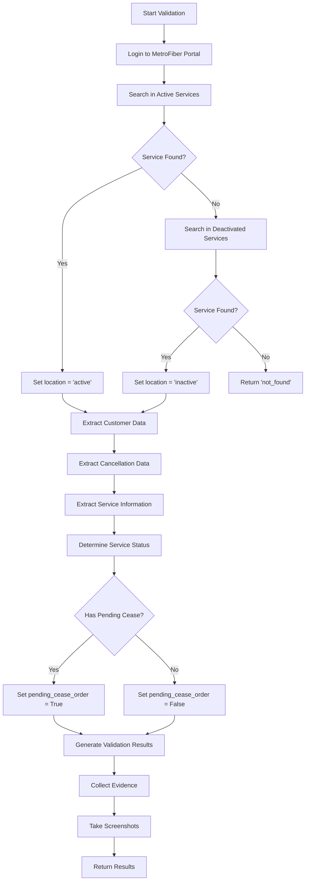
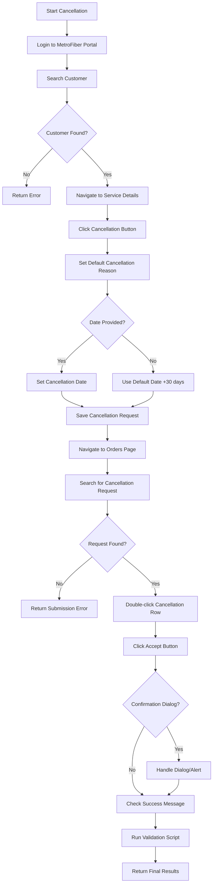

# MetroFiber RPA Automation Documentation

## Overview

This documentation covers the Robotic Process Automation (RPA) system for the MetroFiber portal, consisting of two primary automation scripts that work in sequence:

1. **Validation Script** (`validation.py`) - Service validation and status checking
2. **Cancellation Script** (`cancellation.py`) - Service cancellation processing

The system uses Selenium WebDriver for browser automation and implements a job-based architecture with comprehensive evidence collection and error handling.

---

## System Architecture

### Architectural Patterns Used

1. **Monolithic Class Design** - Single automation class handles all portal interactions
2. **Inheritance Pattern** - Cancellation class inherits from validation class for code reuse
3. **Multiple Strategy Methods** - Different fallback approaches within methods (not formal Strategy pattern)
4. **Retry Pattern** - Built-in resilience with configurable retry logic using tenacity decorators
5. **Template Method Pattern** - Main workflow methods coordinate sequence of smaller operations

### Key Components

- **Job-based execution** with unique job IDs for tracking and evidence collection
- **Centralized configuration** via Config class for credentials and settings  
- **Monolithic automation classes** - MetroFiberAutomation handles all operations
- **Multiple fallback strategies** - Different approaches within methods for robustness
- **Direct portal interaction** - Methods interact directly with web elements
- **Evidence collection system** - Screenshots and data files for audit trails
- **Retry mechanisms** with exponential backoff using tenacity
- **Comprehensive error handling** with graceful degradation
- **Status determination logic** with granular service state analysis

### Code Organization

```python
# Main Classes
class MetroFiberAutomation:           # Base validation functionality
class MetroFiberAutomation(inherited): # Cancellation extends validation

# Configuration
class Config:                         # Centralized settings and paths

# Execution Interface  
def execute(parameters):              # Standard job execution entry point
```

**Note**: The code uses a practical, monolithic approach rather than formal design patterns. This provides simplicity and maintainability for RPA automation scenarios where the primary concern is reliable portal interaction rather than complex software architecture.

---

## Configuration Requirements

### Environment Variables

```python
# Required configuration
METROFIBER_URL = "https://portal.metrofibre.co.za"
EMAIL = "automation@company.com"
PASSWORD = "secure_password"
CHROMEDRIVER_PATH = "/path/to/chromedriver"
EVIDENCE_DIR = "/path/to/evidence/storage"

# Optional settings
HEADLESS = "true"  # Run in headless mode
WAIT_TIMEOUT = "15"  # Element wait timeout
PAGE_LOAD_TIMEOUT = 15
SELENIUM_IMPLICIT_WAIT = 3
```

### Chrome Driver Requirements

- **Chrome Browser** - Latest stable version recommended
- **ChromeDriver** - Compatible version with installed Chrome
- **System Resources** - Minimum 2GB RAM for browser operations
- **Network Access** - Unrestricted access to portal URLs

### Dependencies

```python
# Core automation
selenium>=4.0.0
tenacity>=8.0.0
pydantic>=1.8.0

# Data processing  
pandas>=1.3.0
python-dateutil>=2.8.0

# Utilities
pathlib
base64
json
logging
traceback
```

---

## Validation Automation (`validation.py`)

### Purpose
The validation script is the **first step** in the workflow that:
- Searches for services in the MetroFiber portal
- Extracts customer and service data
- Determines current service status
- Provides foundation data for cancellation decisions

### Validation Workflow



### Parameters

| Parameter | Type | Required | Description |
|-----------|------|----------|-------------|
| `job_id` | string | Yes | Unique job identifier |
| `circuit_number` | string | Yes | Primary identifier for the service (e.g., FTTX047648) |
| `customer_name` | string | No | Customer name for additional search criteria |
| `customer_id` | string | No | Customer ID for search |
| `fsan` | string | No | FSAN identifier for search |

### **Workflow Phases:**

#### **Phase 1: Setup**
Browser initialization and evidence directory creation

```python
def initialize_driver(self):
```
Chrome WebDriver setup with MetroFiber-optimized configuration:
* **Headless Mode**: Configurable for production vs. debug environments
* **Chrome Options**: Maximized window, no-sandbox, disable dev-shm-usage
* **Service Configuration**: Uses ChromeDriver path from Config
* **Platform Detection**: Handles different OS-specific driver requirements


```python
def take_screenshot(self, name):
```
Evidence collection system initialization:
* **Base64 Encoding**: Screenshots encoded for transmission
* **Job-specific Naming**: Files prefixed with job ID and timestamp
* **Directory Structure**: Evidence stored in centralized job directories
* **Metadata Capture**: Screenshot descriptions and timestamps

#### **Phase 2: Authentication**
Login to MetroFiber portal with retry mechanisms

```python
@retry(stop=stop_after_attempt(3), wait=wait_exponential(multiplier=1, min=2, max=10))
def login(self):
```
Robust authentication process:
* **Portal Navigation**: Navigate to MetroFiber portal URL
* **Credential Entry**: Fill username and password fields
* **Login Verification**: Wait for post-login elements to confirm success
* **Evidence Capture**: Screenshots before and after login
* **Retry Logic**: Automatic retry on authentication failures

#### **Phase 3: Service Discovery** 
Search in active and deactivated services with fallback strategy

```python
def search_customer(self, circuit_number="", customer_name="", customer_id="", fsan=""):
```
Multi-stage search implementation:
* **Active Services Search**: Navigate to `/customers.php` and fill search form
* **Search Form Population**: Circuit number, customer name, ID, and FSAN fields
* **Results Validation**: Verify search results contain data
* **Deactivated Fallback**: If not found, search `/inactive_customers.php`
* **Advanced Filtering**: SearchBuilder conditions for deactivated services
* **Location Tracking**: Sets `self.service_location` for status determination

```python
def select_first_result(self):
```
Sophisticated result selection with multiple strategies:
* **Table Detection**: Find results in `#example` table
* **Row Selection**: ActionChains double-click on first result row
* **JavaScript Fallback**: Direct JavaScript click if ActionChains fails
* **Circuit Cell Targeting**: Click specific circuit number cell
* **Nuclear Navigation**: Direct URL navigation as last resort

#### **Phase 4: Data Extraction**
Extract customer and service information using multiple methods

```python
def extract_customer_data(self):
```
Multi-strategy data extraction:
* **Form Elements**: Extract from input, select, and textarea elements by ID
* **Table Parsing**: Process table-based layouts for read-only views
* **Text Pattern Matching**: Regex extraction from page source
* **Expiry Date Handling**: Special processing with multiple fallback methods
* **Data Validation**: Verify critical fields (customer, circuit_number) extracted

**Extracted Fields Include:**
```python
{
    "customer": "Customer name", "circuit_number": "Service circuit ID", 
    "area": "Service location", "originalbw": "Bandwidth package",
    "activation": "Activation date", "expiry_date": "Service expiry date",
    "status": "Current status", "fsan": "FSAN identifier",
    "price_mrc": "Monthly recurring charges"
    # ... additional fields
}
```
```python
def extract_deactivated_cancellation_data(self):
```
Specialized deactivated services processing:
* **Table Row Processing**: Extract all rows from deactivated services table
* **Circuit Identification**: Find rows containing circuit numbers
* **Row Highlighting**: Visual identification for screenshots
* **Comprehensive Data Capture**: Store all row data for audit trail
* **Primary Row Selection**: Identify main service record

#### **Phase 5: Status Analysis**
Determine detailed service status for orchestrator decision-making

```python
def extract_detailed_service_status(self, customer_data, cancellation_data, service_location):
```
Advanced status determination logic:
* **Active Service Detection**: Identify fully operational services
* **Pending Cancellation Analysis**: Detect active services with cancellation requests
* **Implemented Cancellation Recognition**: Identify completed cancellations
* **Status Flag Generation**: Set granular flags for orchestrator consumption
* **Date Analysis**: Process expiry dates and cancellation timestamps

**Key Status Flags:**
```python
{
    "service_found": bool, "is_active": bool, "pending_cease_order": bool,
    "cancellation_implementation_date": str, "service_status_type": str
}
```

#### **Phase 6: Evidence Collection**
Screenshots and data file generation

```python
def _collect_evidence(self, results):
```
Comprehensive evidence compilation:
* **Screenshot Collection**: Gather all job-specific screenshots
* **Data File Assembly**: Compile customer data, history, and cancellation files
* **Base64 Encoding**: Convert screenshots for transmission
* **File Path Management**: Organize evidence in structured directories
* **Results Integration**: Add evidence metadata to job results

**Main Entry Point:**

```python
def validate_service(self, circuit_number, customer_name="", customer_id="", fsan=""):
```
Orchestrates all validation phases:
* **Phase Coordination**: Execute phases 1-6 in sequence
* **Error Handling**: Continue processing on non-critical failures
* **Results Compilation**: Build comprehensive results structure
* **Cleanup Management**: Ensure browser resources are properly released

**Returns:**
```python
{
    "status": "success|failure|error",
    "message": "Descriptive message",
    "details": {
        "found": bool, "circuit_number": str, "service_location": "active|inactive|not_found",
        "customer_data": {}, "cancellation_data": {}, "pending_cease_order": bool,
        "service_status_type": "active_validated|cancelled_implemented|etc"
    },
    "evidence_dir": str, "evidence": [], "screenshot_data": []
}
```

## Complete Validation Field Extraction Reference

The MetroFiber validation system extracts and returns comprehensive data across multiple categories. Below is the complete JSON structure showing all fields that can be extracted and returned:

### Full Validation Response Structure

```json
{
    "status": "success|failure|error",
    "message": "Successfully validated service FTTX047648",
    "details": {
        "found": true,
        "circuit_number": "FTTX047648",
        "service_location": "active|inactive|not_found",
        "validation_status": "complete|failed",
        
        // Service Status Flags
        "service_found": true,
        "is_active": true,
        "pending_cease_order": false,
        "service_status_type": "active_validated",
        "cancellation_implementation_date": null,
        
        // Complete Customer Data (extracted from service details)
        "customer_data": {
            "customer": "JOHN SMITH TELECOMMUNICATIONS PTY LTD",
            "circuit_number": "FTTX047648",
            "area": "CAPE TOWN CENTRAL",
            "originalbw": "100Mbps",
            "activation": "2023-08-15",
            "expiry_date": "2025-08-15",
            "status": "Active",
            "id": "12345",
            "username": "jsmith_fttx047648",
            "customerTypeInfo": "Business",
            "customer_id_number": "1980012345087",
            "mail": "john.smith@company.co.za",
            "home_number": "021-555-0123",
            "mobile_number": "082-555-0456",
            "office_number": "021-555-0789",
            "po_number": "PO-2023-1234",
            "install_name": "John Smith",
            "install_number": "082-555-0456",
            "install_email": "john.smith@company.co.za",
            "start_date_enter": "2023-08-15",
            "install_time": "09:00-17:00",
            "area_detail": "Cape Town CBD, Floor 5",
            "complex_detail": "Business Park Complex A",
            "ad1": "123 Business Street, Cape Town CBD, 8001",
            "port_detail": "Port 24 - Rack A3",
            "resel": "MetroFiber Direct",
            "device_type": "ONT",
            "actual_device_type": "Huawei EchoLife HG8245H",
            "iptype": "Static",
            "originalip": "196.123.45.67",
            "fsan": "HWTC12345678",
            "mac": "AA:BB:CC:DD:EE:FF",
            "systemDate": "2023-08-15 10:30:22",
            "price_nrc": "2500.00",
            "price_mrc": "1200.00",
            "package_upgrade_mrc": "0.00"
        },
        
        // Cancellation Data (when applicable)
        "cancellation_data": {
            "has_cancellation_history": false,
            "cancellation_date": null,
            "cancellation_reason": null,
            "deactivated_services": []
        },
        
        // Legacy compatibility fields
        "customer_address": "123 Business Street, Cape Town CBD, 8001",
        "service_address": "123 Business Street, Cape Town CBD, 8001"
    },
    
    // Evidence and Screenshots
    "evidence_dir": "/path/to/evidence/VAL_20250123_001",
    "evidence": [
        "/path/to/evidence/VAL_20250123_001/customer_data.txt",
        "/path/to/evidence/VAL_20250123_001/history_data.txt"
    ],
    "screenshot_data": [
        {
            "name": "pre_login",
            "timestamp": "20250123_143022",
            "base64_data": "iVBORw0KGgoAAAANSUhEUgAA...",
            "mime_type": "image/png",
            "description": "Screenshot: pre_login"
        },
        {
            "name": "post_login", 
            "timestamp": "20250123_143035",
            "base64_data": "iVBORw0KGgoAAAANSUhEUgBB...",
            "mime_type": "image/png",
            "description": "Screenshot: post_login"
        },
        {
            "name": "active_services_search_results",
            "timestamp": "20250123_143045",
            "base64_data": "iVBORw0KGgoAAAANSUhEUgCC...",
            "mime_type": "image/png", 
            "description": "Screenshot: active_services_search_results"
        },
        {
            "name": "customer_details_extracted",
            "timestamp": "20250123_143100",
            "base64_data": "iVBORw0KGgoAAAANSUhEUgDD...",
            "mime_type": "image/png",
            "description": "Screenshot: customer_details_extracted"
        }
    ],
    "execution_time": 35.42
}
```

### Service Found in Deactivated Services Structure

When a service is found only in deactivated/inactive services:

```json
{
    "status": "success",
    "message": "Service FTTX047648 found in deactivated services",
    "details": {
        "found": true,
        "circuit_number": "FTTX047648",
        "service_location": "inactive",
        "validation_status": "complete",
        
        // Service Status Flags
        "service_found": true,
        "is_active": false,
        "pending_cease_order": false,
        "service_status_type": "cancelled_implemented",
        "cancellation_implementation_date": "2024-12-15",
        
        // Customer Data (from historical records)
        "customer_data": {
            "customer": "JOHN SMITH TELECOMMUNICATIONS PTY LTD",
            "circuit_number": "FTTX047648",
            "area": "CAPE TOWN CENTRAL",
            "originalbw": "100Mbps",
            "activation": "2023-08-15",
            "expiry_date": "2024-12-15",  // Cancellation date
            "status": "Deactivated",
            // ... other historical customer fields
        },
        
        // Cancellation Data (from deactivated services)
        "cancellation_data": {
            "has_cancellation_history": true,
            "cancellation_date": "2024-12-15",
            "cancellation_reason": "Customer Request",
            "deactivated_services": [
                {
                    "circuit_number": "FTTX047648",
                    "customer_name": "JOHN SMITH TELECOMMUNICATIONS PTY LTD",
                    "deactivation_date": "2024-12-15",
                    "reason": "Customer Request",
                    "final_bill_amount": "1200.00",
                    "port_returned": "Yes"
                }
            ]
        }
    },
    "evidence_dir": "/path/to/evidence/VAL_20250123_001",
    "evidence": [
        "/path/to/evidence/VAL_20250123_001/customer_data.txt",
        "/path/to/evidence/VAL_20250123_001/deactivated_data.txt"
    ],
    "screenshot_data": [
        {
            "name": "deactivated_services_search",
            "timestamp": "20250123_143130",
            "base64_data": "iVBORw0KGgoAAAANSUhEUgEE...",
            "mime_type": "image/png",
            "description": "Screenshot: deactivated_services_search"
        },
        {
            "name": "deactivated_row_1",
            "timestamp": "20250123_143145",
            "base64_data": "iVBORw0KGgoAAAANSUhEUgFF...",
            "mime_type": "image/png",
            "description": "Screenshot: deactivated_row_1"
        }
    ]
}
```

### Service with Pending Cancellation Structure

When an active service has a pending cancellation (expiry date set):

```json
{
    "status": "success",
    "message": "Service FTTX047648 found with pending cancellation",
    "details": {
        "found": true,
        "circuit_number": "FTTX047648",
        "service_location": "active",
        "validation_status": "complete",
        
        // Service Status Flags
        "service_found": true,
        "is_active": true,
        "pending_cease_order": true,  // Key flag for pending cancellation
        "service_status_type": "active_with_pending_cancellation",
        "cancellation_implementation_date": null,
        
        // Customer Data (current active service)
        "customer_data": {
            "customer": "JOHN SMITH TELECOMMUNICATIONS PTY LTD",
            "circuit_number": "FTTX047648",
            "area": "CAPE TOWN CENTRAL",
            "originalbw": "100Mbps",
            "activation": "2023-08-15",
            "expiry_date": "2025-02-28",  // Future cancellation date
            "status": "Active - Pending Cancellation",
            // ... other customer fields
        },
        
        // Cancellation Data (pending cancellation info)
        "cancellation_data": {
            "has_cancellation_history": false,
            "cancellation_date": "2025-02-28",  // Scheduled cancellation
            "cancellation_reason": "Customer Request",
            "deactivated_services": []
        }
    },
    "evidence_dir": "/path/to/evidence/VAL_20250123_001",
    "screenshot_data": [...]
}
```

### Service Not Found Response Structure

When a service is not found in either active or deactivated services:

```json
{
    "status": "success",
    "message": "Service FTTX999999 not found in system",
    "details": {
        "found": false,
        "circuit_number": "FTTX999999",
        "service_location": "not_found",
        "validation_status": "complete",
        
        // Service Status Flags
        "service_found": false,
        "is_active": false,
        "pending_cease_order": false,
        "service_status_type": "not_found",
        "cancellation_implementation_date": null,
        
        // Empty Data Structures
        "customer_data": {},
        "cancellation_data": {
            "has_cancellation_history": false,
            "cancellation_date": null,
            "cancellation_reason": null,
            "deactivated_services": []
        }
    },
    "evidence_dir": "/path/to/evidence/VAL_20250123_001",
    "evidence": [],
    "screenshot_data": [
        {
            "name": "active_services_no_results",
            "timestamp": "20250123_143045",
            "base64_data": "iVBORw0KGgoAAAANSUhEUgAA...",
            "mime_type": "image/png",
            "description": "Screenshot: active_services_no_results"
        },
        {
            "name": "deactivated_services_no_results",
            "timestamp": "20250123_143130",
            "base64_data": "iVBORw0KGgoAAAANSUhEUgBB...",
            "mime_type": "image/png",
            "description": "Screenshot: deactivated_services_no_results"
        }
    ]
}
```

### Error Response Structure

When validation encounters an error:

```json
{
    "status": "error",
    "message": "Execution error: Login failed after 3 attempts",
    "details": {
        "error": "Login failed after 3 attempts",
        "found": false,
        "circuit_number": "FTTX047648",
        "service_location": "error",
        "validation_status": "failed",
        "service_found": false,
        "is_active": false,
        "pending_cease_order": false,
        "service_status_type": "error",
        "customer_data": {},
        "cancellation_data": {
            "has_cancellation_history": false,
            "cancellation_date": null,
            "cancellation_reason": null,
            "deactivated_services": []
        }
    },
    "evidence_dir": "/path/to/evidence/VAL_20250123_001",
    "evidence": [],
    "screenshot_data": [
        {
            "name": "error_state",
            "timestamp": "20250123_143022",
            "base64_data": "iVBORw0KGgoAAAANSUhEUgAA...",
            "mime_type": "image/png",
            "description": "Screenshot: error_state"
        }
    ]
}
```

### Field Categories and Descriptions

#### **Core Status Fields**
- `found` - Boolean indicating if service exists in MetroFiber system
- `circuit_number` - The validated circuit number (FTTX format)
- `service_location` - Enum: "active", "inactive", "not_found", "error"
- `validation_status` - "complete" or "failed"

#### **Service Status Flags**
- `service_found` - Boolean: service exists in system
- `is_active` - Boolean: service is currently active
- `pending_cease_order` - Boolean: service has pending cancellation (expiry date set)
- `service_status_type` - Enum: "active_validated", "active_with_pending_cancellation", "cancelled_implemented", "not_found", "error"
- `cancellation_implementation_date` - Date when cancellation was implemented (null if not cancelled)

#### **Customer Data Fields**
Comprehensive customer information extracted from service details:
- **Basic Info**: `customer`, `circuit_number`, `area`, `originalbw`, `activation`, `expiry_date`, `status`
- **Contact Details**: `mail`, `home_number`, `mobile_number`, `office_number`
- **Installation Info**: `install_name`, `install_number`, `install_email`, `install_time`
- **Location Details**: `area_detail`, `complex_detail`, `ad1`
- **Technical Info**: `device_type`, `actual_device_type`, `iptype`, `originalip`, `fsan`, `mac`
- **Financial Info**: `price_nrc`, `price_mrc`, `package_upgrade_mrc`
- **System Info**: `id`, `username`, `customerTypeInfo`, `systemDate`

#### **Cancellation Data Fields**
Information about service cancellation history:
- `has_cancellation_history` - Boolean: service has been cancelled before
- `cancellation_date` - Date of cancellation (scheduled or implemented)
- `cancellation_reason` - Reason for cancellation
- `deactivated_services` - Array of deactivated service records

#### **Evidence Fields**
- `evidence_dir` - Path to job-specific evidence directory
- `evidence` - Array of text file paths containing extracted data
- `screenshot_data` - Array of screenshot objects with base64 data, timestamps, and descriptions
- `execution_time` - Total validation execution time in seconds

### Usage Example

```python
from validation import execute

# Define job parameters
parameters = {
    "job_id": "VAL_20250121_001",
    "circuit_number": "FTTX047648", 
    "customer_name": "JOHN SMITH TELECOMMUNICATIONS",
    "customer_id": "",
    "fsan": ""
}

# Execute validation
result = execute(parameters)

# Check results
if result["status"] == "success":
    details = result["details"]
    if details["found"]:
        print(f"Service found in {details['service_location']} services")
        if details["pending_cease_order"]:
            print("Service has pending cancellation")
        customer_data = details["customer_data"]
        print(f"Customer: {customer_data.get('customer')}")
        print(f"Status: {customer_data.get('status')}")
    else:
        print("Service not found")
```

---

## Cancellation Automation (`cancellation.py`)

### Purpose
The cancellation script is the **second step** in the workflow that:
- Performs service cancellation operations in MetroFiber portal
- Navigates through the cancellation workflow
- Approves cancellation requests in the orders system
- Updates service status through validation integration

### Cancellation Workflow



### Parameters

| Parameter | Type | Required | Description |
|-----------|------|----------|-------------|
| `job_id` | string | Yes | Unique job identifier for tracking |
| `circuit_number` | string | Yes | Circuit number to be cancelled (e.g., FTTX047648) |
| `customer_name` | string | No | Customer name for search |
| `customer_id` | string | No | Customer ID for search |
| `fsan` | string | No | FSAN identifier |
| `effective_cancellation_date` | string | No | Cancellation date (YYYY-MM-DD format) |

### **Workflow Phases:**

#### **Phase 1: Setup**
Browser initialization and evidence directory creation

```python
def initialize_driver(self):
```
Chrome WebDriver setup with MetroFiber-optimized configuration:
* **Headless Mode**: Configurable for production vs. debug environments
* **Chrome Options**: Maximized window, no-sandbox, disable dev-shm-usage
* **Service Configuration**: Uses ChromeDriver path from Config
* **Platform Detection**: Handles different OS-specific driver requirements

#### **Phase 2: Authentication**
Login to MetroFiber portal

```python
@retry(stop=stop_after_attempt(3), wait=wait_exponential(multiplier=1, min=2, max=10))
def login(self):
```
Robust authentication process:
* **Portal Navigation**: Navigate to MetroFiber portal URL
* **Credential Entry**: Fill username and password fields  
* **Login Verification**: Wait for post-login elements to confirm success
* **Evidence Capture**: Screenshots before and after login
* **Retry Logic**: Automatic retry on authentication failures

#### **Phase 3: Customer Discovery**
Search and select customer service

```python
def search_customer(self, circuit_number="", customer_name="", customer_id="", fsan=""):
```
Customer location and selection:
* **Active Services Navigation**: Navigate to `/customers.php`
* **Search Form Population**: Fill circuit number, customer name, ID, and FSAN
* **Search Execution**: Submit search and wait for results
* **Results Validation**: Verify customer found in search results

```python
def select_first_result(self):
```
Customer service selection:
* **Table Row Identification**: Locate first result in `#example` table
* **Double-click Selection**: ActionChains double-click to open customer details
* **JavaScript Fallback**: Direct JavaScript click if ActionChains fails
* **Navigation Verification**: Confirm successful navigation to customer details page

```python
def extract_customer_data(self):
```
Extract customer information for cancellation processing:
* **Customer Name Extraction**: Get customer name for later order search
* **Circuit Validation**: Confirm circuit number matches search
* **Service Details**: Extract current service configuration
* **Evidence Creation**: Save customer data to evidence files

#### **Phase 4: Cancellation Request**
Submit cancellation with date and reason

```python
def perform_cancellation(self, effective_cancellation_date=None):
```
Orchestrates core cancellation workflow:
* **Button Detection**: Locate and click cancellation button
* **Reason Selection**: Select cancellation reason from dropdown
* **Date Configuration**: Set cancellation date (default +30 days)
* **Form Submission**: Save cancellation request

```python
def _find_and_click_cancellation_button(self):
```
Multi-strategy cancellation button interaction:
* **JavaScript Search**: DOM-based button detection by text content "cancel"
* **XPath Fallback**: Traditional element location methods
* **Click Execution**: JavaScript and Selenium click attempts
* **Evidence Capture**: Screenshots before and after button interaction

```python
def _select_cancellation_reason(self):
```
Automated reason selection:
* **Dropdown Detection**: Locate cancellation reason dropdown
* **JavaScript Selection**: Bypass dropdown search with direct JavaScript
* **Event Triggering**: Dispatch change events for form validation
* **Fallback Handling**: Continue processing if dropdown interaction fails

```python
def _set_cancellation_date(self, effective_date=None, future_days=30):
```
Intelligent date field handling:
* **Date Calculation**: Default to 30 days in future if no date provided
* **Readonly Detection**: JavaScript-based readonly field detection  
* **Input Methods**: sendKeys for editable fields, JavaScript for readonly
* **Value Verification**: Confirm date was set correctly

```python
def _save_cancellation_request(self):
```
Form submission with confirmation handling:
* **Save Button Click**: Locate and click form save button
* **Alert Handling**: Process JavaScript confirmation alerts
* **Success Verification**: Check for successful form submission
* **Error Recovery**: Continue workflow even if confirmation unclear

#### **Phase 5: Order Processing**
Navigate to orders system for approval

```python
def _navigate_to_orders_page(self):
```
Orders system navigation:
* **Direct URL Navigation**: Navigate to `/customer_requests.php`
* **Dynamic Content Wait**: Wait for TableFilter search input to load
* **Search Field Verification**: Confirm `#flt0_example` search input available
* **Page Load Confirmation**: Verify orders page fully loaded

```python
def _search_for_customer_in_orders(self):
```
Customer search within orders system:
* **Search Input Location**: Find dynamic TableFilter input `#flt0_example`
* **Customer Name Entry**: Type customer name extracted from Phase 3
* **Search Execution**: Submit search with Enter key
* **Results Verification**: Confirm filtered results contain customer

#### **Phase 6: Request Approval**
Approve the cancellation request

```python
def _approve_cancellation_request(self):
```
Multi-step approval process:
* **Row Identification**: Find cancellation request row by customer name and type
* **Row Selection**: Scroll to and double-click cancellation request row
* **Detail View**: Navigate to cancellation request detail view
* **Approval Execution**: Click accept/approve button

```python
def _click_accept_cancellation_button(self):
```
**Nuclear option** for difficult button interactions:
* **Visibility Force**: JavaScript manipulation of element display properties
* **Overlay Removal**: Remove interfering page elements with pointer-events
* **Triple-click Strategy**: JavaScript click, mouse events, and form submission
* **Success Verification**: Check for success messages after interaction

**Nuclear Option Implementation:**
```python
# 1. Force element visibility
self.driver.execute_script("""
    document.getElementById('acceptOrder').style.display = 'block';
    document.getElementById('acceptOrder').style.visibility = 'visible';
    document.getElementById('acceptOrder').style.opacity = '1';
""")

# 2. Remove overlay elements
self.driver.execute_script("""
    [].forEach.call(document.querySelectorAll('div'), function(el) {
        if (window.getComputedStyle(el).pointerEvents === 'none') {
            el.style.pointerEvents = 'auto';
        }
    });
""")

# 3. Multiple click attempts with fallbacks
```

#### **Phase 7: Confirmation Handling**
Process confirmation dialogs and success messages

```python
def _handle_confirmation_dialog(self):
```
Comprehensive confirmation dialog management:
* **JavaScript Alerts**: Browser alert detection and acceptance
* **HTML Modals**: Modal dialog button clicking with multiple selectors
* **Success Messages**: Text-based confirmation detection in page content
* **Timeout Handling**: Continue processing if no confirmation found

**Dialog Strategies:**
* **Alert Detection**: `EC.alert_is_present()` for JavaScript alerts
* **Modal Buttons**: Multiple XPath selectors for OK/Accept buttons
* **Success Text**: Search for "success", "accepted", "confirmed" messages

#### **Phase 8: Validation Integration**
Execute validation to get updated service status

```python
# Integration with validation script
validation_result = validation_execute({
    "job_id": self.job_id,
    "circuit_number": circuit_number,
    "customer_name": customer_name,
    "customer_id": customer_id,
    "fsan": fsan
})
```
Post-cancellation validation:
* **Fresh Validation**: Execute complete validation workflow
* **Status Update**: Get current service status after cancellation
* **Data Replacement**: Replace cancellation details with validation data
* **Evidence Integration**: Combine cancellation and validation evidence

**Data Integration:**
```python
# COMPLETELY REPLACE details with validation data
if "details" in validation_result and validation_result["details"]:
    results["details"] = validation_result["details"]
```

##### **Phase 9: Cleanup**
Browser cleanup and evidence collection

```python
def cleanup(self):
```
Resource management and evidence compilation:
* **Browser Termination**: Properly close WebDriver instance
* **Temporary File Cleanup**: Remove job-specific temporary files
* **Evidence Organization**: Compile screenshots and data files
* **Memory Release**: Free browser and automation resources

**Main Entry Point:**

```python
def cancel_service(self, circuit_number, customer_name="", customer_id="", fsan="", effective_cancellation_date=None):
```
Orchestrates all cancellation phases:
* **Phase Coordination**: Execute phases 1-9 in sequence
* **Error Recovery**: Continue processing on non-critical failures  
* **Always Execute Validation**: Ensure validation runs regardless of cancellation outcome
* **Results Compilation**: Build comprehensive results with validation data
* **Evidence Management**: Ensure evidence collection in finally block

**Returns:**
```python
{
    "status": "success|failure|error",
    "message": "Descriptive status message", 
    "details": {
        # Validation data replaces cancellation details
        "found": bool, "circuit_number": str, "service_location": str,
        "cancellation_captured_id": str, "pending_cease_order": bool,
        "is_active": bool, "service_status_type": str,
        "customer_data": {}, "cancellation_data": {}
    },
    "evidence_dir": str, "evidence": [], "screenshot_data": []
}
```

## Complete Cancellation Field Reference

The MetroFiber cancellation system performs cancellation operations and then **automatically executes validation** to provide comprehensive, up-to-date service status. The final response combines cancellation-specific fields with complete validation data.

### Full Cancellation Response Structure

```json
{
    "status": "success|failure|error",
    "message": "Successfully submitted and approved cancellation for FTTX047648",
    "details": {
        // Cancellation-Specific Fields (from cancellation process)
        "cancellation_submitted": true,
        "cancellation_captured_id": "REQ_20250123_12345",
        "cancellation_approved": true,
        "cancellation_status": "success|already_cancelled|error",
        "execution_time": 89.45,
        
        // Core Validation Fields (from post-cancellation validation)
        "found": true,
        "circuit_number": "FTTX047648",
        "service_location": "active",
        "validation_status": "complete",
        
        // Updated Service Status Flags (post-cancellation)
        "service_found": true,
        "is_active": true,
        "pending_cease_order": true,  // Now true after cancellation submission
        "service_status_type": "active_with_pending_cancellation",
        "cancellation_implementation_date": null,
        
        // Updated Customer Data (current service state)
        "customer_data": {
            "customer": "JOHN SMITH TELECOMMUNICATIONS PTY LTD",
            "circuit_number": "FTTX047648",
            "area": "CAPE TOWN CENTRAL",
            "originalbw": "100Mbps",
            "activation": "2023-08-15",
            "expiry_date": "2025-02-28",  // NEW - cancellation date set
            "status": "Active - Pending Cancellation",  // Updated status
            "id": "12345",
            "username": "jsmith_fttx047648",
            "customerTypeInfo": "Business",
            "customer_id_number": "1980012345087",
            "mail": "john.smith@company.co.za",
            "home_number": "021-555-0123",
            "mobile_number": "082-555-0456",
            "office_number": "021-555-0789",
            "po_number": "PO-2023-1234",
            "install_name": "John Smith",
            "install_number": "082-555-0456",
            "install_email": "john.smith@company.co.za",
            "start_date_enter": "2023-08-15",
            "install_time": "09:00-17:00",
            "area_detail": "Cape Town CBD, Floor 5",
            "complex_detail": "Business Park Complex A",
            "ad1": "123 Business Street, Cape Town CBD, 8001",
            "port_detail": "Port 24 - Rack A3",
            "resel": "MetroFiber Direct",
            "device_type": "ONT",
            "actual_device_type": "Huawei EchoLife HG8245H",
            "iptype": "Static",
            "originalip": "196.123.45.67",
            "fsan": "HWTC12345678",
            "mac": "AA:BB:CC:DD:EE:FF",
            "systemDate": "2025-01-23 15:30:45",  // Updated timestamp
            "price_nrc": "2500.00",
            "price_mrc": "1200.00",
            "package_upgrade_mrc": "0.00"
        },
        
        // Updated Cancellation Data (includes new cancellation)
        "cancellation_data": {
            "has_cancellation_history": false,
            "cancellation_date": "2025-02-28",  // NEW - scheduled cancellation
            "cancellation_reason": "Customer Request",  // Set during cancellation
            "deactivated_services": []
        },
        
        // Legacy compatibility fields
        "customer_address": "123 Business Street, Cape Town CBD, 8001",
        "service_address": "123 Business Street, Cape Town CBD, 8001"
    },
    
    // Evidence from Both Cancellation and Validation
    "evidence_dir": "/path/to/evidence/CXL_20250123_001",
    "evidence": [
        "/path/to/evidence/CXL_20250123_001/customer_data.txt",
        "/path/to/evidence/CXL_20250123_001/cancellation_captured_id.txt",
        "/path/to/evidence/CXL_20250123_001/history_data.txt"
    ],
    "screenshot_data": [
        // Cancellation Process Screenshots
        {
            "name": "pre_login",
            "timestamp": "20250123_153000",
            "base64_data": "iVBORw0KGgoAAAANSUhEUgAA...",
            "mime_type": "image/png",
            "description": "Screenshot: pre_login"
        },
        {
            "name": "customer_details_for_cancellation",
            "timestamp": "20250123_153030",
            "base64_data": "iVBORw0KGgoAAAANSUhEUgBB...",
            "mime_type": "image/png",
            "description": "Screenshot: customer_details_for_cancellation"
        },
        {
            "name": "cancellation_form_filled",
            "timestamp": "20250123_153100",
            "base64_data": "iVBORw0KGgoAAAANSUhEUgCC...",
            "mime_type": "image/png",
            "description": "Screenshot: cancellation_form_filled"
        },
        {
            "name": "cancellation_request_saved",
            "timestamp": "20250123_153130",
            "base64_data": "iVBORw0KGgoAAAANSUhEUgDD...",
            "mime_type": "image/png",
            "description": "Screenshot: cancellation_request_saved"
        },
        {
            "name": "orders_page_search",
            "timestamp": "20250123_153200",
            "base64_data": "iVBORw0KGgoAAAANSUhEUgEE...",
            "mime_type": "image/png",
            "description": "Screenshot: orders_page_search"
        },
        {
            "name": "cancellation_approved",
            "timestamp": "20250123_153230",
            "base64_data": "iVBORw0KGgoAAAANSUhEUgFF...",
            "mime_type": "image/png",
            "description": "Screenshot: cancellation_approved"
        },
        // Validation Process Screenshots (merged from validation execution)
        {
            "name": "post_cancellation_customer_details",
            "timestamp": "20250123_153300",
            "base64_data": "iVBORw0KGgoAAAANSUhEUgGG...",
            "mime_type": "image/png",
            "description": "Screenshot: post_cancellation_customer_details"
        }
    ],
    "execution_time": 89.45
}
```

### Already Cancelled Response Structure

When attempting to cancel a service that already has a pending cancellation:

```json
{
    "status": "failure",
    "message": "Service FTTX047648 already has pending cancellation",
    "details": {
        // Cancellation-Specific Fields
        "cancellation_submitted": false,
        "cancellation_captured_id": null,
        "cancellation_approved": false,
        "cancellation_status": "already_cancelled",
        
        // Validation Data (from post-cancellation validation)
        "found": true,
        "circuit_number": "FTTX047648",
        "service_location": "active",
        "service_found": true,
        "is_active": true,
        "pending_cease_order": true,  // Already true from existing cancellation
        "service_status_type": "active_with_pending_cancellation",
        
        "customer_data": {
            "customer": "JOHN SMITH TELECOMMUNICATIONS PTY LTD",
            "circuit_number": "FTTX047648",
            "expiry_date": "2025-01-31",  // Existing cancellation date
            "status": "Active - Pending Cancellation",
            // ... other customer fields
        },
        
        "cancellation_data": {
            "has_cancellation_history": false,
            "cancellation_date": "2025-01-31",  // Existing cancellation
            "cancellation_reason": "Customer Request",
            "deactivated_services": []
        }
    },
    "evidence_dir": "/path/to/evidence/CXL_20250123_001",
    "evidence": [
        "/path/to/evidence/CXL_20250123_001/customer_data.txt"
    ],
    "screenshot_data": [
        {
            "name": "existing_cancellation_detected",
            "timestamp": "20250123_153100",
            "base64_data": "iVBORw0KGgoAAAANSUhEUgAA...",
            "mime_type": "image/png",
            "description": "Screenshot: existing_cancellation_detected"
        }
    ]
}
```

### Service Not Found Response Structure

When attempting to cancel a non-existent service:

```json
{
    "status": "error",
    "message": "Service FTTX999999 not found for cancellation",
    "details": {
        // Cancellation-Specific Fields
        "cancellation_submitted": false,
        "cancellation_captured_id": null,
        "cancellation_approved": false,
        "cancellation_status": "error",
        
        // Validation Data (from post-cancellation validation)
        "found": false,
        "circuit_number": "FTTX999999",
        "service_location": "not_found",
        "service_found": false,
        "is_active": false,
        "pending_cease_order": false,
        "service_status_type": "not_found",
        "cancellation_implementation_date": null,
        
        "customer_data": {},
        "cancellation_data": {
            "has_cancellation_history": false,
            "cancellation_date": null,
            "cancellation_reason": null,
            "deactivated_services": []
        }
    },
    "evidence_dir": "/path/to/evidence/CXL_20250123_001",
    "evidence": [],
    "screenshot_data": [
        {
            "name": "service_not_found_search",
            "timestamp": "20250123_153030",
            "base64_data": "iVBORw0KGgoAAAANSUhEUgAA...",
            "mime_type": "image/png",
            "description": "Screenshot: service_not_found_search"
        }
    ]
}
```

### Cancellation Field Categories and Descriptions

#### **Cancellation-Specific Fields** (Added by cancellation process)
- `cancellation_submitted` - Boolean: whether cancellation form was successfully submitted
- `cancellation_captured_id` - String: MetroFiber request ID generated for the cancellation (e.g., "REQ_20250123_12345")
- `cancellation_approved` - Boolean: whether cancellation request was approved in orders system
- `cancellation_status` - Enum: "success", "already_cancelled", "error"
- `execution_time` - Float: total time for cancellation + validation process

#### **Enhanced Validation Fields** (Updated post-cancellation)
All validation fields are included (see validation reference), with these key updates:
- `pending_cease_order` - Likely `true` after successful cancellation submission
- `service_status_type` - Likely "active_with_pending_cancellation" after cancellation
- `customer_data.expiry_date` - Set to the cancellation date after successful submission
- `customer_data.status` - Updated to reflect pending cancellation status
- `cancellation_data.cancellation_date` - Set to the scheduled cancellation date

#### **Data Integration Pattern**
The cancellation system follows this critical pattern:
1. **Perform Cancellation** - Submit cancellation form and approve in orders system
2. **Execute Validation** - Run complete validation to get updated system state  
3. **Replace Details** - **COMPLETELY REPLACE** cancellation details with validation data
4. **Preserve Cancellation Fields** - Keep cancellation-specific fields (captured_id, submitted, approved, etc.)
5. **Merge Evidence** - Combine screenshots and data files from both cancellation and validation processes

This ensures the response contains:
- **Current system state** (via validation data)
- **Cancellation outcome** (via cancellation-specific fields)  
- **Complete audit trail** (via merged evidence from both processes)

### Advanced Features

#### Nuclear Option Button Clicking
For difficult-to-interact elements, the script implements a "nuclear option":

```python
def _click_accept_cancellation_button(self):
    # 1. Force element visibility
    self.driver.execute_script("""
        document.getElementById('acceptOrder').style.display = 'block';
        document.getElementById('acceptOrder').style.visibility = 'visible';
        document.getElementById('acceptOrder').style.opacity = '1';
    """)
    
    # 2. Remove overlay elements that block interaction
    self.driver.execute_script("""
        [].forEach.call(document.querySelectorAll('div'), function(el) {
            if (window.getComputedStyle(el).pointerEvents === 'none') {
                el.style.pointerEvents = 'auto';
            }
        });
    """)
    
    # 3. Triple-click strategy with fallbacks
    # JavaScript click, mouse events, form submission
```

#### Integration with Validation
The cancellation script **always calls validation** at the end:

```python
# At the end of cancel_service method
validation_result = validation_execute({
    "job_id": self.job_id,
    "circuit_number": circuit_number,
    "customer_name": customer_name,
    "customer_id": customer_id,
    "fsan": fsan
})

# COMPLETELY REPLACE details with validation data
if "details" in validation_result and validation_result["details"]:
    results["details"] = validation_result["details"]
```

### Critical Integration Notes

- **Always Runs Validation**: Validation executes regardless of cancellation success/failure
- **Data Replacement**: Validation data completely replaces most cancellation details
- **Evidence Merging**: Screenshots and data files from both processes are combined
- **Status Accuracy**: Final status reflects current system state, not just cancellation outcome
- **Orchestrator Ready**: Response structure is designed for orchestrator decision-making with comprehensive service status

### Usage Example

```python
from cancellation import execute

# Define cancellation parameters  
parameters = {
    "job_id": "CXL_20250123_001",
    "circuit_number": "FTTX047648",
    "customer_name": "JOHN SMITH TELECOMMUNICATIONS", 
    "effective_cancellation_date": "2025-02-28"
}

# Execute cancellation
result = execute(parameters)

# Check results
if result["status"] == "success":
    print("Cancellation completed successfully")
    # Details will contain updated validation data
    details = result["details"]
    if details.get("cancellation_captured_id"):
        print(f"Cancellation ID: {details['cancellation_captured_id']}")
    if details.get("pending_cease_order"):
        print("Service now has pending cancellation")
        print(f"Cancellation date: {details['cancellation_data']['cancellation_date']}")
```

---

## Evidence Collection System

Both scripts implement comprehensive evidence collection:

### Screenshot Management
- **Automatic screenshots** at key workflow points
- **Base64 encoding** for easy transmission
- **Timestamped filenames** with job ID prefixes
- **Error state capture** for debugging

### Data Files
Evidence files are stored in job-specific directories:

```
/evidence/
├── JOB_20250121_001/
│   ├── screenshots/
│   │   ├── JOB_20250121_001_pre_login_20250121_143022.png
│   │   ├── JOB_20250121_001_search_results_20250121_143045.png
│   │   ├── JOB_20250121_001_cancellation_complete_20250121_143125.png
│   │   └── JOB_20250121_001_deactivated_row_1_20250121_143150.png
│   ├── customer_data.txt
│   ├── deactivated_data.txt
│   ├── history_data.txt  
│   └── cancellation_captured_id.txt
```

### Evidence Data Structure
```python
{
    "evidence": [
        "/path/to/evidence/customer_data.txt",
        "/path/to/evidence/cancellation_captured_id.txt"
    ],
    "screenshot_data": [
        {
            "name": "active_services_search_results",
            "timestamp": "20250121_143045", 
            "base64_data": "iVBORw0KGgoAAAANSUhEUgAA...",
            "mime_type": "image/png",
            "description": "Screenshot: active_services_search_results"
        }
    ]
}
```

---

## Error Handling & Retry Logic

### Retry Decorators
Both scripts use `tenacity` for robust retry mechanisms:

```python
@retry(
    stop=stop_after_attempt(3),
    wait=wait_exponential(multiplier=1, min=2, max=10),
    retry=retry_if_exception_type((TimeoutException, WebDriverException)),
    before_sleep=before_sleep_log(logger, logging.INFO)
)
def login(self):
    # Login implementation with automatic retry
```

### Error Categories
1. **Authentication Errors** - Invalid credentials, portal access issues
2. **Navigation Errors** - Page not found, access denied
3. **Element Interaction Errors** - Elements not found, not clickable
4. **Data Extraction Errors** - Missing fields, format changes
5. **Network Errors** - Connection timeouts, DNS resolution
6. **TimeoutException**: Element not found within timeout
7. **ElementClickInterceptedException**: Element not clickable due to overlays
8. **WebDriverException**: Browser/driver issues
9. **NoSuchElementException**: Missing page elements

### Graceful Degradation
- Scripts continue processing even if non-critical steps fail
- **Always attempt validation** at the end of cancellation
- Comprehensive error logging with stack traces
- Evidence collection continues regardless of operation success/failure

---

## Status Determination Logic

### Service Status Types

| Status Type | Description | Validation Flags |
|------------|-------------|------------------|
| `active_validated` | Service fully active, no issues | `is_active=True`, `pending_cease_order=False` |
| `active_with_pending_cancellation` | Active but cancellation pending | `is_active=True`, `pending_cease_order=True` |
| `cancelled_implemented` | Cancellation completed | `is_active=False`, `has_cancellation_data=True` |
| `not_found` | Service not found anywhere | `service_found=False` |

### Key Decision Flags

#### `pending_cease_order`
**Critical flag** that indicates cancellation is pending:
- Set when service found in active services AND has expiry date
- Set when service found in active services AND has cancellation data
- Used by orchestrator to determine "Cancellation Pending" status

#### `cancellation_implementation_date`
When cancellation was actually implemented:
- Extracted from deactivated services data
- Used to determine "Already Cancelled" status

#### `service_location`
Where the service was found:
- `"active"`: Found in active services
- `"inactive"`: Found in deactivated services only  
- `"not_found"`: Not found in either location

---

## Integration Patterns

### Job Queue System
Both scripts are designed for integration with job queue systems:

```python
# Execute function interface
def execute(parameters):
    job_id = parameters.get("job_id")
    circuit_number = parameters.get("circuit_number") or parameters.get("order_id")
    # ... process job
    return results
```
---

## Security & Compliance

### Data Protection

- **Credential Security** - Environment-based credential storage
- **Evidence Encryption** - Encrypt screenshot and log data
- **PII Handling** - Secure processing of customer personal information
- **Audit Trails** - Complete operation logging for compliance

### Best Practices

- **Access Control** - Restricted access to automation credentials
- **Evidence Retention** - Configurable retention periods for screenshots
- **Error Logging** - Sanitized logs without sensitive information
- **Compliance Monitoring** - Regular audits of automation activities

---

## Troubleshooting

### Common Issues

#### Element Not Found
- **Symptoms**: `TimeoutException` or `NoSuchElementException`
- **Solutions**: Check selectors, increase timeouts, verify page loading
- **MetroFiber Specific**: Search input `#flt0_example` may load dynamically

#### Click Intercepted  
- **Symptoms**: `ElementClickInterceptedException`
- **Solutions**: Use JavaScript clicks, scroll to element, wait for overlays
- **MetroFiber Specific**: Accept button often blocked by modal overlays

#### Login Failures
- **Symptoms**: Authentication errors
- **Solutions**: Verify credentials, check for CAPTCHA, clear browser data

#### Missing ChromeDriver
- **Symptoms**: `WebDriverException` on initialization
- **Solutions**: Verify ChromeDriver path, check permissions, update driver version

#### Cancellation Button Not Found
```
Error: Could not find cancellation button
Solution: Service may already be cancelled or button text changed
```

#### Orders Page Loading Issues
```
Error: Search field not found in orders page  
Solution: TableFilter JavaScript may not have loaded, increase wait time
```

### Debug Mode
Enable debug mode by setting:
```python
HEADLESS = "false"  # Show browser
logging.basicConfig(level=logging.DEBUG)
```

### Evidence Review
Always review evidence files after job completion:
- Check screenshots for unexpected states
- Verify data extraction accuracy
- Confirm cancellation completion in deactivated services

---

## Best Practices

### Job Execution
1. **Always run validation first** to understand current state
2. **Only run cancellation** if validation indicates service is active
3. **Check validation results** after cancellation for status updates

### Error Handling
1. **Capture screenshots** on errors for debugging
2. **Log comprehensive error details** including stack traces
3. **Continue processing** where possible rather than failing completely

### Evidence Collection
1. **Collect evidence** regardless of success/failure
2. **Use descriptive screenshot names** for easy identification
3. **Store structured data** in text files for analysis

### Browser Management
1. **Use headless mode** for production environments
2. **Configure appropriate timeouts** for MetroFiber's slower page loads
3. **Clean up resources** in finally blocks

---

## MetroFiber-Specific Considerations

### Portal Characteristics
- **Slower Loading**: MetroFiber portal has slower page load times, requiring increased timeouts
- **Dynamic Content**: Uses TableFilter for search functionality that loads asynchronously
- **Modal Dialogs**: Confirmation dialogs may appear as JavaScript alerts or HTML modals
- **Two-Phase Cancellation**: Requires both submission and approval steps

### Search Behavior
- **Active Services**: Standard form-based search with immediate results
- **Deactivated Services**: Advanced SearchBuilder with condition-based filtering
- **Circuit Format**: Uses FTTX prefix followed by numbers (e.g., FTTX047648)

### UI Interactions
- **Cancellation Flow**: Customer details → Cancellation button → Date/Reason → Save → Orders → Approve
- **Evidence Requirements**: Screenshots at each major step for audit compliance
- **Fallback Strategies**: Multiple approaches for clicking difficult elements

---

## Support & Maintenance

For technical support, configuration assistance, or reporting issues with the MetroFiber automation scripts, please refer to your internal RPA team documentation or contact your system administrator.

The MetroFiber automation system provides robust service validation and cancellation workflows with:

- **Comprehensive service discovery** across active and deactivated states
- **Reliable cancellation processing** with multiple fallback strategies  
- **Detailed status reporting** for orchestrator decision-making
- **Complete evidence collection** for audit and debugging purposes
- **MetroFiber-specific optimizations** for portal characteristics

The system's retry mechanisms, error handling, and evidence collection make it suitable for production use in enterprise environments.

**Last Updated**: 23 July 2025  
**Version**: 2.1 (MetroFiber Implementation with Complete Field Reference)