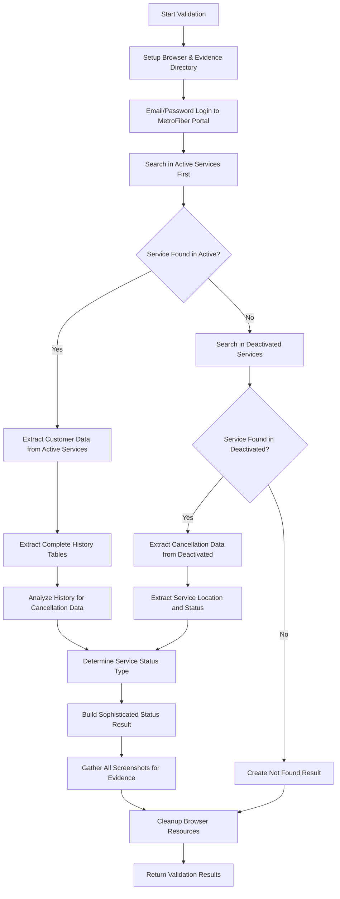
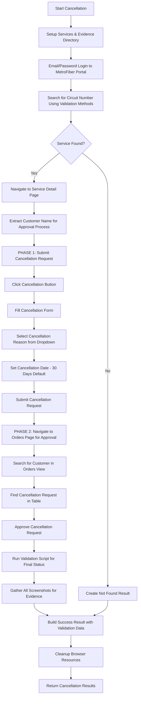

# MetroFiber RPA Automation Documentation

## Overview

This documentation covers the Robotic Process Automation (RPA) system for the MetroFiber portal, consisting of two primary automation scripts that work in sequence:

1. **Validation Script** (`validation.py`) - Service validation with dual-location search and comprehensive history extraction
2. **Cancellation Script** (`cancellation.py`) - Service cancellation with submission and approval workflow

The system uses Selenium WebDriver for browser automation with email/password authentication, implementing a dual-search strategy with comprehensive history table extraction and a two-phase cancellation workflow with approval management.

---

## System Architecture

### Architectural Patterns Used

1. **Inheritance Pattern** - `MetroFiberAutomation` in cancellation inherits from validation automation
2. **Dual Search Strategy** - Active services search with deactivated services fallback
3. **History-Centric Design** - Comprehensive history table extraction for status determination
4. **Two-Phase Cancellation** - Separate submission and approval workflows
5. **Service Location Detection** - Sophisticated logic to determine service location (active/inactive)
6. **Comprehensive Data Extraction** - Detailed customer data with history analysis
7. **Retry Pattern** - Built-in resilience using tenacity decorators for critical operations

### Key Components

- **Job-based execution** with unique job IDs for tracking and evidence collection
- **Email/password authentication** for secure portal access
- **Centralized configuration** via Config class for credentials and portal settings
- **Dual search strategy** - Active services first, then deactivated services fallback
- **History table extraction** - Complete history analysis for cancellation detection
- **Service location awareness** - Tracks whether service found in active or inactive systems
- **Two-phase cancellation workflow** - Submission followed by approval process
- **Evidence collection system** - Screenshots and structured data for audit trails
- **Cancellation request management** - Complete workflow from submission to approval
- **Validation integration** - Cancellation script integrates with validation for final status

### Code Organization

```python
# Validation Module (validation.py)
class MetroFiberAutomation:                # Main validation functionality with dual search
class ValidationRequest:                   # Input parameters (uses circuit_number)
class ServiceData, CancellationData:       # Data extraction models
class ValidationResult:                    # Comprehensive validation results

# Cancellation Module (cancellation.py)  
class MetroFiberAutomation:                # Inherits from validation automation
class CancellationRequest:                 # Input parameters (uses circuit_number)
class CancellationResult:                  # Cancellation workflow results

# Shared Components
class BrowserService:                      # Chrome WebDriver management
class ScreenshotService:                   # Evidence collection service

# History Analysis
def view_history():                        # Complete history table extraction
def extract_cancellation_captured_id():   # Cancellation ID extraction from history
def extract_detailed_service_status():    # Sophisticated status determination

# Dual Search Strategy
def search_customer():                     # Active services search with deactivated fallback
def extract_customer_data():               # Customer data extraction
def extract_deactivated_cancellation_data(): # Deactivated services data extraction

# Two-Phase Cancellation Workflow
def perform_cancellation():                # Phase 1: Cancellation submission
def _navigate_to_orders_page():           # Phase 2: Navigation to approval workflow
def _approve_cancellation_request():      # Phase 2: Cancellation approval

# Configuration (config.py)
class Config:                             # Centralized settings and credentials

# Execution Interface
def execute(parameters):                  # Standard job execution entry point
```

**Note**: The MetroFiber implementation uses an **inheritance-based approach** where the cancellation script inherits from the validation automation class. This provides access to all validation methods while adding cancellation-specific functionality. The system always executes validation at the end to provide comprehensive status updates.

---

## Configuration Requirements

### Environment Variables

```python
# Required configuration
METROFIBER_URL = "https://portal.metrofibre.co.za"
EMAIL = "automation@company.com"
PASSWORD = "secure_password"
CHROMEDRIVER_PATH = "/path/to/chromedriver"

# Optional settings
HEADLESS = "true"  # Run in headless mode
TIMEOUT = 15       # Default timeout for operations
```

### Authentication Configuration

MetroFiber uses standard email/password authentication:
- **Email**: Valid email address for MetroFiber portal access
- **Password**: Corresponding password for the email account
- **Authentication Flow**: Standard email/password login for portal access

### Chrome Driver Requirements

- **Chrome Browser** - Latest stable version recommended
- **ChromeDriver** - Compatible version with installed Chrome
- **Network Access** - Unrestricted access to MetroFiber portal

### Dependencies

```python
# Core automation
selenium>=4.0.0
tenacity>=8.0.0
pathlib
base64
json
logging
traceback
re

# Data processing
datetime
time
itertools

# Utilities
os
```

---

## Validation Automation (`validation.py`)

### Purpose
The validation script is the **first step** in the workflow that:
- Searches for services using dual-location strategy (active and deactivated services)
- Extracts comprehensive customer data and complete history tables
- Determines current service status and location
- Provides foundation data for cancellation decisions with sophisticated status determination

### Validation Workflow



### Parameters

| Parameter | Type | Required | Description |
|-----------|------|----------|-------------|
| `job_id` | string | Yes | Unique job identifier |
| `circuit_number` | string | Yes | Circuit number to validate (MetroFiber service identifier) |
| `customer_name` | string | No | Customer name for search enhancement |
| `customer_id` | string | No | Customer ID for search enhancement |
| `fsan` | string | No | FSAN number for search enhancement |

### **Workflow Phases:**

#### **Phase 1: Setup and Authentication**
**Class:** `MetroFiberAutomation`
**Method:** `__init__(job_id)`

Browser initialization and evidence directory creation:
* **Chrome Driver Setup**: Uses Config-based Chrome WebDriver configuration
* **Browser Options**: Headless mode via `Config.HEADLESS`, security configurations
* **Config-based Settings**: All browser settings controlled via Config class
* **Evidence Directory**: Creates job-specific evidence directories under `/evidence/mfn_validation/job_id/`
* **Screenshot Service**: Initializes comprehensive evidence collection
* **Retry Configuration**: Configurable retry attempts and timeout settings

```python
# Browser configuration (Config-based)
if Config.HEADLESS:
    chrome_options.add_argument("--headless=new")
if Config.NO_SANDBOX:
    chrome_options.add_argument("--no-sandbox")
if Config.DISABLE_DEV_SHM_USAGE:
    chrome_options.add_argument("--disable-dev-shm-usage")

service = Service(executable_path=Config.CHROMEDRIVER_PATH)
```

#### **Phase 2: Email/Password Authentication**
**Class:** `MetroFiberAutomation`
**Method:** `login()`

Email/password authentication to MetroFiber portal with retry mechanisms:
* **Portal Navigation**: Navigate to configured `Config.METROFIBER_URL`
* **Email Field Entry**: Locate email field using `#username` selector
* **Password Field Entry**: Locate password field using `#password` selector
* **Login Submission**: Click login button using `.btnLogin` class selector
* **Login Verification**: Wait for `/customers.php` navigation indicating successful login
* **Retry Logic**: Built-in retry with tenacity decorator for authentication failures

```python
# Authentication field selectors
username_selector = "#username"
password_selector = "#password"
login_button_class = ".btnLogin"

# Success verification
success_indicator = "//a[@href='customers.php']"  # Active services navigation link
```

#### **Phase 3: Dual Search Strategy**
**Class:** `MetroFiberAutomation`
**Method:** `search_customer()`

Search for service using sophisticated dual-location strategy:

**Active Services Search (Primary):**
* **Navigation**: Click active services link (`//a[@href='customers.php']`)
* **Search Form**: Use multiple search fields if provided
* **Circuit Search**: Primary search using `#circuit_search` field
* **Customer Search**: Optional `#name_search` field
* **Customer ID Search**: Optional `#id_search` field
* **FSAN Search**: Optional `#fsan_search` field
* **Search Submission**: Submit search and wait for results
* **Results Verification**: Check for results in `#example` table

**Deactivated Services Search (Fallback):**
* **Exit Active Search**: Navigate back to main via `//a[@href='main.php']`
* **Deactivated Navigation**: Click deactivated services link (`//a[@href='inactive_customers.php']`)
* **Advanced Filtering**: Use DataTables SearchBuilder for precise filtering
* **Condition Setup**: Add circuit number condition with "Equals" operator
* **Auto-filtering**: Search executes automatically on input
* **Result Verification**: Wait for circuit number to appear in filtered results

```python
# Dual search strategy implementation
def search_customer(circuit_number, customer_name="", customer_id="", fsan=""):
    # Try active services first
    if try_active_services_search():
        self.service_location = "active"
        return True
    
    # Fallback to deactivated services
    if try_deactivated_services_search():
        self.service_location = "inactive"  # Critical: Set service location
        return True
    
    return False  # Not found in either location
```

#### **Phase 4: Service Selection and Data Extraction**
**Class:** `MetroFiberAutomation`
**Method:** `select_first_result()`

Navigate to service and extract data based on location:

**Active Services Navigation:**
* **Table Selection**: Target `#example` table for active services
* **Row Selection**: Multiple strategies for double-clicking service rows
* **ActionChains**: Primary method using ActionChains double-click
* **JavaScript Fallback**: JavaScript double-click if ActionChains fails
* **Circuit Cell Click**: Specific circuit number cell targeting
* **Direct Navigation**: Nuclear option using circuit number in URL

**Service Data Extraction (Active Services):**
* **Customer Data**: Extract all form elements (inputs, selects, textareas)
* **Element Processing**: Process elements matching `elements_to_extract` list
* **Data Mapping**: Map extracted values to customer data structure
* **History Integration**: Call `view_history()` for complete history analysis

**Deactivated Services Data Extraction:**
* **Table Analysis**: Extract all rows from deactivated services table
* **Row Processing**: Process every row with column mapping
* **Primary Row Selection**: Select first row with circuit number
* **Data Mapping**: Map deactivated service data to standard structure

```python
# Elements extracted from active services
elements_to_extract = [
    "id", "username", "customerTypeInfo", "customer", "customer_id_number", 
    "mail", "home_number", "mobile_number", "office_number", "po_number", 
    "install_name", "install_number", "install_email", "start_date_enter", 
    "install_time", "area_detail", "complex_detail", "ad1", "port_detail", 
    "resel", "originalbw", "device_type", "actual_device_type", "iptype", 
    "originalip", "fsan", "mac", "activation", "systemDate", "price_nrc", 
    "price_mrc", "package_upgrade_mrc", "exp_date"
]
```

#### **Phase 5: Complete History Table Extraction**
**Class:** `MetroFiberAutomation`
**Method:** `view_history()`

Extract complete history tables for comprehensive analysis:

**History Navigation:**
* **History Button**: Multiple strategies to find and click history button
* **ID-based Search**: Look for button with `id="history"`
* **Text-based Search**: Find elements containing "History" text
* **JavaScript Fallback**: JavaScript-based clicking for stubborn elements
* **Page Load Wait**: Wait for history page to load completely

**Manual Table Extraction:**
* **Table Detection**: Find main table (try `id="example"` first, then any table)
* **Row Processing**: Process all rows excluding header row
* **Cell Extraction**: Extract text from each cell (16 columns expected)
* **Structured Records**: Create structured record objects with proper field mapping
* **Cancellation Detection**: Identify cancellation records with "captured" status

**Record Structure:**
```python
record = {
    "id": cell_texts[0],
    "customer_name": cell_texts[1],
    "account_number": cell_texts[2],
    "circuit_number": cell_texts[3],
    "email": cell_texts[4],
    "address": cell_texts[5],
    "fsan": cell_texts[6],
    "mobile_number": cell_texts[7],
    "reseller": cell_texts[8],
    "activation_date": cell_texts[9],
    "ip_address": cell_texts[10],
    "package": cell_texts[11],
    "user_logged": cell_texts[12],
    "time": cell_texts[13],
    "record_type": cell_texts[14],
    "upgrade": cell_texts[15],
    "is_cancellation": "cancellation" in cell_texts[14].lower(),
    "is_captured": "captured" in cell_texts[15].lower(),
    "row_index": row_index
}
```

#### **Phase 6: Sophisticated Service Status Determination**
**Class:** `MetroFiberAutomation`
**Method:** `extract_detailed_service_status()`

Analyze comprehensive data for sophisticated status determination:

**Status Analysis Logic:**
```python
detailed_status = {
    "service_found": False,
    "is_active": False,
    "has_active_service": False,
    "has_cancellation_data": False,
    "pending_cease_order": False,
    "cancellation_implementation_date": None,
    "cancellation_captured_id": None,
    "service_status_type": "unknown"
}
```

**Service Status Types:**
1. **`active_validated`** - Service found in active services, no cancellation data
2. **`active_with_pending_cancellation`** - Service active but has cancellation history/data
3. **`cancelled_implemented`** - Service found only in deactivated services
4. **`found_unclear_state`** - Service found but status unclear
5. **`not_found`** - Service not found in any location

**Status Determination Rules:**
* **Active Service + No Cancellation**: `active_validated`
* **Active Service + History Cancellation**: `active_with_pending_cancellation`
* **Active Service + Deactivated Data**: `active_with_pending_cancellation`
* **Deactivated Service Only**: `cancelled_implemented`
* **Service Not Found**: `not_found`

#### **Phase 7: Results Compilation**
**Class:** `MetroFiberAutomation`
**Method:** `validate_service()`

Build comprehensive validation results with enhanced status:

**Core Result Structure:**
* **Basic Fields**: `found`, `circuit_number`, `customer_data`, `cancellation_data`
* **Service Location**: Accurate location reporting (`active`, `inactive`, `not_found`)
* **Enhanced Status**: All detailed status flags for sophisticated determination
* **History Data**: Complete history analysis results
* **Metadata**: Extraction timestamps, processing approach, completeness assessment

**Main Entry Point:**

```python
def validate_service(self, circuit_number, customer_name="", customer_id="", fsan=""):
```
**Class:** `MetroFiberAutomation`

Orchestrates all validation phases:
* **Phase Coordination**: Execute phases 1-7 in sequence with error handling
* **Dual Search Execution**: Try active services first, fallback to deactivated
* **Service Location Detection**: Accurately determine and report service location
* **Comprehensive Data Collection**: Extract customer data, history, and status information
* **Evidence Integration**: Combine screenshots and structured data
* **Status Determination**: Apply sophisticated logic for service status

**Returns:**
```python
{
    "status": "success|failure|error",
    "message": "Descriptive message",
    "details": {
        # Basic compatibility fields
        "found": bool,
        "circuit_number": str,
        "customer_data": dict,
        "cancellation_data": dict,
        "service_location": "active|inactive|not_found",
        
        # Enhanced status fields for sophisticated determination
        "service_found": bool,
        "is_active": bool,
        "has_active_service": bool,
        "has_cancellation_data": bool,
        "pending_cease_order": bool,  # DRIVES "Cancellation Pending"
        "cancellation_implementation_date": str,  # DRIVES "Already Cancelled"
        "cancellation_captured_id": str,
        "service_status_type": str,
        
        # Metadata
        "search_successful": bool,
        "data_extraction_successful": bool,
        "validation_status": "complete",
        "data_source": "mfn_portal",
        "extraction_timestamp": str
    },
    "evidence": list,
    "screenshot_data": [screenshot objects]
}
```

### Usage Example

```python
from validation import execute

# Define job parameters
parameters = {
    "job_id": "MFN_VAL_20250123_001", 
    "circuit_number": "FTTX-CT-12345"
}

# Execute validation
result = execute(parameters)

# Check results
if result["status"] == "success":
    details = result["details"]
    if details.get("found"):
        print(f"Service Location: {details['service_location']}")
        print(f"Status Type: {details['service_status_type']}")
        if details.get("pending_cease_order"):
            print("⚠️ Cancellation Pending")
        elif details.get("cancellation_implementation_date"):
            print("❌ Already Cancelled")
        else:
            print("✅ Active Service")
    else:
        print("Circuit number not found")
```

---

## Cancellation Automation (`cancellation.py`)

### Purpose
The cancellation script is the **second step** in the workflow that:
- Performs service cancellation operations in MetroFiber portal
- Implements two-phase workflow: cancellation submission AND approval
- Handles cancellation forms with date selection and reason dropdown
- Manages work orders and approval workflow
- Always integrates with validation for comprehensive status updates

### Cancellation Workflow



### Parameters

| Parameter | Type | Required | Description |
|-----------|------|----------|-------------|
| `job_id` | string | Yes | Unique job identifier for tracking |
| `circuit_number` | string | Yes | Circuit number to be cancelled |
| `customer_name` | string | No | Customer name for search enhancement |
| `customer_id` | string | No | Customer ID for search enhancement |
| `fsan` | string | No | FSAN for search enhancement |
| `effective_cancellation_date` | string | No | Cancellation date (defaults to 30 days) |

### **Two-Phase Cancellation Workflow:**

The MetroFiber cancellation process requires both **submission** and **approval** phases:
1. **Phase 1**: Submit cancellation request on customer detail page
2. **Phase 2**: Navigate to orders page and approve the submitted request

### **Workflow Phases:**

#### **Phase 1: Setup and Service Discovery**
**Class:** `MetroFiberAutomation` (inherits from validation)
**Method:** `cancel_service()`

Initialization and service validation:
* **Inheritance Setup**: Use validation automation as base class
* **Browser Service**: Initialize Chrome WebDriver with Config settings
* **Screenshot Service**: Setup evidence collection in `/evidence/mfn_cancellation/job_id/`
* **Service Search**: Use inherited `search_customer()` method from validation
* **Service Selection**: Use inherited `select_first_result()` method
* **Customer Data**: Extract customer data and determine customer name for approval

#### **Phase 2: Cancellation Request Submission**
**Class:** `MetroFiberAutomation`
**Method:** `perform_cancellation()`

Submit cancellation request on service detail page:

**Cancellation Button Detection:**
* **Page State Check**: Verify we're on correct detail page (not history)
* **Exit History**: If on history page, click exit to return to detail page
* **Scroll to Top**: Ensure cancellation button is visible
* **JavaScript Detection**: Use JavaScript to find and click cancellation buttons
* **Fallback Selectors**: Multiple XPath selectors for cancellation button

**Cancellation Form Processing:**
```python
# Form field processing
def _fill_cancellation_form(self, effective_date=None):
    # 1. Select cancellation reason (required dropdown)
    if not self._select_cancellation_reason():
        return False
    
    # 2. Set cancellation date if provided (30 days default)
    if effective_date:
        if not self._set_cancellation_date(effective_date):
            logger.warning("Failed to set date, but continuing")
    
    # 3. Wait for dynamic calculations (penalty, etc.)
    time.sleep(2)
    
    return True
```

**Reason Selection:**
* **Dropdown Handling**: Select element with `id="comments"`
* **Default Reason**: Use "No Reason Provided" if no specific reason
* **Option Selection**: Try visible text first, fallback to index selection
* **Change Event**: Trigger change event for dynamic updates

**Date Configuration:**
* **Date Field**: Input field with `id="cancellation_date"`
* **Date Format**: YYYY-MM-DD format for form submission
* **Default Calculation**: 30 days from current date if not provided
* **JavaScript Setting**: Use JavaScript if field is readonly
* **Verification**: Verify date was set correctly

#### **Phase 3: Form Submission and Confirmation**
**Class:** `MetroFiberAutomation`
**Method:** `_save_cancellation_request()`

Submit cancellation form and handle confirmations:

**Save Button Processing:**
* **Button Detection**: Find save button with `id="save_reseller"`
* **Enable Button**: Remove disabled attribute if present
* **Form Submission**: Click save button to trigger `saveRequest()` JavaScript
* **Dialog Handling**: Handle penalty confirmation dialogs automatically

**Confirmation Dialog Management:**
* **Alert Detection**: Wait for JavaScript alerts with penalty warnings
* **Auto-acceptance**: Accept penalty confirmation dialogs
* **Success Verification**: Wait for form submission completion
* **Page Navigation**: Check for navigation to `cancellation_request.php`

#### **Phase 4: Orders Page Navigation and Approval**
**Class:** `MetroFiberAutomation`
**Methods:** `_navigate_to_orders_page()`, `_search_for_customer_in_orders()`, `_approve_cancellation_request()`

Navigate to orders and approve submitted cancellation:

**Orders Navigation:**
* **Direct Navigation**: Navigate to `customer_requests.php`
* **Dynamic Search**: Wait for TableFilter to add dynamic search input
* **Search Field**: Use dynamic input with `id="flt0_example"`

**Customer Search in Orders:**
* **Search Input**: Use customer name extracted from detail page
* **Filter Execution**: Enter customer name and press return
* **Result Verification**: Wait for filtered results to appear

**Cancellation Approval:**
* **Request Detection**: Find row containing "cancellation request" and customer name
* **Row Selection**: Scroll to row and double-click to open
* **Accept Button**: Click accept button with `id="acceptOrder"`
* **Nuclear Click**: Use JavaScript click for reliable button interaction
* **Confirmation Handling**: Handle any confirmation dialogs

```python
# Approval process
def _approve_cancellation_request(self):
    try:
        # Find cancellation request row
        target_row = WebDriverWait(self.driver, 30).until(
            EC.presence_of_element_located((
                By.XPATH, 
                f"//tr[contains(., 'cancellation request') and contains(., '{self.customer_name}')]"
            ))
        )
        
        # Double-click to open
        ActionChains(self.driver).double_click(target_row).perform()
        
        # Click accept with nuclear option
        accept_button = WebDriverWait(self.driver, 30).until(
            EC.presence_of_element_located((By.ID, "acceptOrder"))
        )
        
        self.driver.execute_script("arguments[0].click();", accept_button)
        return True
        
    except Exception as e:
        logger.error(f"Approval failed: {str(e)}")
        return False
```

#### **Phase 5: Cancellation ID Extraction**
**Class:** `MetroFiberAutomation`
**Method:** `extract_cancellation_captured_id()`

Extract cancellation captured ID from history:

**History Navigation:**
* **Return to Detail**: Navigate back to customer detail page
* **History Access**: Click history button to view complete history
* **Table Analysis**: Examine all history tables for cancellation data

**ID Extraction Logic:**
* **Row Scanning**: Check each table row for "cancellation" and "captured" keywords
* **Data Extraction**: Extract ID from first cell of matching row
* **Row Highlighting**: Highlight found row with yellow background
* **Evidence Capture**: Save detailed capture data to file

#### **Phase 6: Integration with Validation**
**Integration:** Always execute validation after cancellation workflow

**Comprehensive Status Update:**
```python
# Critical integration - always executed
try:
    validation_result = validation_execute({
        "job_id": self.job_id,
        "circuit_number": circuit_number,
        "customer_name": customer_name,
        "customer_id": customer_id,
        "fsan": fsan
    })
    
    # COMPLETELY REPLACE details with validation data
    if "details" in validation_result and validation_result["details"]:
        results["details"] = validation_result["details"]
        logger.info("Successfully updated with post-cancellation validation data")
        
except Exception as validation_error:
    logger.error(f"Error in final validation: {str(validation_error)}")
    # Don't fail the whole job if validation fails
```

#### **Phase 7: Results Compilation**
**Class:** `MetroFiberAutomation`
**Method:** `cancel_service()`

Build comprehensive results with validation integration:

**Status Determination Logic:**
```python
# Result status based on workflow success
if cancellation_submitted and approval_successful:
    results["status"] = "success"
    results["message"] = f"Cancellation fully completed and approved for {circuit_number}"
elif cancellation_submitted:
    results["status"] = "partial_success"  # or "success"
    results["message"] = f"Cancellation submitted for {circuit_number} but approval failed"
else:
    results["status"] = "failure"
    results["message"] = "Failed to submit cancellation request"
```

**Evidence Collection:**
* **Cancellation Screenshots**: All screenshots from cancellation workflow
* **Validation Screenshots**: Screenshots from final validation run
* **Combined Evidence**: Merge evidence from both processes
* **Audit Trail**: Complete workflow documentation

**Main Entry Point:**

```python
def cancel_service(self, circuit_number, customer_name="", customer_id="", fsan="", effective_cancellation_date=None):
```
**Class:** `MetroFiberAutomation`

Orchestrates complete two-phase cancellation workflow:
* **Phase 1**: Service discovery and cancellation submission
* **Phase 2**: Orders navigation and approval workflow
* **Status Tracking**: Track success of both submission and approval
* **Error Handling**: Graceful degradation with partial success states
* **Always Execute Validation**: Get final status regardless of cancellation outcome
* **Evidence Management**: Comprehensive screenshot collection
* **Results Integration**: Merge cancellation and validation data

**Returns:**
```python
{
    "status": "success|partial_success|failure|error",
    "message": "Descriptive status message",
    "details": {
        # Cancellation workflow status (replaced by validation data)
        "cancellation_submitted": bool,
        "approval_successful": bool,
        "cancellation_captured_id": str,
        
        # Complete validation data (from final validation run)
        "found": bool,
        "service_location": "active|inactive|not_found",
        "service_found": bool,
        "is_active": bool,
        "has_active_service": bool,
        "has_cancellation_data": bool,
        "pending_cease_order": bool,
        "cancellation_implementation_date": str,
        "service_status_type": str,
        
        # Customer and service data
        "customer_data": dict,
        "cancellation_data": dict,
        
        # Processing metadata
        "search_successful": bool,
        "data_extraction_successful": bool,
        "validation_status": "complete",
        "extraction_timestamp": str
    },
    "evidence": list,
    "screenshot_data": [screenshot objects]
}
```

### Usage Example

```python
from cancellation import execute

# Define cancellation parameters
parameters = {
    "job_id": "MFN_CXL_20250123_001",
    "circuit_number": "FTTX-CT-12345",
    "customer_name": "John Smith",  # Optional - helps with approval search
    "effective_cancellation_date": "2025-02-15"  # Optional - defaults to 30 days
}

# Execute cancellation
result = execute(parameters)

# Check results
if result["status"] == "success":
    details = result["details"]
    if details["cancellation_submitted"]:
        print(f"✅ Cancellation submitted and approved")
        if details.get("cancellation_captured_id"):
            print(f"Cancellation ID: {details['cancellation_captured_id']}")
    
    # Current service status from validation
    print(f"Final Status: {details['service_status_type']}")
    print(f"Service Location: {details['service_location']}")
elif result["status"] == "partial_success":
    print(f"⚠️ Cancellation submitted but approval failed")
```

---

## Complete Field Extraction Reference

The MetroFiber validation system extracts comprehensive service data with dual-location search and sophisticated status determination. Below is the complete structure:

### Full Validation Response Structure

```json
{
    "status": "success|failure|error",
    "message": "Successfully validated circuit number FTTX-CT-12345. Service found in active services with pending cancellation data.",
    "details": {
        # Basic Compatibility Fields
        "found": true,
        "circuit_number": "FTTX-CT-12345",
        "customer_data": {
            "customer": "John Smith",
            "circuit_number": "FTTX-CT-12345",
            "area": "Cape Town Central",
            "originalbw": "100Mbps",
            "activation": "2024-03-15",
            "expiry_date": "2025-03-15",
            "mail": "john.smith@example.com",
            "mobile_number": "0821234567",
            "home_number": "0214567890",
            "install_name": "John Smith",
            "install_email": "john.smith@example.com",
            "area_detail": "Residential Area",
            "resel": "MetroFibre",
            "device_type": "ONT",
            "fsan": "ALCLB12345678901",
            "mac": "00:11:22:33:44:55",
            "price_nrc": "R1500.00",
            "price_mrc": "R699.00"
        },
        "cancellation_data": {
            "found": true,
            "cancellation_captured_id": "12345678",
            "primary_row": {
                "id": "12345678",
                "customer_name": "John Smith",
                "circuit_number": "FTTX-CT-12345",
                "record_type": "cancellation",
                "upgrade": "captured"
            }
        },
        "service_location": "active",
        
        # Enhanced Status Fields (MetroFiber Sophisticated Determination)
        "service_found": true,
        "is_active": true,
        "has_active_service": true,
        "has_cancellation_data": true,
        "pending_cease_order": true,  # DRIVES "Cancellation Pending"
        "cancellation_implementation_date": null,  # DRIVES "Already Cancelled"
        "cancellation_captured_id": "12345678",
        "service_status_type": "active_with_pending_cancellation",
        
        # MetroFiber-Specific Fields
        "is_deactivated": false,
        "customer_is_active": true,
        "service_is_active": true,
        
        # History Analysis (MetroFiber Specific)
        "cancellation_captured_ids": ["12345678"],
        "history_record_count": 15,
        
        # Processing Metadata
        "search_successful": true,
        "data_extraction_successful": true,
        "validation_status": "complete",
        "data_source": "mfn_portal",
        "extraction_timestamp": "2025-01-23T14:30:22.123456"
    },
    "evidence": [],
    "screenshot_data": [
        {
            "name": "pre_login",
            "timestamp": "2025-01-23T14:30:00.123456",
            "base64_data": "iVBORw0KGgoAAAANSUhEUgAA...",
            "path": "/evidence/pre_login_20250123_143000.png"
        },
        {
            "name": "post_login", 
            "timestamp": "2025-01-23T14:30:15.234567",
            "base64_data": "iVBORw0KGgoAAAANSUhEUgBB...",
            "path": "/evidence/post_login_20250123_143015.png"
        },
        {
            "name": "active_services_search_form",
            "timestamp": "2025-01-23T14:30:30.345678",
            "base64_data": "iVBORw0KGgoAAAANSUhEUgCC...",
            "path": "/evidence/active_services_search_form_20250123_143030.png"
        },
        {
            "name": "active_services_search_results",
            "timestamp": "2025-01-23T14:30:45.456789",
            "base64_data": "iVBORw0KGgoAAAANSUhEUgDD...",
            "path": "/evidence/active_services_search_results_20250123_143045.png"
        },
        {
            "name": "customer_data_page",
            "timestamp": "2025-01-23T14:31:00.567890",
            "base64_data": "iVBORw0KGgoAAAANSUhEUgEE...",
            "path": "/evidence/customer_data_page_20250123_143100.png"
        },
        {
            "name": "history_page_loaded",
            "timestamp": "2025-01-23T14:31:15.678901",
            "base64_data": "iVBORw0KGgoAAAANSUhEUgFF...",
            "path": "/evidence/history_page_loaded_20250123_143115.png"
        },
        {
            "name": "history_extraction_complete",
            "timestamp": "2025-01-23T14:31:30.789012",
            "base64_data": "iVBORw0KGgoAAAANSUhEUgGG...",
            "path": "/evidence/history_extraction_complete_20250123_143130.png"
        }
    ]
}
```

### Deactivated Service Response Structure

When service found only in deactivated services:

```json
{
    "status": "success",
    "message": "Circuit number FTTX-CT-12345 found in deactivated services. Service has been cancelled.",
    "details": {
        "found": true,
        "circuit_number": "FTTX-CT-12345",
        "customer_data": {},
        "cancellation_data": {
            "found": true,
            "rows": [
                {
                    "row_index": 1,
                    "id": "87654321",
                    "customer_name": "John Smith",
                    "circuit_number": "FTTX-CT-12345",
                    "date_time": "2024-12-15 10:30",
                    "record_type": "Cancellation",
                    "change_type": "Service Cancelled"
                }
            ],
            "primary_row": {
                "id": "87654321",
                "customer_name": "John Smith",
                "circuit_number": "FTTX-CT-12345",
                "date_time": "2024-12-15 10:30"
            }
        },
        "service_location": "inactive",
        
        # Enhanced Status for Cancelled Service
        "service_found": true,
        "is_active": false,
        "has_active_service": false,
        "has_cancellation_data": true,
        "pending_cease_order": false,
        "cancellation_implementation_date": "2024-12-15 10:30",  # From deactivated data
        "cancellation_captured_id": "87654321",
        "service_status_type": "cancelled_implemented"
    }
}
```

### Service Not Found Response

When service not found in either location:

```json
{
    "status": "success",
    "message": "Circuit number FTTX-CT-12345 not found in active or deactivated services",
    "details": {
        "found": false,
        "circuit_number": "FTTX-CT-12345",
        "customer_data": {},
        "cancellation_data": {"found": false},
        "service_location": "not_found",
        "search_attempted": true,
        
        # Enhanced Status for Not Found
        "service_found": false,
        "service_status_type": "not_found"
    }
}
```

---

## Complete Cancellation Field Reference

The MetroFiber cancellation system performs two-phase cancellation (submission + approval) and **automatically executes validation** to provide comprehensive status updates.

### Full Cancellation Response Structure

```json
{
    "status": "success|partial_success|failure|error",
    "message": "Cancellation fully completed and approved for FTTX-CT-12345",
    "details": {
        # Complete Validation Data (post-cancellation) - REPLACES cancellation details
        "found": true,
        "circuit_number": "FTTX-CT-12345",
        "customer_data": {
            "customer": "John Smith",
            "circuit_number": "FTTX-CT-12345",
            "area": "Cape Town Central"
            // ... complete customer data
        },
        "cancellation_data": {
            "found": true,
            "cancellation_captured_id": "98765432",  // New cancellation ID
            "primary_row": {
                "id": "98765432",
                "customer_name": "John Smith",
                "record_type": "cancellation", 
                "upgrade": "captured"
            }
        },
        "service_location": "active",  // May still show active immediately after cancellation
        
        # Enhanced Status (Updated Post-Cancellation)
        "service_found": true,
        "is_active": true,  // May still be true immediately after cancellation
        "has_active_service": true,
        "has_cancellation_data": true,  // Now true due to new cancellation
        "pending_cease_order": true,    // Now true - cancellation pending implementation
        "cancellation_implementation_date": null,  // Not yet implemented
        "cancellation_captured_id": "98765432",   // New cancellation ID
        "service_status_type": "active_with_pending_cancellation",  // Updated status
        
        # Cancellation Workflow Metadata (preserved)
        "cancellation_submitted": true,
        "approval_successful": true,
        "work_order_number": "98765432",
        
        # Processing Metadata
        "search_successful": true,
        "data_extraction_successful": true,
        "validation_status": "complete",
        "extraction_timestamp": "2025-01-23T14:32:00.123456"  // Post-cancellation timestamp
    },
    "evidence": [],
    "screenshot_data": [
        // Cancellation Process Screenshots
        {
            "name": "ready_for_cancellation_button",
            "timestamp": "2025-01-23T14:30:00.123456",
            "base64_data": "iVBORw0KGgoAAAANSUhEUgAA...",
            "path": "/evidence/ready_for_cancellation_button_20250123_143000.png"
        },
        {
            "name": "clicked_cancellation_button",
            "timestamp": "2025-01-23T14:30:15.234567",
            "base64_data": "iVBORw0KGgoAAAANSUhEUgBB...",
            "path": "/evidence/clicked_cancellation_button_20250123_143015.png"
        },
        {
            "name": "cancellation_form_filled",
            "timestamp": "2025-01-23T14:30:30.345678",
            "base64_data": "iVBORw0KGgoAAAANSUhEUgCC...",
            "path": "/evidence/cancellation_form_filled_20250123_143030.png"
        },
        {
            "name": "cancellation_form_submitted",
            "timestamp": "2025-01-23T14:30:45.456789",
            "base64_data": "iVBORw0KGgoAAAANSUhEUgDD...",
            "path": "/evidence/cancellation_form_submitted_20250123_143045.png"
        },
        {
            "name": "orders_page_navigation",
            "timestamp": "2025-01-23T14:31:00.567890",
            "base64_data": "iVBORw0KGgoAAAANSUhEUgEE...",
            "path": "/evidence/orders_page_navigation_20250123_143100.png"
        },
        {
            "name": "cancellation_request_approved",
            "timestamp": "2025-01-23T14:31:15.678901",
            "base64_data": "iVBORw0KGgoAAAANSUhEUgFF...",
            "path": "/evidence/cancellation_request_approved_20250123_143115.png"
        },
        // Validation Process Screenshots (merged)
        {
            "name": "post_cancellation_validation",
            "timestamp": "2025-01-23T14:31:30.789012",
            "base64_data": "iVBORw0KGgoAAAANSUhEUgGG...",
            "path": "/evidence/post_cancellation_validation_20250123_143130.png"
        }
    ]
}
```

### Partial Success Response

When cancellation submitted but approval fails:

```json
{
    "status": "partial_success",
    "message": "Cancellation submitted for FTTX-CT-12345 but approval failed",
    "details": {
        // Complete validation data showing submitted cancellation
        "has_cancellation_data": true,
        "pending_cease_order": true,
        "service_status_type": "active_with_pending_cancellation",
        
        // Workflow status
        "cancellation_submitted": true,
        "approval_successful": false
    }
}
```

### Service Not Found Response

```json
{
    "status": "failure",
    "message": "Service FTTX-CT-12345 not found in MetroFiber portal",
    "details": {
        "found": false,
        "cancellation_submitted": false,
        "approval_successful": false,
        "service_status_type": "not_found"
    }
}
```

---

## Evidence Collection System

Both scripts implement comprehensive evidence collection with job-specific organization:

### Screenshot Management
**Class:** Job-specific screenshot handling
- **Automatic screenshots** at all critical workflow points
- **Base64 encoding** for secure transmission and database storage
- **Timestamped filenames** with job ID prefixes for audit trails
- **Descriptive naming** for easy workflow reconstruction
- **Error state capture** for debugging failed operations

### Data Files
Evidence files stored in job-specific directories:

```
/evidence/
├── mfn_validation/
│   └── MFN_VAL_20250123_001/
│       ├── pre_login_20250123_143000.png
│       ├── post_login_20250123_143015.png
│       ├── active_services_search_form_20250123_143030.png
│       ├── active_services_search_results_20250123_143045.png
│       ├── customer_data_page_20250123_143100.png
│       ├── history_page_loaded_20250123_143115.png
│       └── history_extraction_complete_20250123_143130.png
├── mfn_cancellation/
│   └── MFN_CXL_20250123_002/
│       ├── ready_for_cancellation_button_20250123_143000.png
│       ├── clicked_cancellation_button_20250123_143015.png
│       ├── cancellation_form_filled_20250123_143030.png
│       ├── cancellation_form_submitted_20250123_143045.png
│       ├── orders_page_navigation_20250123_143100.png
│       ├── cancellation_request_approved_20250123_143115.png
│       └── post_cancellation_validation_20250123_143130.png
```

---

## Error Handling & Retry Logic

### Retry Decorators
Both scripts use `tenacity` for robust retry mechanisms:

```python
@retry(
    stop=stop_after_attempt(3),
    wait=wait_exponential(multiplier=1, min=2, max=10),
    retry=retry_if_exception_type((TimeoutException, ElementClickInterceptedException, WebDriverException)),
    before_sleep=before_sleep_log(logger, logging.INFO)
)
def perform_cancellation(self, effective_cancellation_date=None):
    # Cancellation workflow with automatic retry
```

### Error Categories
1. **Authentication Errors** - Email/password login failures, session timeouts
2. **Portal Navigation Errors** - Page load failures, element detection issues
3. **Search Strategy Errors** - Active services search failures, deactivated services fallback issues
4. **Data Extraction Errors** - History table extraction failures, customer data missing
5. **Cancellation Form Errors** - Form field detection, dropdown selection, date setting
6. **Approval Workflow Errors** - Orders page navigation, request detection, approval button clicking
7. **Service Location Errors** - Dual search failures, service not found in either location
8. **History Analysis Errors** - History button detection, table parsing, cancellation ID extraction

### MetroFiber-Specific Error Handling
- **Dual Search Resilience**: Automatic fallback from active to deactivated services
- **History Page Navigation**: Multiple strategies for finding and clicking history buttons
- **Service Location Tracking**: Accurate tracking of where service was found
- **Cancellation Button Detection**: Multiple approaches for finding cancellation elements
- **Approval Workflow Recovery**: Graceful handling of approval process failures
- **Customer Name Extraction**: Fallback methods for extracting customer names

### Graceful Degradation
- **Always Attempt Validation**: Final validation runs regardless of cancellation success
- **Partial Success Handling**: Track and report partial workflow completion
- **Service Location Reporting**: Accurate reporting even when data extraction fails
- **Evidence Collection**: Continue collecting screenshots even during failures
- **Status Determination**: Sophisticated status logic handles incomplete data

---

## Integration Patterns

### Job Queue System
Both scripts designed for integration with job queue systems:

```python
# Execute function interface
def execute(parameters):
    job_id = parameters.get("job_id")
    circuit_number = parameters.get("circuit_number") or parameters.get("order_id")
    customer_name = parameters.get("customer_name", "")
    customer_id = parameters.get("customer_id", "")
    fsan = parameters.get("fsan", "")
    effective_cancellation_date = parameters.get("effective_cancellation_date")
    # ... process job
    return results
```

### Validation-Cancellation Integration
Cancellation script integrates with validation through inheritance and final execution:

```python
# Inheritance-based integration
class MetroFiberAutomation(ValidationAutomation):  # In cancellation.py
    # Inherits all validation methods
    
    def cancel_service(self, ...):
        # Use inherited search_customer() method
        # Use inherited select_first_result() method
        # ... perform cancellation workflow
        
        # ALWAYS execute validation at the end
        try:
            validation_result = validation_execute({
                "job_id": self.job_id,
                "circuit_number": circuit_number,
                "customer_name": customer_name,
                "customer_id": customer_id,
                "fsan": fsan
            })
            
            # COMPLETELY REPLACE details with validation data
            if "details" in validation_result and validation_result["details"]:
                results["details"] = validation_result["details"]
                logger.info("Successfully updated with post-cancellation validation data")
                
        except Exception as validation_error:
            logger.error(f"Error in final validation: {str(validation_error)}")
```

---

## Security & Compliance

### Data Protection
- **Credential Security** - Secure credential storage via Config class
- **Evidence Encryption** - Base64 encoded screenshot data for secure transmission
- **PII Handling** - Secure processing of customer information from MetroFiber portal
- **Audit Trails** - Complete operation logging with job-based evidence collection
- **History Data Protection** - Secure handling of comprehensive history table data

### Best Practices
- **Access Control** - Restricted access to MetroFiber automation credentials
- **Evidence Retention** - Configurable retention periods for screenshots in job directories
- **Error Logging** - Sanitized logs without sensitive customer information
- **Compliance Monitoring** - Regular audits of automation activities through evidence trails
- **Two-Phase Verification** - Submission and approval workflow provides additional verification

---

## Troubleshooting

### Common Issues

#### Email/Password Authentication Failures
- **Symptoms**: "Login failed" errors, timeout on authentication
- **Solutions**: Verify email/password credentials, check portal availability, confirm URL configuration
- **MetroFiber Specific**: Portal may require specific user agent or session handling

#### Dual Search Strategy Failures
```
Error: Service not found in active or deactivated services
Symptoms: search_customer() returns False for both locations
Solution: Check search field selectors and form submission logic
Debug: Verify circuit_number format and search term processing
MetroFiber Specific: Check DataTables SearchBuilder configuration for deactivated search
```

#### Service Location Detection Issues
```
Error: service_location not properly set
Symptoms: Service found but location shows as "unknown"
Solution: Ensure self.service_location is set correctly in search methods
Debug: Check conditional logic in try_active_services_search() and try_deactivated_services_search()
Critical: Verify self.service_location = "inactive" is set during deactivated search
```

#### History Table Extraction Failures
```
Error: No history tables found or history button not detected
Symptoms: view_history() returns error or empty records
Solution: Check history button selectors and table detection logic
Debug: Review history page structure and table ID/class selectors
MetroFiber Specific: History tables use manual extraction without dependencies
```

#### Cancellation Button Detection Failed
```
Error: Could not find cancellation button
Symptoms: _find_and_click_cancellation_button() returns False
Solution: Check if on correct page (detail vs history) and button selectors
Debug: Verify JavaScript button detection and XPath selectors
MetroFiber Specific: Button may be hidden or require scrolling to top
```

#### Two-Phase Workflow Failures
```
Error: Cancellation submitted but approval failed
Symptoms: perform_cancellation() succeeds but _approve_cancellation_request() fails
Solution: Check orders page navigation and customer name extraction
Debug: Verify customer name is properly extracted for approval search
MetroFiber Specific: Approval workflow requires exact customer name matching
```

#### Cancellation Form Processing Failed
```
Error: Failed to fill cancellation form
Symptoms: Form fields not detected or dropdown selection fails
Solution: Check form field selectors and dropdown option values
Debug: Review cancellation form structure and JavaScript interactions
MetroFiber Specific: Form uses specific dropdown with "No Reason Provided" option
```

### Debug Mode
Enable debug mode by setting:
```python
HEADLESS = "false"  # Show browser for debugging
logging.basicConfig(level=logging.DEBUG)
```

### Evidence Review
Always review evidence files after job completion:
- Check screenshots for unexpected portal states
- Verify dual search strategy execution (active then deactivated)
- Confirm service location detection accuracy
- Review history table extraction completeness
- Validate two-phase cancellation workflow execution
- Check validation integration results and data replacement

---

## Best Practices

### Job Execution
1. **Always run validation first** to understand current service state and location
2. **Only run cancellation** if validation indicates service exists and is cancellable
3. **Check both workflow phases** - submission success AND approval success
4. **Review validation integration** - final status comes from post-cancellation validation
5. **Understand service locations** - active vs deactivated services have different workflows

### Error Handling
1. **Capture screenshots** on errors for debugging workflow failures
2. **Log comprehensive error details** including search strategy and location information
3. **Continue processing** where possible with graceful degradation
4. **Handle partial success** - distinguish between submission and approval failures
5. **Track service location** - critical for understanding where service was found

### Evidence Collection
1. **Collect evidence** regardless of success/failure for audit compliance
2. **Use descriptive screenshot names** that indicate workflow phase and location
3. **Store structured data** for orchestrator consumption and status determination
4. **Maintain job-based organization** for easy evidence retrieval and audit trails

### Browser Management
1. **Use headless mode** for production environments via `HEADLESS` configuration
2. **Configure appropriate timeouts** for MetroFiber's page loading characteristics
3. **Clean up resources** using proper cleanup in finally blocks
4. **Handle authentication timing** with retry mechanisms for portal access

---

## MetroFiber-Specific Considerations

### Portal Characteristics
- **Email/Password Authentication**: Standard credential-based authentication with specific selectors
- **Dual Service Locations**: Services can exist in active OR deactivated systems
- **History-Centric Design**: Heavy reliance on history table analysis for status determination
- **Two-Phase Cancellation**: Submission and approval are separate required phases
- **Dynamic Content**: Portal uses dynamic elements requiring robust wait strategies

### Search Behavior
- **Active Services Priority**: Always search active services first
- **Deactivated Fallback**: Automatic fallback to deactivated services search
- **DataTables Integration**: Deactivated search uses DataTables SearchBuilder
- **Service Location Tracking**: Critical tracking of where service was found

### UI Interactions
- **Dual Navigation**: Different navigation patterns for active vs deactivated services
- **History Analysis**: Comprehensive history table extraction and analysis
- **Cancellation Workflow**: Navigate to detail page, submit form, navigate to orders, approve
- **Form Interactions**: Dropdown selections, date inputs, form submissions with confirmations

### Data Extraction Patterns
- **Customer Data Extraction**: Comprehensive form element extraction from active services
- **History Table Analysis**: Manual table extraction with structured record creation
- **Cancellation Detection**: Sophisticated logic to identify cancellation records in history
- **Service Status Determination**: Complex logic combining active service data with history analysis

### Status Determination Logic
MetroFiber implements sophisticated status determination:

1. **`active_validated`** - Found in active services, no cancellation history
2. **`active_with_pending_cancellation`** - Found in active services, has cancellation history/data
3. **`cancelled_implemented`** - Found only in deactivated services
4. **`found_unclear_state`** - Found but status unclear
5. **`not_found`** - Not found in either location

---

## Support & Maintenance

For technical support, configuration assistance, or reporting issues with the MetroFiber automation scripts, please refer to your internal RPA team documentation or contact your system administrator.

The MetroFiber automation system provides robust service validation and cancellation workflows with:

- **Email/password authentication** for secure portal access
- **Dual search strategy** with active services priority and deactivated fallback
- **Comprehensive history analysis** with complete table extraction and cancellation detection
- **Two-phase cancellation workflow** with submission and approval phases
- **Service location awareness** with accurate tracking of active vs deactivated services
- **Sophisticated status determination** using combined active and history data analysis
- **Inheritance-based integration** between validation and cancellation scripts
- **Complete evidence collection** for audit trails and debugging support
- **MetroFiber-specific optimizations** for portal characteristics and workflow requirements

The system's dual search strategy, history-centric design, retry mechanisms, and comprehensive status determination make it suitable for production use in enterprise environments with full integration between validation and cancellation processes.

---

**Last Updated**: August 14, 2025  
**Version**: 1.0 (MetroFiber Implementation)