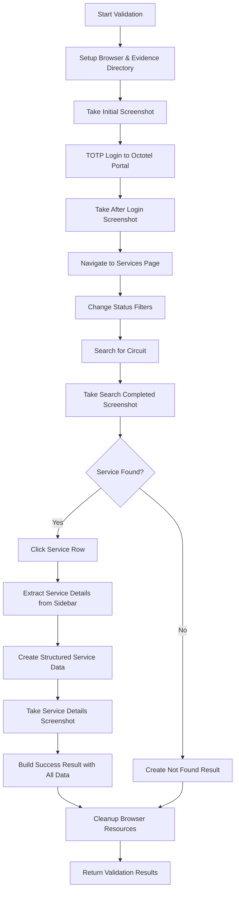
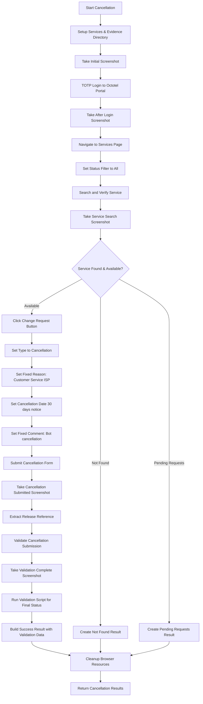

# Octotel RPA Automation Documentation

## Overview

This documentation covers the Robotic Process Automation (RPA) system for the Octotel portal, consisting of two primary automation scripts that work in sequence:

1. **Validation Script** (`validation.py`) - Service validation and data extraction
2. **Cancellation Script** (`cancellation.py`) - Service cancellation processing

The system uses Selenium WebDriver for browser automation with TOTP (Time-based One-Time Password) authentication, implementing a job-based architecture with comprehensive evidence collection and error handling.

---

## System Architecture

### Architectural Patterns Used

1. **Service Layer Pattern** - `BrowserService` and `ScreenshotService` handle cross-cutting concerns
2. **Data Model Pattern** - Pydantic models (`ValidationResult`, `CancellationResult`) for structured data handling
3. **Strategy Pattern** - Multiple strategies for form interaction and data extraction
4. **Robust Input Handling** - `RobustInputHandler` with multiple fallback methods
5. **Streamlined Data Processing** - `StreamlinedDataProcessor` for clean data organization
6. **Factory Pattern** - Browser creation with standardized configuration
7. **Retry Pattern** - Built-in resilience using tenacity decorators for critical operations

### Key Components

- **Job-based execution** with unique job IDs for tracking and evidence collection
- **TOTP authentication** using pyotp for secure portal access
- **Centralized configuration** via Config class for credentials and portal settings
- **Multi-method data extraction** with robust fallback strategies
- **Evidence collection system** - Screenshots and structured data for audit trails
- **Fixed cancellation parameters** - Standardized reason and comment fields
- **Service integration** - Cancellation script integrates with validation for comprehensive status

### Code Organization

```python
# Validation Module (validation.py)
class OctotelValidationAutomation:         # Main validation functionality
class ValidationRequest:                   # Pydantic input model
class ScreenshotData, ServiceData:         # Pydantic data models
class ValidationResult:                    # Pydantic result model
class ValidationStatus, SearchResult:      # Enums

# Cancellation Module (cancellation.py)
class OctotelCancellationAutomation:       # Main cancellation functionality
class CancellationRequest:                 # Pydantic input model
class CancellationResult:                  # Pydantic result model
class CancellationStatus:                  # Enum

### Shared Services
class BrowserService:                      # Chrome WebDriver management
class ScreenshotService:                   # Evidence collection service
class OctotelTOTPLogin:                    # TOTP authentication handler

# Input and Data Processing
class RobustInputHandler:                  # Multi-method form interaction with fallback strategies
  - _method_clear_and_send_keys():         # Standard clear and type approach
  - _method_javascript_fill():             # JavaScript-based value setting with focus
  - _method_select_all_and_type():         # Select all and replace approach

class StreamlinedDataProcessor:            # Clean data organization and completeness scoring
class RobustDataExtractor:                 # Comprehensive data extraction with table scoring

# Configuration (config.py)
class Config:                              # Centralized settings and credentials

# Execution Interface
def execute(parameters):                   # Standard job execution entry point
```

**Note**: The Octotel implementation uses a **modular approach** where validation and cancellation are separate, independent modules. The cancellation script integrates with validation by importing and calling the validation `execute()` function, ensuring comprehensive data collection regardless of cancellation outcome.

---

## Configuration Requirements

### Environment Variables

```python
# Required configuration
OCTOTEL_USERNAME = "automation@company.com"
OCTOTEL_PASSWORD = "secure_password" 
OCTOTEL_TOTP_SECRET = "BASE32_TOTP_SECRET"
OCTOTEL_URL = "https://portal.octotel.com"
CHROMEDRIVER_PATH = "/path/to/chromedriver"

# Optional settings
HEADLESS = "true"  # Run in headless mode
TIMEOUT = 30       # Default timeout for operations
```

### TOTP Configuration

Octotel uses Time-based One-Time Password (TOTP) authentication:
- **TOTP Secret**: Base32-encoded secret key for TOTP generation
- **Time Sync**: System clock must be synchronized for accurate TOTP codes
- **Authentication Flow**: Username/password + TOTP code for portal access

### Chrome Driver Requirements

- **Chrome Browser** - Latest stable version recommended
- **ChromeDriver** - Compatible version with installed Chrome
- **System Resources** - Minimum 2GB RAM for browser operations
- **Network Access** - Unrestricted access to Octotel portal

### Dependencies

```python
# Core automation
selenium>=4.0.0
tenacity>=8.0.0
pydantic>=1.8.0
pyotp>=2.6.0

# Data processing
pandas>=1.3.0
python-dateutil>=2.8.0

# Utilities
pathlib
base64
json
logging
traceback
re
```

---

## Validation Automation (`validation.py`)

### Purpose
The validation script is the **first step** in the workflow that:
- Searches for services in the Octotel portal
- Extracts comprehensive service data from tables and detail panels
- Determines current service status and availability
- Provides foundation data for cancellation decisions

### Validation Workflow



### Parameters

| Parameter | Type | Required | Description |
|-----------|------|----------|-------------|
| `job_id` | string | Yes | Unique job identifier |
| `circuit_number` | string | Yes | Circuit number to validate |

### **Workflow Phases:**

#### **Phase 1: Setup**
**Class:** `OctotelValidationAutomation`
**Method:** `_setup_services(job_id)`

Browser initialization and evidence directory creation:
* **Chrome Driver Setup**: Uses `BrowserService` for Chrome WebDriver configuration
* **Evidence Directory**: Creates job-specific evidence directories under `/evidence/octotel_validation/job_id/`
* **Screenshot Service**: Initializes `ScreenshotService` for comprehensive evidence collection
* **Browser Options**: Headless mode, window size 1920x1080, security configurations
* **Input Handler**: Initialize `RobustInputHandler` for form interaction

#### **Phase 2: TOTP Authentication**
**Class:** `OctotelTOTPLogin`
**Method:** `login(driver)`

TOTP-based authentication to Octotel portal with retry mechanisms:
* **Portal Navigation**: Navigate to configured `Config.OCTOTEL_URL`
* **Login Button Detection**: Multiple selectors for login button including XPath and CSS
* **Credential Entry**: Fill username and password using JavaScript injection for reliability
* **TOTP Generation**: Generate TOTP code using pyotp with `Config.OCTOTEL_TOTP_SECRET`
* **TOTP Submission**: Enter TOTP code and submit authentication form
* **Login Verification**: Wait for Services navigation element to confirm success
* **Retry Logic**: Built-in retry with tenacity decorator for authentication failures

#### **Phase 3: Services Navigation**
**Class:** `OctotelValidationAutomation`
**Method:** `navigate_to_services()`

Navigate to services page and prepare for search:
* **Services Navigation**: Click Services link in navigation menu
* **Status Filter Setup**: Set status filter to "All" to include all service states
* **Page Verification**: Confirm services page loaded successfully
* **Search Preparation**: Initialize search functionality for circuit lookup

#### **Phase 4: Circuit Search**
**Class:** `OctotelValidationAutomation`
**Method:** `search_for_circuit(circuit_number)`

Search for specific circuit with robust handling:
* **Search Field Location**: Multiple selectors for search input field
* **Input Methods**: Use `RobustInputHandler` for reliable text entry
* **Search Submission**: Submit search with Enter key and wait for results
* **Result Processing**: Extract all services from table using `RobustDataExtractor`
* **Match Filtering**: Filter matching services based on circuit number

```python
# Search field selectors
search_selectors = [
    "#search",
    "input[ng-model='filter.search']", 
    "input[placeholder='Search...']",
    "//input[@placeholder='Search...' or @placeholder='Search']"
]
```

#### **Phase 5: Data Extraction**
**Class:** `RobustDataExtractor`
**Methods:** `extract_all_services()`, `extract_service_details()`

Comprehensive data extraction from Octotel portal:

**Service Table Extraction:**
* **Table Detection**: Multiple selectors including `"div.app-body table"`, `"table"`, `".table"`, `"//table"`
* **Header Processing**: Extract table headers (`th` elements) for column mapping reference
* **Row Processing**: Extract all table rows with cell-by-cell data capture, skipping empty rows
* **Column Mapping**: Map table columns to semantic fields with positional fallbacks
* **Service Classification**: Categorize services and extract metadata with row indexing

```python
# Column mapping strategy (positional-based with fallbacks)
field_mapping = {
    "column_0/service_id": "Primary service identifier",
    "column_1/line_reference": "Line reference number", 
    "column_2/service_type": "Type of service",
    "column_3/start_date": "Service start date",
    "column_4/isp_order_number": "ISP order reference",
    "column_5/customer_name": "Customer name (if not ID code)",
    "column_6": "Additional customer data",
    "column_7/service_address": "Service installation address",
    "column_8/speed_profile": "Service speed profile",
    "column_9/network_node": "Network infrastructure node", 
    "column_10/ont_device": "ONT device identifier",
    "column_11/table_status": "Service status from table"
}
```

```python
# Extracted Table Fields
{
    "service_id": "Primary service identifier", 
    "line_reference": "Line reference number",
    "service_type": "Type of service",
    "start_date": "Service start date",
    "customer_name": "Customer name",
    "service_address": "Service address", 
    "speed_profile": "Service speed profile",
    "network_node": "Network infrastructure node",
    "ont_device": "ONT device identifier",
    "table_status": "Service status from table"
}
```

**Service Detail Extraction:**
* **Service Row Click**: Click specific service row to load details
* **Sidebar Detection**: Locate detail panel or sidebar containing service information
* **Text Extraction**: Extract raw text content from detail panel
* **Pattern Matching**: Use regex patterns to extract structured data
* **Field Organization**: Organize extracted data into structured format

```python
# Extracted Detail Fields
{
    "customer_email": "Customer email address",
    "customer_phone": "Customer phone number", 
    "service_uuid": "Service UUID identifier",
    "line_uuid": "Line UUID identifier",
    "raw_sidebar_text": "Complete sidebar text content",
    "extraction_timestamp": "Data extraction timestamp"
}
```

#### **Phase 6: Data Processing**
**Class:** `StreamlinedDataProcessor`
**Method:** `create_streamlined_service_data()`

Process raw data into clean structured format:
* **Service Identifiers**: Extract and organize primary identifiers
* **Customer Information**: Clean and validate customer data
* **Service Details**: Organize service-specific information
* **Technical Details**: Extract technical infrastructure data
* **Location Information**: Process address and location data
* **Status Information**: Analyze current service status
* **Change Requests Processing**: Extract and organize change request data from sidebar tables
* **Data Completeness**: Assess extraction completeness and quality

#### **Phase 6a: Change Requests Extraction**
**Class:** `RobustDataExtractor`  
**Method:** `extract_change_requests_data()`

Advanced change request extraction from Octotel sidebar:
* **Sidebar Table Detection**: Multiple strategies to locate change request tables in sidebar
* **Table Scoring Algorithm**: Intelligent scoring system to identify the correct table
* **Key-Value Pair Extraction**: Parse table rows as key-value pairs (ID, Type, Status, etc.)
* **Field Mapping**: Map extracted pairs to standardized change request fields
* **Fallback Strategies**: Multiple extraction methods if primary approach fails

```python
# Change request scoring criteria
scoring_factors = {
    "key_value_rows": "Tables with ID/Type/Status structure",
    "keyword_matches": "Contains 'cancellation', 'pending', 'due date'",
    "id_patterns": "ID contains 'VOD', 'CR', or similar patterns",
    "table_classes": "Properties tables or similar structural indicators"
}

# Extracted change request fields
{
    "change_request_id": "CR or VOD identifier",
    "change_request_type": "Type (e.g., Cancellation)",
    "change_request_status": "Status (Pending, Completed, etc.)",
    "change_request_due_date": "Due or target completion date", 
    "change_request_requested_by": "User who requested the change"
}
```

```python
# Structured Service Data
{
    "service_identifiers": {
        "primary_id": "Main service identifier",
        "line_reference": "Line reference", 
        "service_uuid": "Service UUID",
        "line_uuid": "Line UUID"
    },
    "customer_information": {
        "name": "Customer name",
        "email": "Customer email",
        "phone": "Customer phone"
    },
    "service_details": {
        "type": "Service type",
        "speed_profile": "Speed profile",
        "start_date": "Service start date",
        "isp_order_number": "ISP order reference"
    },
    "technical_details": {
        "network_node": "Network node",
        "ont_device": "ONT device",
        "service_uuid": "Service UUID",
        "line_uuid": "Line UUID"
    },
    "location_information": {
        "address": "Service address"
    },
    "status_information": {
        "current_status": "Current service status",
        "has_pending_cancellation": "Pending cancellation indicator",
        "has_change_requests": "Change request indicator"
    },
    "change_requests": {
        "change_requests_found": "Boolean - has change requests",
        "total_change_requests": "Number of change requests",
        "first_change_request": {
            "id": "Change request ID",
            "type": "Change request type", 
            "status": "Change request status",
            "due_date": "Due date",
            "requested_by": "Requested by user"
        },
        "all_change_requests": "Array of all change requests",
        "extraction_successful": "Boolean - extraction success"
    },
    "data_completeness": {
        "has_table_data": "Table data availability",
        "has_sidebar_data": "Sidebar data availability",
        "has_customer_contact": "Customer contact info availability",
        "has_technical_uuids": "Technical UUID availability", 
        "has_change_requests": "Change requests data availability",
        "overall_score": "Completeness percentage (0.0-1.0)"
    }
}
```

#### **Phase 7: Evidence Collection**
**Class:** `ScreenshotService`
**Method:** `take_screenshot(driver, name)`, `get_all_screenshots()`

Screenshots and evidence generation:
* **Screenshot Management**: Automated screenshots at key workflow points
* **Base64 Encoding**: Screenshots encoded for secure transmission
* **Evidence Organization**: Structured file storage in job-specific directories
* **Metadata Collection**: Screenshot names, timestamps, paths, and descriptions
* **Results Integration**: Add evidence metadata to validation results

#### **Phase 8: Results Compilation**
**Class:** `OctotelValidationAutomation`
**Method:** `_create_streamlined_success_result()`

Build comprehensive validation results:
* **Structured Services**: Clean service data for consumption
* **Raw Extraction**: Raw data for auditing and debugging
* **Extraction Metadata**: Statistics and completeness information
* **Backward Compatibility**: Legacy fields for orchestrator integration
* **Evidence Integration**: Include all screenshots and evidence files

**Main Entry Point:**

```python
def validate_circuit(self, request: ValidationRequest) -> ValidationResult:
```
**Class:** `OctotelValidationAutomation`

Orchestrates all validation phases:
* **Phase Coordination**: Execute phases 1-8 in sequence with error handling
* **Resource Management**: Proper browser setup and cleanup
* **Results Compilation**: Build `ValidationResult` object with extracted data
* **Evidence Integration**: Combine screenshots and service information

**Returns:**
```python
{
    "status": "success|failure|error",
    "message": "Descriptive message",
    "details": {
        "services": [structured_service_objects],
        "raw_extraction": {
            "table_data": [raw_table_entries],
            "sidebar_data": {raw_sidebar_info},
            "total_services_scanned": int,
            "matching_services_found": int
        },
        "extraction_metadata": {
            "total_services_found": int,
            "search_term": str,
            "extraction_timestamp": str,
            "completeness_score": float
        },
        # Backward compatibility fields
        "found": bool,
        "circuit_number": str,
        "customer_name": str,
        "service_type": str,
        "service_address": str,
        "current_status": str
    },
    "evidence_dir": str,
    "screenshot_data": [ScreenshotData objects]
}
```

### Usage Example

```python
from validation import execute

# Define job parameters
parameters = {
    "job_id": "OCTOTEL_VAL_20250123_001", 
    "circuit_number": "OCT123456789"
}

# Execute validation
result = execute(parameters)

# Check results
if result["status"] == "success":
    details = result["details"]
    if details.get("services"):
        print(f"Found {len(details['services'])} matching services")
        primary_service = details["services"][0]
        print(f"Service Type: {primary_service['service_details']['type']}")
        print(f"Customer: {primary_service['customer_information']['name']}")
    else:
        print("No services found for circuit number")
```

## Complete Field Extraction Reference

The Octotel validation system extracts and returns comprehensive service data across multiple categories. Below is the complete structure showing all fields that can be extracted and returned:

### Full Validation Response Structure

```json
{
    "status": "success|failure|error",
    "message": "Successfully extracted 1 matching services. Completeness: 95%",
    "details": {
        // Primary Service Data Array
        "services": [
            {
                "service_identifiers": {
                    "primary_id": "OCT123456789",
                    "line_reference": "LINE_REF_123",
                    "service_uuid": "550e8400-e29b-41d4-a716-446655440000",
                    "line_uuid": "550e8400-e29b-41d4-a716-446655440001"
                },
                "customer_information": {
                    "name": "John Smith",
                    "email": "john.smith@example.com",
                    "phone": "0821234567"
                },
                "service_details": {
                    "type": "Fibre Internet",
                    "speed_profile": "100/100 Mbps",
                    "start_date": "2024-03-15",
                    "isp_order_number": "ISP_12345"
                },
                "technical_details": {
                    "network_node": "NODE_CT_001",
                    "ont_device": "ONT_DEVICE_789",
                    "service_uuid": "550e8400-e29b-41d4-a716-446655440000",
                    "line_uuid": "550e8400-e29b-41d4-a716-446655440001"
                },
                "location_information": {
                    "address": "123 Main Street, Cape Town, 8001"
                },
                "status_information": {
                    "current_status": "Active",
                    "has_pending_cancellation": false,
                    "has_change_requests": false,
                    "table_status": "Active",
                    "sidebar_indicators": {
                        "is_active": true,
                        "is_cancelled": false
                    },
                    "ui_elements": {
                        "change_request_available": true,
                        "interactive_elements_detected": true
                    }
                },
                "data_completeness": {
                    "has_table_data": true,
                    "has_sidebar_data": true,
                    "has_customer_contact": true,
                    "has_technical_uuids": true,
                    "overall_score": 0.95
                }
            }
        ],
        
        // Raw Extraction Data (for auditing)
        "raw_extraction": {
            "table_data": [
                {
                    "row_text": "OCT123456789 | LINE_REF_123 | Fibre Internet | 2024-03-15 | John Smith",
                    "extraction_timestamp": "2025-01-23T14:30:22.123456",
                    "table_row_index": 1
                }
            ],
            "sidebar_data": {
                "raw_text": "Customer: John Smith\nEmail: john.smith@example.com\nPhone: 0821234567\nService UUID: 550e8400-e29b-41d4-a716-446655440000",
                "extraction_timestamp": "2025-01-23T14:30:35.654321",
                "text_length": 156
            },
            "total_services_scanned": 25,
            "matching_services_found": 1
        },
        
        // Extraction Metadata
        "extraction_metadata": {
            "total_services_found": 1,
            "total_services_scanned": 25,
            "search_term": "OCT123456789",
            "extraction_timestamp": "2025-01-23T14:30:22.123456",
            "completeness_score": 0.95,
            "processing_approach": "streamlined_v1.0"
        },
        
        // Backward Compatibility Fields
        "found": true,
        "circuit_number": "OCT123456789",
        "customer_name": "John Smith",
        "service_type": "Fibre Internet",
        "service_address": "123 Main Street, Cape Town, 8001",
        "current_status": "Active"
    },
    
    // Evidence and Screenshots
    "evidence_dir": "/path/to/evidence/octotel_validation/OCTOTEL_VAL_20250123_001",
    "screenshot_data": [
        {
            "name": "initial_state",
            "timestamp": "2025-01-23T14:30:00.123456",
            "data": "iVBORw0KGgoAAAANSUhEUgAA...",
            "path": "/evidence/OCTOTEL_VAL_20250123_001/initial_state_20250123_143000.png"
        },
        {
            "name": "after_login",
            "timestamp": "2025-01-23T14:30:15.234567",
            "data": "iVBORw0KGgoAAAANSUhEUgBB...",
            "path": "/evidence/OCTOTEL_VAL_20250123_001/after_login_20250123_143015.png"
        },
        {
            "name": "search_completed",
            "timestamp": "2025-01-23T14:30:30.345678",
            "data": "iVBORw0KGgoAAAANSUhEUgCC...",
            "path": "/evidence/OCTOTEL_VAL_20250123_001/search_completed_20250123_143030.png"
        },
        {
            "name": "service_details_extracted",
            "timestamp": "2025-01-23T14:30:45.456789",
            "data": "iVBORw0KGgoAAAANSUhEUgDD...",
            "path": "/evidence/OCTOTEL_VAL_20250123_001/service_details_extracted_20250123_143045.png"
        }
    ],
    "execution_time": 45.67
}
```

### Not Found Response Structure

When a circuit is not found in the Octotel system:

```json
{
    "status": "success",
    "message": "Circuit OCT999999999 not found. Searched 25 services.",
    "details": {
        "found": false,
        "total_services_searched": 25,
        "search_term": "OCT999999999",
        "services": [],
        "raw_extraction": {
            "table_data": [],
            "sidebar_data": {},
            "total_services_scanned": 25,
            "matching_services_found": 0
        },
        "extraction_metadata": {
            "total_services_found": 0,
            "search_term": "OCT999999999",
            "extraction_timestamp": "2025-01-23T14:30:22.123456"
        }
    },
    "evidence_dir": "/path/to/evidence/octotel_validation/OCTOTEL_VAL_20250123_001",
    "screenshot_data": [...],
    "execution_time": 25.43
}
```

### Error Response Structure

When validation encounters an error:

```json
{
    "status": "error",
    "message": "Execution error: TOTP authentication failed",
    "details": {
        "error": "TOTP authentication failed",
        "found": false,
        "services": [],
        "extraction_metadata": {
            "error_occurred": true
        }
    },
    "evidence_dir": "/path/to/evidence/octotel_validation/OCTOTEL_VAL_20250123_001",
    "screenshot_data": [
        {
            "name": "error_state",
            "timestamp": "2025-01-23T14:30:22.123456",
            "data": "iVBORw0KGgoAAAANSUhEUgAA...",
            "path": "/evidence/error_state_20250123_143022.png"
        }
    ]
}
```

---

## Cancellation Automation (`cancellation.py`)

### Purpose
The cancellation script is the **second step** in the workflow that:
- Performs service cancellation operations in Octotel portal
- Uses fixed cancellation reason and comment as per business requirements
- Handles change request submission and confirmation dialogs
- Always integrates with validation for comprehensive status updates

### Cancellation Workflow



### Parameters

| Parameter | Type | Required | Description |
|-----------|------|----------|-------------|
| `job_id` | string | Yes | Unique job identifier for tracking |
| `circuit_number` | string | Yes | Circuit number to be cancelled |
| `solution_id` | string | Yes | Solution ID for external reference |
| `requested_date` | string | No | Cancellation date (DD/MM/YYYY format, defaults to 30 days) |

### **Fixed Cancellation Parameters:**

As per business requirements, the following values are fixed in the system:
- **Cancellation Reason**: `"Customer Service ISP"`
- **Cancellation Comment**: `"Bot cancellation"`  
- **Default Notice Period**: 30 days from current date

### **Workflow Phases:**

#### **Phase 1: Setup and Authentication**
**Class:** `OctotelCancellationAutomation`
**Method:** `_setup_services(job_id)`

Service initialization identical to validation:
* **Browser Service**: Initialize Chrome WebDriver with production settings
* **Screenshot Service**: Setup evidence collection in `/evidence/octotel_cancellation/job_id/`
* **TOTP Login**: Use `OctotelTOTPLogin` for secure portal authentication
* **Evidence Preparation**: Create job-specific directories and initialize screenshot tracking

#### **Phase 2: Service Discovery and Verification**
**Class:** `OctotelCancellationAutomation`
**Method:** `_search_and_verify_service(circuit_number)`

Search and validate service availability for cancellation:
* **Services Navigation**: Navigate to Services page and set status filter to "All"
* **Circuit Search**: Search for specific circuit using search functionality
* **Service Verification**: Confirm service exists and extract service data
* **Change Request Check**: Verify Change Request button is available and enabled
* **Pending Requests Detection**: Check for existing pending change requests

```python
# Service verification checks
{
    "service_found": "Boolean - service exists in search results",
    "change_request_available": "Boolean - cancellation is possible", 
    "pending_requests_detected": "Boolean - has pending changes",
    "service_status": "Current service status"
}
```

#### **Phase 3: Cancellation Form Processing**
**Class:** `OctotelCancellationAutomation`
**Methods:** `_click_change_request_button()`, `_set_cancellation_type()`, etc.

Multi-step form completion with fixed business parameters:

**Change Request Initiation:**
* **Button Location**: Multiple selectors for Change Request button
* **Click Execution**: Robust clicking with scroll-to-element and multiple strategies
* **Form Load Wait**: Wait for cancellation form to appear

**Form Field Population:**
```python
# Fixed form values (hardcoded in business logic)
CANCELLATION_TYPE = "Cancellation" (dropdown value "1")
CANCELLATION_REASON = "Customer Service ISP" (dropdown value "2") 
CANCELLATION_COMMENT = "Bot cancellation"

# Dynamic form values  
cancellation_date = requested_date or (current_date + 30_days)
external_reference = solution_id

# Exact selectors from portal analysis
TYPE_SELECTOR = "form > div:nth-of-type(1) select"
REASON_SELECTOR = "#reason_ddl" 
COMMENT_SELECTOR = "textarea"
SUBMIT_SELECTORS = [
    "div.modal-footer > button",
    "//html/body/div[3]/div/div[2]/div/div[3]/button",
    "//button[contains(text(), 'Submit Request')]"
]
```

**Type Selection:**
* **Dropdown Detection**: Locate Type dropdown using multiple selectors
* **Option Selection**: Select "Cancellation" from dropdown options
* **Selection Verification**: Confirm correct option is selected

**Reason Selection:**
* **Reason Dropdown**: Locate and open reason selection dropdown
* **Fixed Reason**: Select "Customer Service ISP" as per business requirements
* **No User Configuration**: Reason is hardcoded and cannot be changed

**Date Configuration:**
* **Date Processing**: Convert requested_date from DD/MM/YYYY to required format
* **Default Calculation**: If no date provided, calculate 30 days from current date using `datetime.now() + timedelta(days=30)`
* **Multiple Input Strategies**: Handle various date field types including text inputs and calendar components
* **Fallback Detection**: Try multiple selectors for date inputs with contextual analysis
* **Character-by-character Entry**: Some date fields require character-by-character input with delays

```python
# Date input field detection strategies
date_selectors = [
    "//input[contains(@name, 'date') or contains(@id, 'date')]",
    "//input[@type='date']", 
    "//input[contains(@placeholder, 'date')]",
    "//input[preceding-sibling::*[contains(text(), 'Date')]]",
    "//form//input[@type='text']"  # Fallback to all text inputs
]
```

**Comment Entry:**
* **Comment Field**: Locate textarea for cancellation comments
* **Fixed Comment**: Enter "Bot cancellation. Reference: {solution_id}"
* **Reference Addition**: Append solution_id for tracking purposes

#### **Phase 4: Form Submission and Confirmation**
**Class:** `OctotelCancellationAutomation`
**Methods:** `_submit_form()`, `_extract_release_reference()`

Submit cancellation request and capture confirmation:
* **Submit Button**: Locate and click submit button with robust strategies
* **Form Processing**: Wait for form submission to complete
* **Release Reference**: Extract cancellation reference number from confirmation
* **Pattern Matching**: Use regex patterns to capture CR/CHG reference numbers

```python
# Release reference patterns
patterns = [
    r'(CR[\-_]?\d{6,})',      # CR123456 format
    r'(CHG[\-_]?\d{6,})',     # CHG123456 format  
    r'([A-Z]{2,3}\d{6,})'     # General format
]
```

#### **Phase 5: Cancellation Validation**
**Class:** `OctotelCancellationAutomation`
**Method:** `_validate_cancellation_submission()`

Confirm cancellation was successfully submitted:
* **Success Indicators**: Look for confirmation messages and success text
* **Page Analysis**: Analyze page content for cancellation confirmation
* **Status Verification**: Verify cancellation is in submitted state
* **Evidence Capture**: Take screenshots of confirmation page

#### **Phase 6: Integration with Validation**
**Integration:** Direct import and execution of validation module

**Always execute validation** after cancellation attempt:
```python
# Critical integration pattern - always runs
try:
    from automations.octotel.validation import execute as validation_execute
    validation_result = validation_execute({
        "job_id": job_id,
        "circuit_number": circuit_number
    })
    
    # COMPLETELY REPLACE details with validation data
    if "details" in validation_result and validation_result["details"]:
        results["details"] = validation_result["details"]
        logger.info("Successfully replaced details with validation data")
        
except Exception as validation_error:
    logger.error(f"Validation execution failed: {str(validation_error)}")
    results["details"]["validation_error"] = str(validation_error)
```

#### **Phase 7: Results Compilation**
**Class:** `OctotelCancellationAutomation`
**Method:** `cancel_service()`

Build comprehensive results with validation integration:
* **Cancellation Status**: Record cancellation submission success/failure
* **Release Reference**: Include generated cancellation reference
* **Validation Data**: **COMPLETELY REPLACE** details with current validation data
* **Evidence Merging**: Combine cancellation and validation screenshots
* **Execution Metrics**: Include timing and performance data

#### **Phase 8: Error Handling and Recovery**
**Multiple Classes:** Comprehensive error detection and graceful degradation

Handle various failure scenarios:
* **Service Not Found**: Return appropriate not found result
* **Pending Requests**: Handle services with existing change requests
* **Form Errors**: Detect and report form submission failures
* **Authentication Issues**: Handle TOTP and login failures
* **Always Run Validation**: Execute validation regardless of cancellation outcome

**Main Entry Point:**

```python
def cancel_service(self, request: CancellationRequest) -> CancellationResult:
```
**Class:** `OctotelCancellationAutomation`

Orchestrates all cancellation phases:
* **Phase Coordination**: Execute phases 1-8 in sequence with error handling
* **Fixed Parameters**: Apply business-mandated cancellation reason and comment
* **Evidence Management**: Comprehensive screenshot collection throughout process
* **Always Execute Validation**: Validation runs regardless of cancellation success/failure
* **Results Compilation**: Build final result with integrated validation data

**Returns:**
```python
{
    "status": "success|failure|error",
    "message": "Descriptive status message",
    "details": {
        # Core cancellation fields
        "found": bool,
        "cancellation_submitted": bool,
        "release_reference": str,
        "service_found": bool,
        "is_active": bool,
        
        # Validation data (replaces cancellation details)
        "services": [structured_service_objects],
        "extraction_metadata": {...},
        
        # Fixed cancellation parameters
        "cancellation_reason": "Customer Service ISP",
        "cancellation_comment": "Bot cancellation",
        "cancellation_details": {...}
    },
    "evidence_dir": str,
    "screenshot_data": [ScreenshotData objects]
}
```

### Usage Example

```python
from cancellation import execute

# Define cancellation parameters
parameters = {
    "job_id": "OCTOTEL_CXL_20250123_001",
    "circuit_number": "OCT123456789", 
    "solution_id": "SOL_12345",
    "requested_date": "31/01/2025"  # Optional - defaults to 30 days
}

# Execute cancellation
result = execute(parameters)

# Check results
if result["status"] == "success":
    details = result["details"]
    if details["cancellation_submitted"]:
        print(f"Cancellation submitted. Reference: {details['release_reference']}")
        print(f"Using reason: {details['cancellation_reason']}")
    # Details contains current service status from validation
    print(f"Current service status: {details['services'][0]['status_information']['current_status']}")
```

---

## Complete Cancellation Field Reference

The Octotel cancellation system performs cancellation operations and then **automatically executes validation** to provide comprehensive, up-to-date service status. The final response combines cancellation-specific fields with complete validation data.

### Full Cancellation Response Structure

```json
{
    "status": "success|failure|error",
    "message": "Successfully submitted cancellation for OCT123456789",
    "details": {
        // Cancellation-Specific Fields
        "cancellation_submitted": true,
        "release_reference": "CR_20250123_001234",
        "service_found": true,
        "is_active": true,
        "execution_time": 67.89,
        
        // Fixed Business Parameters
        "cancellation_reason": "Customer Service ISP",
        "cancellation_comment": "Bot cancellation",
        "cancellation_details": {
            "external_reference": "SOL_12345",
            "requested_date": "2025-01-31",
            "submission_timestamp": "2025-01-23T14:31:45.123456"
        },
        
        // Complete Validation Data (post-cancellation)
        "services": [
            {
                "service_identifiers": {
                    "primary_id": "OCT123456789",
                    "line_reference": "LINE_REF_123",
                    "service_uuid": "550e8400-e29b-41d4-a716-446655440000",
                    "line_uuid": "550e8400-e29b-41d4-a716-446655440001"
                },
                "customer_information": {
                    "name": "John Smith",
                    "email": "john.smith@example.com", 
                    "phone": "0821234567"
                },
                "service_details": {
                    "type": "Fibre Internet",
                    "speed_profile": "100/100 Mbps",
                    "start_date": "2024-03-15",
                    "isp_order_number": "ISP_12345"
                },
                "technical_details": {
                    "network_node": "NODE_CT_001",
                    "ont_device": "ONT_DEVICE_789",
                    "service_uuid": "550e8400-e29b-41d4-a716-446655440000",
                    "line_uuid": "550e8400-e29b-41d4-a716-446655440001"
                },
                "location_information": {
                    "address": "123 Main Street, Cape Town, 8001"
                },
                "status_information": {
                    "current_status": "Pending Cancellation",  // Updated after cancellation
                    "has_pending_cancellation": true,          // Now true
                    "has_change_requests": true,               // Now true
                    "table_status": "Pending Cancellation",
                    "ui_elements": {
                        "change_request_available": false  // No longer available
                    }
                },
                "data_completeness": {
                    "has_table_data": true,
                    "has_sidebar_data": true,
                    "overall_score": 0.95
                }
            }
        ],
        
        // Raw Extraction Data (updated post-cancellation)
        "raw_extraction": {
            "table_data": [...],
            "sidebar_data": {...},
            "total_services_scanned": 25,
            "matching_services_found": 1
        },
        
        // Updated Extraction Metadata
        "extraction_metadata": {
            "total_services_found": 1,
            "search_term": "OCT123456789",
            "extraction_timestamp": "2025-01-23T14:32:00.123456",  // Post-cancellation
            "completeness_score": 0.95
        },
        
        // Backward Compatibility Fields (updated)
        "found": true,
        "circuit_number": "OCT123456789",
        "customer_name": "John Smith",
        "service_type": "Fibre Internet",
        "current_status": "Pending Cancellation"
    },
    
    // Evidence from Both Cancellation and Validation
    "evidence_dir": "/path/to/evidence/octotel_cancellation/OCTOTEL_CXL_20250123_001",
    "screenshot_data": [
        // Cancellation Process Screenshots
        {
            "name": "initial_state",
            "timestamp": "2025-01-23T14:30:00.123456",
            "data": "iVBORw0KGgoAAAANSUhEUgAA...",
            "path": "/evidence/initial_state_20250123_143000.png"
        },
        {
            "name": "cancellation_page_loaded",
            "timestamp": "2025-01-23T14:30:30.345678",
            "data": "iVBORw0KGgoAAAANSUhEUgCC...",
            "path": "/evidence/cancellation_page_loaded_20250123_143030.png"
        },
        {
            "name": "cancellation_submitted",
            "timestamp": "2025-01-23T14:31:00.456789",
            "data": "iVBORw0KGgoAAAANSUhEUgDD...",
            "path": "/evidence/cancellation_submitted_20250123_143100.png"
        },
        {
            "name": "validation_complete",
            "timestamp": "2025-01-23T14:31:30.567890",
            "data": "iVBORw0KGgoAAAANSUhEUgEE...",
            "path": "/evidence/validation_complete_20250123_143130.png"
        },
        // Validation Process Screenshots (merged)
        {
            "name": "validation_search_completed",
            "timestamp": "2025-01-23T14:32:00.123456",
            "data": "iVBORw0KGgoAAAANSUhEUgFF...",
            "path": "/evidence/validation_search_completed_20250123_143200.png"
        }
    ]
}
```

### Service Already Has Pending Requests Response

When attempting to cancel a service that already has pending change requests:

```json
{
    "status": "failure",
    "message": "Cannot cancel OCT123456789 - pending requests detected",
    "details": {
        // Cancellation-Specific Fields
        "cancellation_submitted": false,
        "release_reference": null,
        "service_found": true,
        "is_active": true,
        
        // Service has pending change requests
        "pending_requests_detected": true,
        "change_request_available": false,
        "message": "Service has pending change requests - cancellation not allowed",
        
        // Complete validation data shows current state
        "services": [
            {
                "status_information": {
                    "has_pending_cancellation": true,  // Already has pending cancellation
                    "has_change_requests": true,
                    "current_status": "Pending Changes"
                }
            }
        ]
    }
}
```

### Service Not Found Response

When attempting to cancel a non-existent service:

```json
{
    "status": "success",
    "message": "Service OCT999999999 not found in system",
    "details": {
        // Cancellation-Specific Fields
        "cancellation_submitted": false,
        "release_reference": null,
        "service_found": false,
        "is_active": false,
        
        // Validation data shows not found
        "found": false,
        "services": [],
        "extraction_metadata": {
            "total_services_found": 0,
            "search_term": "OCT999999999"
        }
    }
}
```

### Cancellation Field Categories and Descriptions

#### **Cancellation-Specific Fields** (Added by cancellation process)
- `cancellation_submitted` - Boolean: whether cancellation form was successfully submitted
- `release_reference` - String: Octotel-generated reference for the cancellation (e.g., "CR_20250123_001234")
- `service_found` - Boolean: whether service was found during cancellation attempt
- `is_active` - Boolean: whether service was active when cancellation was attempted
- `execution_time` - Float: total time for cancellation + validation process

#### **Fixed Business Parameters** (Cannot be changed)
- `cancellation_reason` - Fixed: "Customer Service ISP"
- `cancellation_comment` - Fixed: "Bot cancellation"
- `cancellation_details.external_reference` - Provided solution_id for tracking
- `cancellation_details.requested_date` - Provided or calculated date (30 days default)

#### **Enhanced Validation Fields** (Updated post-cancellation)
All validation fields are included with these key updates after successful cancellation:
- `status_information.has_pending_cancellation` - Likely `true` after cancellation
- `status_information.has_change_requests` - Likely `true` after cancellation
- `status_information.current_status` - May show "Pending Cancellation" or similar
- `ui_elements.change_request_available` - Likely `false` after cancellation submitted

#### **Data Integration Pattern**
The cancellation system follows this critical pattern:
1. **Perform Cancellation** - Submit change request with fixed parameters
2. **Extract Release Reference** - Capture Octotel reference number
3. **Execute Validation** - Run complete validation to get updated system state
4. **Replace Details** - **COMPLETELY REPLACE** cancellation details with validation data
5. **Preserve Cancellation Fields** - Keep cancellation-specific fields
6. **Merge Evidence** - Combine screenshots from both processes

---

## Evidence Collection System

Both scripts implement comprehensive evidence collection using the service layer pattern:

### Screenshot Management
**Class:** `ScreenshotService`
- **Automatic screenshots** at key workflow points with descriptive names
- **Base64 encoding** for secure transmission and storage
- **Timestamped filenames** with job ID prefixes for audit trails
- **Error state capture** for debugging failed operations
- **Evidence organization** in job-specific directory structures

### Data Files
Evidence files are stored in job-specific directories:

```
/evidence/
├── octotel_validation/
│   └── OCTOTEL_VAL_20250123_001/
│       ├── initial_state_20250123_143000.png
│       ├── after_login_20250123_143015.png
│       ├── search_completed_20250123_143030.png
│       └── service_details_extracted_20250123_143045.png
├── octotel_cancellation/
│   └── OCTOTEL_CXL_20250123_002/
│       ├── initial_state_20250123_143100.png
│       ├── after_login_20250123_143115.png
│       ├── service_search_complete_20250123_143130.png
│       ├── cancellation_submitted_20250123_143145.png
│       └── validation_complete_20250123_143200.png
```

### Evidence Data Structure
```python
{
    "evidence_dir": "/path/to/evidence/octotel_cancellation/OCTOTEL_CXL_20250123_002",
    "screenshot_data": [
        {
            "name": "cancellation_submitted",
            "timestamp": "2025-01-23T14:31:45.123456",
            "data": "iVBORw0KGgoAAAANSUhEUgAA...",  # Base64 encoded
            "path": "/evidence/cancellation_submitted_20250123_143145.png"
        }
    ]
}
```

---

## Error Handling & Retry Logic

### Retry Decorators
Both scripts use `tenacity` for robust retry mechanisms:

```python
@retry(
    stop=stop_after_attempt(3),
    wait=wait_fixed(5),
    retry=retry_if_exception_type((TimeoutException, WebDriverException))
)
def login(self, driver: webdriver.Chrome) -> bool:
    # TOTP login implementation with automatic retry
```

### Error Categories
1. **TOTP Authentication Errors** - Invalid TOTP secret, time sync issues, expired codes
2. **Portal Access Errors** - Service unavailable, network connectivity, session timeouts
3. **Element Interaction Errors** - Dynamic content loading, element not found, click intercepted
4. **Data Extraction Errors** - Missing fields, portal layout changes, sidebar not loading
5. **Form Submission Errors** - Validation failures, server-side errors, modal dialog issues
6. **Service State Errors** - Service not found, already cancelled, pending requests blocking cancellation
7. **Change Request Conflicts** - Existing pending change requests preventing new cancellation requests

### Octotel-Specific Error Handling
- **TOTP Failures**: Automatic retry with fresh TOTP code generation
- **Dynamic Content**: Wait strategies for Angular/JavaScript-heavy portal
- **Fixed Parameters**: No validation needed for hardcoded cancellation reason/comment
- **Change Request Conflicts**: Graceful handling of services with pending changes

### Graceful Degradation
- Scripts continue processing even if non-critical steps fail
- **Always attempt validation** at the end regardless of cancellation outcome
- Comprehensive error logging with stack traces and job context
- Evidence collection continues regardless of operation success/failure
- Multiple fallback strategies for form interaction and element detection

---

## Status Determination Logic

### Service Status Types

| Status Type | Description | Validation Indicators |
|------------|-------------|---------------------|
| `found` | Service exists in Octotel system | Service appears in search results with matching circuit |
| `is_active` | Service is currently active | Change Request button available and enabled |  
| `has_pending_cancellation` | Service has pending cancellation | Status shows "Pending Cancellation" or sidebar text analysis |
| `has_change_requests` | Service has any pending changes | Change Request button unavailable or disabled |
| `change_request_available` | Can submit new change requests | Change Request button visible and clickable |
| `pending_requests_detected` | Existing change requests block new ones | Inverse of change_request_available flag |

### Utility Functions

```python
def robust_click(driver, element, description="element") -> bool:
    """Multi-method element clicking with fallback strategies"""
    methods = [
        ("regular click", lambda: element.click()),
        ("javascript click", lambda: driver.execute_script("arguments[0].click();", element)),
        ("action chains click", lambda: ActionChains(driver).move_to_element(element).click().perform())
    ]
    # Includes scroll-to-element and retry logic
```

### Key Decision Flags

#### `change_request_available`
**Critical flag** that indicates cancellation is possible:
- Set when Change Request button is visible and enabled
- Used to determine if service can accept new cancellation requests
- False when service already has pending change requests

#### `has_pending_cancellation`
Indicates cancellation is already in progress:
- Determined by service status or sidebar text analysis
- Used by orchestrator to determine "Cancellation Pending" status
- May prevent additional cancellation attempts

#### `is_active`
Service operational status:
- `True`: Service is active and potentially cancellable
- `False`: Service is inactive, cancelled, or not accessible
- Combined with other flags to determine final status

---

## Integration Patterns

### Job Queue System
Both scripts are designed for integration with job queue systems:

```python
# Execute function interface
def execute(parameters):
    job_id = parameters.get("job_id")
    circuit_number = parameters.get("circuit_number")
    solution_id = parameters.get("solution_id")  # For cancellation
    # ... process job
    return results
```

### Validation-Cancellation Integration
Cancellation script integrates with validation for comprehensive data:

```python
# In cancellation.py execute function - ALWAYS runs
try:
    from automations.octotel.validation import execute as validation_execute
    validation_result = validation_execute({
        "job_id": job_id,
        "circuit_number": circuit_number
    })
    
    # COMPLETELY REPLACE details with validation data
    if "details" in validation_result and validation_result["details"]:
        results["details"] = validation_result["details"]
        
except Exception as validation_error:
    logger.error(f"Validation execution failed: {str(validation_error)}")
    results["details"]["validation_error"] = str(validation_error)
```

---

## Security & Compliance

### Data Protection

- **TOTP Security** - Secure TOTP secret storage and generation using pyotp
- **Credential Security** - Environment-based credential storage via Config class
- **Evidence Encryption** - Base64 encoded screenshot data for secure transmission
- **PII Handling** - Secure processing of customer information from Octotel portal
- **Audit Trails** - Complete operation logging with job-based evidence collection

### Best Practices

- **Access Control** - Restricted access to Octotel automation credentials and TOTP secrets
- **Evidence Retention** - Configurable retention periods for screenshots in job directories
- **Error Logging** - Sanitized logs without sensitive customer information
- **Fixed Parameters** - Business-mandated cancellation reasons prevent unauthorized variations
- **Compliance Monitoring** - Regular audits of automation activities through evidence trails

---

## Troubleshooting

### Common Issues

#### TOTP Authentication Failures
- **Symptoms**: "TOTP authentication failed" errors
- **Solutions**: Verify TOTP secret, check system clock synchronization, confirm portal TOTP requirements
- **Octotel Specific**: Portal may have specific TOTP timing requirements

#### Element Not Found
- **Symptoms**: `TimeoutException` or `NoSuchElementException`
- **Solutions**: Check Octotel portal selectors, increase timeouts, verify page loading
- **Octotel Specific**: Portal uses dynamic content loading requiring robust wait strategies

#### Change Request Button Not Available
```
Error: Change Request button not available
Symptoms: pending_requests_detected = True, change_request_available = False
Solution: Service has existing change requests - check service status via validation
Check: Look for existing cancellation or modification requests in sidebar
```

#### Date Input Field Detection Failed
```  
Error: Could not find date input field
Symptoms: TimeoutException when locating cancellation date field
Solution: Portal may have changed date field structure - update date_selectors list
Debug: Review screenshot evidence to identify new date field selectors
```

#### Change Request Table Extraction Failed
```
Error: No change request table found with sufficient score
Symptoms: Change requests show extraction_error or empty table_rows
Solution: Portal sidebar structure changed - update table scoring algorithm
Debug: Check sidebar_selectors and table scoring criteria in extract_change_requests_data
```

#### Form Submission Failures
```
Error: Could not submit cancellation form  
Solution: Check form selectors, verify all required fields populated, confirm portal changes
```

### Debug Mode
Enable debug mode by setting:
```python
HEADLESS = "false"  # Show browser for debugging
logging.basicConfig(level=logging.DEBUG)
```

### Evidence Review
Always review evidence files after job completion:
- Check screenshots for unexpected portal states
- Verify service data extraction accuracy
- Confirm cancellation submission through release reference
- Review validation integration results

---

## Best Practices

### Job Execution
1. **Always run validation first** to understand current service state
2. **Only run cancellation** if validation indicates service exists and is cancellable  
3. **Check validation results** integrated into cancellation response for final status
4. **Use fixed parameters** - cancellation reason and comment are business-mandated

### Error Handling
1. **Capture screenshots** on errors for debugging failed operations
2. **Log comprehensive error details** including TOTP and portal interaction failures
3. **Continue processing** where possible with robust fallback strategies
4. **Handle TOTP timeouts** with automatic retry mechanisms

### Evidence Collection
1. **Collect evidence** regardless of success/failure for audit compliance
2. **Use descriptive screenshot names** for easy identification in investigations
3. **Store structured data** for orchestrator consumption and reporting
4. **Maintain job-based organization** for easy evidence retrieval

### Browser Management
1. **Use headless mode** for production environments via Config.HEADLESS
2. **Configure appropriate timeouts** for Octotel's dynamic content loading
3. **Clean up resources** using BrowserService cleanup in finally blocks
4. **Handle TOTP timing** with proper synchronization

---

## Octotel-Specific Considerations

### Portal Characteristics
- **TOTP Authentication**: Two-factor authentication using time-based codes
- **Fixed Business Rules**: Cancellation reason and comment cannot be customized
- **Dynamic Content**: JavaScript-heavy portal requiring robust wait strategies
- **Change Request Workflow**: Single-step change request submission with form validation

### Search Behavior  
- **Service Search**: Search functionality with "All" status filter for comprehensive results
- **Circuit Matching**: Text-based matching across multiple service fields
- **Service Details**: Click-to-expand service details with sidebar information extraction

### UI Interactions
- **Change Request Flow**: Navigate to services, search, click service, submit change request
- **Form Interactions**: Multi-method input handling with JavaScript fallbacks
- **Fixed Parameters**: Hardcoded "Customer Service ISP" reason and "Bot cancellation" comment
- **Date Handling**: 30-day default notice period with DD/MM/YYYY format support

### Data Extraction Patterns
- **Table Extraction**: Comprehensive row-by-row service data extraction
- **Sidebar Details**: Pattern-based extraction of UUIDs, customer info, and technical details
- **Structured Processing**: Clean organization of raw data into structured service objects
- **Completeness Scoring**: Assessment of data extraction quality and completeness

---

## Support & Maintenance

For technical support, configuration assistance, or reporting issues with the Octotel automation scripts, please refer to your internal RPA team documentation or contact your system administrator.

The Octotel automation system provides robust service validation and cancellation workflows with:

- **TOTP-secured authentication** for enhanced portal security
- **Comprehensive service discovery** with structured data extraction  
- **Fixed business parameters** ensuring compliance with cancellation policies
- **Reliable cancellation processing** with change request workflow
- **Detailed status reporting** with validation integration for current service state
- **Complete evidence collection** for audit trails and debugging support
- **Octotel-specific optimizations** for portal characteristics and business requirements

The system's retry mechanisms, error handling, TOTP authentication, and evidence collection make it suitable for production use in enterprise environments with full integration between validation and cancellation processes.

---

**Last Updated**: August 6, 2025  
**Version**: 1.0 (Octotel Implementation)