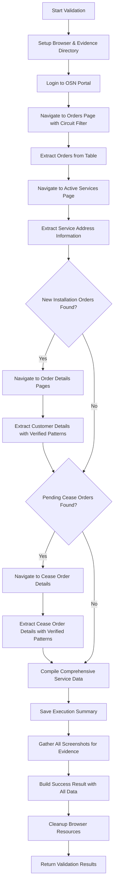
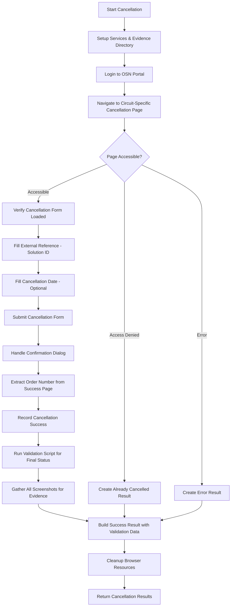

# Openserve (OSN) RPA Automation Documentation

## Overview

This documentation covers the Robotic Process Automation (RPA) system for the Openserve (OSN) portal, consisting of two primary automation scripts that work in sequence:

1. **Validation Script** (`validation.py`) - Service validation and comprehensive data extraction
2. **Cancellation Script** (`cancellation.py`) - Service cancellation processing with strategy pattern implementation

The system uses Selenium WebDriver for browser automation with standard username/password authentication, implementing a sophisticated strategy-based architecture with comprehensive evidence collection, detailed customer data extraction, and robust error handling.

---

## System Architecture

### Architectural Patterns Used

1. **Strategy Pattern** - Multiple strategies for error detection, access denied detection, form interaction, and confirmation handling
2. **Service Layer Pattern** - `BrowserService` and `ScreenshotService` handle cross-cutting concerns
3. **Page Object Pattern** - `LoginPage` and `CancellationPage` encapsulate page-specific functionality
4. **Data Model Pattern** - Pydantic models for structured data handling (`ValidationResult`, `CancellationResult`, `CustomerDetails`, `CeaseOrderDetails`)
5. **Factory Pattern** - `OSNCancellationFactory` for creating automation instances with standard strategies
6. **Robust Data Extraction** - Working regex patterns verified by browser testing for customer and order data
7. **Retry Pattern** - Built-in resilience using tenacity decorators for critical operations

### Key Components

- **Job-based execution** with unique job IDs for tracking and evidence collection
- **Standard authentication** using username/password for OSN portal access
- **Centralized configuration** via Config class for credentials and portal settings
- **Strategy-based interactions** with multiple fallback methods for form handling
- **Comprehensive data extraction** - Orders, customer details, cease order details, and service information
- **Evidence collection system** - Screenshots and structured data for audit trails
- **Solution ID integration** - External reference tracking for cancellation requests
- **Service integration** - Cancellation script integrates with validation for comprehensive status updates

### Code Organization

```python
# Validation Module (validation.py)
class OSNValidationAutomation:              # Main validation functionality
class ValidationRequest:                    # Pydantic input model
class ScreenshotData, OrderData:            # Pydantic data models
class CustomerDetails, CeaseOrderDetails:   # Detailed extraction models
class ServiceInfo, ValidationResult:       # Service and result models
class ValidationStatus, SearchResult:      # Enums

# Cancellation Module (cancellation.py)
class OSNCancellationAutomation:            # Main cancellation functionality
class CancellationRequest:                  # Pydantic input model
class CancellationResult:                   # Pydantic result model
class CancellationStatus:                   # Status enumeration

### Strategy Interfaces and Implementations
class IErrorDetectionStrategy:              # Interface for error detection
class IAccessDeniedDetectionStrategy:       # Interface for access denied detection
class IFormInteractionStrategy:             # Interface for form interactions
class IConfirmationStrategy:                # Interface for confirmation handling

class StandardErrorDetectionStrategy:       # Standard error detection implementation
class OSNAccessDeniedDetectionStrategy:     # OSN-specific access denied detection
class RobustFormInteractionStrategy:        # Multi-method form interaction with fallbacks
class OSNConfirmationStrategy:              # OSN-specific confirmation handling

### Page Objects
class LoginPage:                            # OSN login functionality
class CancellationPage:                     # OSN cancellation functionality

### Shared Services
class BrowserService:                       # Chrome WebDriver management
class ScreenshotService:                    # Evidence collection service

# Factory
class OSNCancellationFactory:               # Factory for creating automation instances

# Configuration (config.py)
class Config:                               # Centralized settings and credentials

# Execution Interface
def execute(parameters):                    # Standard job execution entry point
```

**Note**: The OSN implementation uses a **sophisticated strategy-based approach** where validation and cancellation are separate modules. The cancellation script integrates with validation by importing and calling the validation `execute()` function, ensuring comprehensive data collection including customer details, order information, and service status regardless of cancellation outcome.

---

## Configuration Requirements

### Environment Variables via Config Class

```python
# Required configuration in Config class
OSEMAIL = "automation@company.com"
OSPASSWORD = "secure_password"
OSN_URL = "https://partners.openserve.co.za"
CHROMEDRIVER_PATH = "/path/to/chromedriver"

# Optional settings
HEADLESS = True/False          # Run in headless mode
NO_SANDBOX = True/False        # Chrome no-sandbox mode
DISABLE_DEV_SHM_USAGE = True/False  # Chrome dev-shm usage
START_MAXIMIZED = True/False   # Maximize browser window
```

### Authentication Configuration

OSN uses standard username/password authentication:
- **Username**: Company email address for OSN portal access
- **Password**: Secure password for the automation account
- **No TOTP Required**: Standard web authentication flow
- **Session Management**: Automatic session handling and timeout management

### Chrome Driver Requirements

- **Chrome Browser** - Latest stable version recommended
- **ChromeDriver** - Compatible version with installed Chrome
- **Network Access** - Unrestricted access to Openserve partners portal

### Dependencies

```python
# Core automation
selenium>=4.0.0
tenacity>=8.0.0
pydantic>=1.8.0

# Data processing
pandas>=1.3.0
python-dateutil>=2.8.0

# Utilities
pathlib
base64
json
logging
traceback
re
time
datetime
```

---

## Validation Automation (`validation.py`)

### Purpose
The validation script is the **comprehensive data extraction step** that:
- Searches for circuits in the OSN portal across multiple order types
- Extracts detailed customer information from New Installation orders
- Extracts cease order details from pending cancellation requests  
- Gathers service information from active services pages
- Provides foundation data for business decisions and cancellation processes

### Validation Workflow



### Parameters

| Parameter | Type | Required | Description |
|-----------|------|----------|-------------|
| `job_id` | string | Yes | Unique job identifier |
| `circuit_number` | string | Yes | Circuit number to validate |

### **Workflow Phases:**

#### **Phase 1: Setup and Authentication**
**Class:** `OSNValidationAutomation`
**Method:** `_setup_browser(job_id)`

Browser initialization and evidence directory creation:
* **Chrome Driver Setup**: Uses Config-based settings for Chrome WebDriver configuration
* **Evidence Directory**: Creates job-specific evidence directories under `/evidence/osn_validation/job_id/`
* **Screenshot Service**: Initializes screenshot collection for comprehensive evidence
* **Browser Options**: Headless mode control, window size 1920x1080, security configurations
* **Config Integration**: Uses Config class instead of environment variables directly

#### **Phase 2: OSN Portal Authentication**
**Class:** `LoginPage`
**Method:** `login()`

Standard username/password authentication with retry mechanisms:
* **Portal Navigation**: Navigate to `https://partners.openserve.co.za/login`
* **Credential Entry**: Fill email and password fields using Config.OSEMAIL and Config.OSPASSWORD
* **Form Submission**: Submit login form and wait for successful authentication
* **Login Verification**: Wait for navigation elements (navOrders) to confirm successful login
* **Retry Logic**: Built-in retry with tenacity decorator for authentication failures

#### **Phase 3: Orders Data Extraction**
**Class:** `OSNValidationAutomation`
**Method:** `_navigate_to_orders(circuit_number)`

Navigate to orders page and extract comprehensive order data:
* **Orders Navigation**: Navigate to orders page with circuit number filter
* **Order Processing**: Extract all orders related to the circuit from table data
* **Order Classification**: Categorize orders (New Installation, Cease Active Service, Modification)
* **Status Analysis**: Determine order status and implementation state

**Order Data Structure:**
```python
{
    "orderNumber": "Order reference number",
    "type": "OrderType enum (NEW_INSTALLATION, CEASE_ACTIVE_SERVICE, etc.)",
    "orderStatus": "Current order status",
    "dateImplemented": "Implementation date if completed",
    "is_new_installation": "Boolean - is new installation order",
    "is_cancellation": "Boolean - is cancellation order", 
    "is_implemented_cease": "Boolean - cancellation completed",
    "is_pending_cease": "Boolean - cancellation pending",
    "serviceNumber": "Service/circuit number",
    "externalRef": "External reference",
    "productName": "Product name",
    "createdOn": "Order creation date"
}
```

#### **Phase 4: Service Information Extraction**
**Class:** `OSNValidationAutomation`
**Method:** `_navigate_to_active_services(circuit_number)`

Extract service information from active services page:
* **Active Services Navigation**: Navigate to circuit-specific active services page
* **Service Info Access**: Click Service Information button to access details
* **Address Extraction**: Extract service address from Service end points tab
* **Status Determination**: Assess current service status and availability

#### **Phase 5: Customer Details Extraction**
**Class:** `OSNValidationAutomation`
**Method:** `_extract_customer_details(order_number)`

**Verified extraction patterns** for customer information from New Installation orders:

```python
# Working regex patterns verified by browser testing
customer_patterns = {
    "name": r"Name\s*:\s*([^:]*?)(?=Surname\s*:|$)",
    "surname": r"Surname\s*:\s*([^:]*?)(?=Mobile Number\s*:|$)",
    "mobile_number": r"Mobile Number\s*:\s*([^:]*?)(?=Domicile|Email|Appointment|$)",
    "domicile_type": r"Domicile type\s*:\s*([^:]*?)(?=Address\s*:|$)",
    "address": r"Address\s*:\s*([^:]*?)(?=Appointment|Email|$)",
    "email": r"Email\s*:\s*([\w.-]+@[\w.-]+\.[a-zA-Z]{2,})"
}
```

**Customer Details Data Structure:**
```python
{
    "name": "Customer first name",
    "surname": "Customer surname", 
    "contact_number": "Mobile number (cleaned to digits)",
    "email": "Customer email address",
    "order_number": "Associated order number",
    "domicile_type": "Residential/Business classification",
    "address": "Customer address from order"
}
```

#### **Phase 6: Cease Order Details Extraction**
**Class:** `OSNValidationAutomation`
**Method:** `_extract_cease_order_details(order_number)`

**Verified extraction patterns** for cease order information from pending cancellation requests:

```python
# Working regex patterns for cease order fields
cease_patterns = {
    "placed_by": r"Placed by\s*:\s*([^:]*?)(?=Date Submitted\s*:|$)",
    "date_submitted": r"Date Submitted\s*:\s*([^:]*?)(?=Requested Cease Date\s*:|Product\s*:|$)",
    "requested_cease_date": r"Requested Cease Date\s*:\s*([^:]*?)(?=Product\s*:|$)",
    "product": r"Product\s*:\s*([^:]*?)(?=Service speed\s*:|Order type\s*:|$)",
    "order_type": r"Order type\s*:\s*([^:]*?)(?=Contract term\s*:|Service\s*:|$)",
    "service_circuit_no": r"Service\/Circuit no\.\s*:\s*([^:]*?)(?=External Ref\s*:|$)",
    "external_ref": r"External Ref\.\s*:\s*([^:]*?)(?=Remark\s*:|$)"
}
```

**Cease Order Details Data Structure:**
```python
{
    "order_number": "Cease order number",
    "placed_by": "User who placed the order",
    "date_submitted": "Cancellation request date",
    "requested_cease_date": "Requested termination date", 
    "product": "Product being cancelled",
    "order_type": "Type of order",
    "service_circuit_no": "Service/circuit number",
    "external_ref": "External reference for tracking"
}
```

#### **Phase 7: Data Compilation and Results**
**Class:** `OSNValidationAutomation`
**Method:** `validate_circuit(request)`

Compile comprehensive validation results:
* **Service Status**: Determine if circuit exists and current status
* **Customer Information**: Include extracted customer details from installation orders
* **Order History**: Complete order history with classifications
* **Cease Information**: Details of any pending or completed cancellations
* **Service Information**: Active services data including address
* **Data Quality**: Assess completeness and extraction success

**Main Entry Point:**

```python
def validate_circuit(self, request: ValidationRequest) -> ValidationResult:
```
**Class:** `OSNValidationAutomation`

Orchestrates all validation phases:
* **Phase Coordination**: Execute phases 1-7 in sequence with comprehensive error handling
* **Resource Management**: Proper browser setup and cleanup
* **Results Compilation**: Build `ValidationResult` object with all extracted data
* **Evidence Integration**: Combine screenshots and comprehensive service information

**Returns:**
```python
{
    "status": "success|failure|error",
    "message": "Successfully validated circuit with comprehensive data",
    "details": {
        "found": bool,
        "circuit_number": str,
        "search_result": "found|not_found|error",
        "order_data": [OrderData objects],
        "customer_details": CustomerDetails object,
        "cease_order_details": [CeaseOrderDetails objects],
        "service_info": ServiceInfo object,
        "validation_status": "complete|failed",
        "order_count": int,
        "has_new_installation": bool,
        "has_cancellation": bool,
        "has_pending_cease": bool,
        "has_implemented_cease": bool,
        "service_accessible": bool,
        "customer_data_extracted": bool,
        "cease_order_data_extracted": bool,
        "formatted_customer_data": {...},
        "formatted_cease_order_data": [...]
    },
    "evidence_dir": str,
    "screenshot_data": [ScreenshotData objects],
    "execution_time": float
}
```

### Usage Example

```python
from validation import execute

# Define job parameters
parameters = {
    "job_id": "OSN_VAL_20250123_001",
    "circuit_number": "B530003043" 
}

# Execute validation
result = execute(parameters)

# Check results
if result["status"] == "success":
    details = result["details"]
    if details.get("found"):
        print(f"Found {details['order_count']} orders for circuit")
        if details.get("customer_details"):
            customer = details["customer_details"]
            print(f"Customer: {customer['name']} {customer['surname']}")
            print(f"Contact: {customer['contact_number']}")
        if details.get("cease_order_details"):
            for cease in details["cease_order_details"]:
                print(f"Pending cancellation: {cease['order_number']}")
    else:
        print("Circuit not found in OSN system")
```

---

## Complete Field Extraction Reference

The OSN validation system extracts and returns comprehensive service data across multiple categories. Below is the complete structure showing all fields that can be extracted and returned:

### Full Validation Response Structure

```json
{
    "status": "success",
    "message": "Successfully validated circuit B530003043",
    "details": {
        // Core Search Results
        "found": true,
        "circuit_number": "B530003043",
        "search_result": "found",
        "validation_status": "complete",
        
        // Order Information
        "order_count": 3,
        "has_new_installation": true,
        "has_cancellation": true,
        "has_pending_cease": true,
        "has_implemented_cease": false,
        
        // Service Accessibility
        "service_accessible": true,
        "customer_data_extracted": true,
        "cease_order_data_extracted": true,
        
        // Detailed Order Data
        "order_data": [
            {
                "orderNumber": "123456789",
                "type": "new_installation",
                "orderStatus": "Accepted",
                "dateImplemented": "2024-03-15",
                "is_new_installation": true,
                "is_cancellation": false,
                "is_implemented_cease": false,
                "is_pending_cease": false,
                "serviceNumber": "B530003043",
                "externalRef": "EXT_REF_001",
                "productName": "Fibre Internet 100/100",
                "createdOn": "2024-03-01"
            },
            {
                "orderNumber": "987654321",
                "type": "cease_active_service", 
                "orderStatus": "Pending",
                "dateImplemented": null,
                "is_new_installation": false,
                "is_cancellation": true,
                "is_implemented_cease": false,
                "is_pending_cease": true,
                "serviceNumber": "B530003043",
                "externalRef": "SOL_12345",
                "productName": "Fibre Internet 100/100",
                "createdOn": "2025-01-20"
            }
        ],
        
        // Customer Details (from New Installation orders)
        "customer_details": {
            "name": "John",
            "surname": "Smith",
            "contact_number": "0821234567",
            "email": "john.smith@example.com",
            "order_number": "123456789",
            "domicile_type": "Residential",
            "address": "123 Main Street, Cape Town, 8001"
        },
        
        // Formatted Customer Data (for display)
        "formatted_customer_data": {
            "Name": "John",
            "Surname": "Smith", 
            "Mobile Number": "0821234567",
            "Email": "john.smith@example.com",
            "Domicile type": "Residential",
            "Address": "123 Main Street, Cape Town, 8001"
        },
        
        // Cease Order Details (from pending cancellations)
        "cease_order_details": [
            {
                "order_number": "987654321",
                "placed_by": "automation@company.com",
                "date_submitted": "2025-01-20",
                "requested_cease_date": "2025-02-20",
                "product": "Fibre Internet 100/100",
                "order_type": "Cease Active Service",
                "service_circuit_no": "B530003043",
                "external_ref": "SOL_12345"
            }
        ],
        
        // Formatted Cease Order Data (for display)
        "formatted_cease_order_data": [
            {
                "Order Number": "987654321",
                "Placed by": "automation@company.com",
                "Date Submitted": "2025-01-20",
                "Requested Cease Date": "2025-02-20",
                "Product": "Fibre Internet 100/100",
                "Order type": "Cease Active Service",
                "Service/Circuit no.": "B530003043",
                "External Ref.": "SOL_12345"
            }
        ],
        
        // Service Information
        "service_info": {
            "circuit_number": "B530003043",
            "address": "123 Main Street, Cape Town, 8001",
            "is_active": true
        }
    },
    
    // Evidence and Screenshots
    "evidence_dir": "/path/to/evidence/osn_validation/OSN_VAL_20250123_001",
    "screenshot_data": [
        {
            "name": "initial_state",
            "timestamp": "2025-01-23T14:30:00.123456",
            "data": "iVBORw0KGgoAAAANSUhEUgAA...",
            "path": "/evidence/initial_state_20250123_143000.png"
        },
        {
            "name": "after_login", 
            "timestamp": "2025-01-23T14:30:15.234567",
            "data": "iVBORw0KGgoAAAANSUhEUgBB...",
            "path": "/evidence/after_login_20250123_143015.png"
        },
        {
            "name": "orders_page",
            "timestamp": "2025-01-23T14:30:30.345678", 
            "data": "iVBORw0KGgoAAAANSUhEUgCC...",
            "path": "/evidence/orders_page_20250123_143030.png"
        },
        {
            "name": "customer_details_123456789",
            "timestamp": "2025-01-23T14:30:45.456789",
            "data": "iVBORw0KGgoAAAANSUhEUgDD...", 
            "path": "/evidence/customer_details_123456789_20250123_143045.png"
        },
        {
            "name": "cease_details_987654321",
            "timestamp": "2025-01-23T14:31:00.567890",
            "data": "iVBORw0KGgoAAAANSUhEUgEE...",
            "path": "/evidence/cease_details_987654321_20250123_143100.png"
        }
    ],
    "execution_time": 65.43
}
```

### Not Found Response Structure

When a circuit is not found in the OSN system:

```json
{
    "status": "success",
    "message": "Circuit B999999999 not found in system",
    "details": {
        "found": false,
        "circuit_number": "B999999999",
        "search_result": "not_found",
        "order_count": 0,
        "has_new_installation": false,
        "has_cancellation": false,
        "service_accessible": false,
        "customer_data_extracted": false,
        "cease_order_data_extracted": false,
        "order_data": [],
        "customer_details": {},
        "cease_order_details": [],
        "formatted_customer_data": {},
        "formatted_cease_order_data": [],
        "service_info": null
    },
    "evidence_dir": "/path/to/evidence/osn_validation/OSN_VAL_20250123_001",
    "screenshot_data": [...],
    "execution_time": 25.67
}
```

---

## Cancellation Automation (`cancellation.py`)

### Purpose
The cancellation script is the **sophisticated cancellation processing step** that:
- Performs service cancellation operations in OSN portal using strategy pattern
- Handles external reference (solution_id) integration for tracking
- Manages confirmation dialogs and access denied scenarios
- Extracts order numbers from successful cancellation submissions
- Always integrates with validation for comprehensive status updates

### Cancellation Workflow



### Parameters

| Parameter | Type | Required | Description |
|-----------|------|----------|-------------|
| `job_id` | string | Yes | Unique job identifier for tracking |
| `circuit_number` | string | Yes | Circuit number to be cancelled |
| `solution_id` | string | Yes | Solution ID for external reference tracking |
| `requested_date` | string | No | Cancellation date (DD/MM/YYYY format, defaults to system default) |

### **Strategy-Based Architecture:**

The cancellation system uses multiple strategy interfaces for robust operation:

#### **Error Detection Strategy**
**Interface:** `IErrorDetectionStrategy`
**Implementation:** `StandardErrorDetectionStrategy`

Detect various error conditions on pages:
```python
error_selectors = [
    "//div[contains(@class, 'error')]",
    "//div[contains(@class, 'alert-danger')]",
    "//span[contains(text(), 'Error')]", 
    "//div[contains(text(), 'An error occurred')]",
    "//div[contains(@class, 'p-message-error')]"
]
```

#### **Access Denied Detection Strategy**
**Interface:** `IAccessDeniedDetectionStrategy`
**Implementation:** `OSNAccessDeniedDetectionStrategy`

Detect when service is already cancelled:
```python
# Check URL patterns
if "error/access-denied" in current_url:
    return True

# Check page content
access_denied_selectors = [
    "//h1[contains(text(), 'Access Denied')]",
    "//div[contains(text(), 'You do not have permission')]",
    "//div[contains(text(), 'Access denied')]"
]
```

#### **Form Interaction Strategy**
**Interface:** `IFormInteractionStrategy`
**Implementation:** `RobustFormInteractionStrategy`

Multi-method form interaction with fallback approaches:
```python
# External reference field population
selectors = [
    "//input[@formcontrolname='reference']",
    "input[formcontrolname='reference']",
    "#externalReference",
    "input[name='reference']"
]

# Multiple fill methods
methods = [
    lambda: self._method_clear_and_send_keys(element, value),
    lambda: self._method_javascript_fill(element, value),
    lambda: self._method_select_all_and_type(element, value)
]
```

#### **Confirmation Strategy**
**Interface:** `IConfirmationStrategy`
**Implementation:** `OSNConfirmationStrategy`

Handle OSN-specific confirmation dialogs and extract order numbers:
```python
# Confirmation dialog detection
dialog_selector = "//div[contains(@class, 'p-dialog')]"

# Continue button options
continue_selectors = [
    "//button[@id='ceaseActiveServiceOrderSubmit']",
    "//button[.//span[text()='Continue']]",
    "//button[contains(text(), 'Continue')]",
    "//button[contains(@class, 'p-button-success')]"
]

# Order number extraction patterns
patterns = [
    r'Order number[:\s]+#?(\d+)',
    r'Order #(\d+)',
    r'Reference[:\s]+(\d+)'
]
```

### **Workflow Phases:**

#### **Phase 1: Setup and Authentication**
**Class:** `OSNCancellationAutomation`
**Method:** `_setup_services(job_id)`

Service initialization using strategy pattern:
* **Browser Service**: Initialize Chrome WebDriver with Config-based settings
* **Screenshot Service**: Setup evidence collection in `/evidence/osn_cancellation/job_id/`
* **Strategy Injection**: Initialize all strategy implementations for error detection, form interaction, etc.
* **Evidence Preparation**: Create job-specific directories and initialize screenshot tracking

#### **Phase 2: Direct Cancellation Navigation**
**Class:** `CancellationPage`
**Method:** `navigate_to_cancellation(circuit_number)`

Direct navigation to circuit-specific cancellation page:
* **Direct URL Navigation**: Navigate to `https://partners.openserve.co.za/active-services/{circuit_number}/cease-service`
* **Page Verification**: Confirm "Cease active service" heading is present
* **Access Control Check**: Use access denied strategy to detect already cancelled services
* **Form Readiness**: Verify cancellation form is loaded and accessible

#### **Phase 3: Form Processing with Strategy Pattern**
**Class:** `CancellationPage`
**Method:** `submit_cancellation_request(solution_id, requested_date)`

Multi-step form completion using robust strategies:

**External Reference (Solution ID):**
* **Field Detection**: Multiple selectors for external reference input field
* **Value Population**: Use `RobustFormInteractionStrategy` with fallback methods
* **Required Field**: Solution ID is mandatory for OSN cancellations
* **Verification**: Confirm value is correctly entered

**Cancellation Date (Optional):**
* **Date Processing**: Handle DD/MM/YYYY format conversion
* **Angular Component Support**: Special handling for p-calendar date inputs
* **Character-by-Character Entry**: Some date fields require slow character input
* **Default Behavior**: If no date provided, OSN uses system default

```python
# Date field detection and population
selectors = [
    "p-calendar input",
    "input[formcontrolname='ceaseDate']", 
    ".p-calendar input",
    "input[type='date']"
]

# Special Angular date handling
for char in formatted_date:
    element.send_keys(char)
    time.sleep(0.1)  # Character delay for Angular
element.send_keys(Keys.TAB)  # Commit value
```

#### **Phase 4: Form Submission and Confirmation**
**Class:** `OSNConfirmationStrategy`
**Method:** `handle_confirmation_dialog()`

Handle OSN-specific confirmation workflow:
* **Form Submission**: Submit cancellation form using robust click strategies
* **Confirmation Dialog**: Wait for OSN confirmation dialog to appear
* **Continue Action**: Click Continue button to confirm cancellation
* **Success Verification**: Confirm cancellation was accepted

#### **Phase 5: Order Number Extraction**
**Class:** `OSNConfirmationStrategy`
**Method:** `extract_order_number()`

Extract OSN order number from success page:
* **Success Page Detection**: Wait for "Cease active service request submitted successfully" message
* **Order Number Patterns**: Use regex patterns to extract order reference
* **Reference Capture**: Store extracted order number for tracking
* **Evidence Collection**: Screenshot success page with order number

#### **Phase 6: Integration with Validation**
**Integration:** Direct import and execution of validation module

**Always execute validation** after cancellation attempt:
```python
# Critical integration pattern - always runs
try:
    from automations.osn.validation import execute as validation_execute
    validation_result = validation_execute({
        "job_id": job_id,
        "circuit_number": circuit_number
    })
    
    # COMPLETELY REPLACE details with validation data
    if "details" in validation_result and validation_result["details"]:
        results["details"] = validation_result["details"]
        logger.info("Successfully replaced details with validation data")
        
    # Merge validation screenshots
    if "screenshot_data" in validation_result:
        results["screenshot_data"].extend(validation_result["screenshot_data"])
        
except Exception as validation_error:
    logger.error(f"Validation execution failed: {str(validation_error)}")
    results["details"]["validation_error"] = str(validation_error)
```

#### **Phase 7: Results Compilation**
**Class:** `OSNCancellationAutomation`
**Method:** `cancel_service()`

Build comprehensive results with validation integration:
* **Cancellation Status**: Record successful/failed cancellation submission
* **Order Number**: Include extracted OSN order number
* **Validation Data**: **COMPLETELY REPLACE** details with current validation data
* **Evidence Merging**: Combine cancellation and validation screenshots
* **Execution Metrics**: Include timing and performance data

#### **Phase 8: Error Handling and Factory Pattern**
**Class:** `OSNCancellationFactory`
**Method:** `create_standard_automation()`

Create automation instance with all strategies:
```python
return OSNCancellationAutomation(
    config=config,
    error_detection_strategy=StandardErrorDetectionStrategy(),
    access_denied_strategy=OSNAccessDeniedDetectionStrategy(),
    form_interaction_strategy=RobustFormInteractionStrategy(),
    confirmation_strategy=OSNConfirmationStrategy()
)
```

**Main Entry Point:**

```python
def cancel_service(self, request: CancellationRequest) -> CancellationResult:
```
**Class:** `OSNCancellationAutomation`

Orchestrates all cancellation phases using strategy pattern:
* **Strategy Coordination**: Use injected strategies for all interactions
* **Evidence Management**: Comprehensive screenshot collection throughout process
* **Always Execute Validation**: Validation runs regardless of cancellation success/failure
* **Results Compilation**: Build final result with integrated validation data

**Returns:**
```python
{
    "status": "success|failure|error",
    "message": "Successfully submitted cancellation for circuit B530003043",
    "details": {
        # Core cancellation fields
        "found": bool,
        "cancellation_submitted": bool,
        "cancellation_captured_id": str,  # OSN order number
        "service_found": bool,
        "is_active": bool,
        
        # Validation data (replaces cancellation details)
        "customer_details": CustomerDetails,
        "cease_order_details": [CeaseOrderDetails],
        "order_data": [OrderData],
        "service_info": ServiceInfo,
        
        # Cancellation tracking
        "cancellation_details": {
            "order_number": str,
            "external_reference": str,
            "requested_date": str,
            "submission_date": datetime,
            "status": "submitted",
            "confirmation_received": bool
        }
    },
    "evidence_dir": str,
    "screenshot_data": [ScreenshotData objects]
}
```

### Usage Example

```python
from cancellation import execute

# Define cancellation parameters
parameters = {
    "job_id": "OSN_CXL_20250123_001",
    "circuit_number": "B530003043",
    "solution_id": "SOL_12345",
    "requested_date": "31/01/2025"  # Optional
}

# Execute cancellation
result = execute(parameters)

# Check results
if result["status"] == "success":
    details = result["details"]
    if details["cancellation_submitted"]:
        order_id = details.get("cancellation_captured_id")
        print(f"Cancellation submitted. OSN Order: {order_id}")
    # Details contains current service status from validation
    if details.get("customer_details"):
        customer = details["customer_details"]
        print(f"Customer: {customer['name']} {customer['surname']}")
```

---

## Complete Cancellation Field Reference

The OSN cancellation system performs cancellation operations using a sophisticated strategy pattern and then **automatically executes validation** to provide comprehensive, up-to-date service status including customer details and order information.

### Full Cancellation Response Structure

```json
{
    "status": "success",
    "message": "Successfully submitted cancellation for circuit B530003043",
    "details": {
        // Cancellation-Specific Fields
        "cancellation_submitted": true,
        "cancellation_captured_id": "987654321",  // OSN order number
        "service_found": true,
        "is_active": true,
        "execution_time": 87.65,
        
        // Cancellation Details
        "cancellation_details": {
            "order_number": "987654321",
            "external_reference": "SOL_12345",
            "requested_date": "2025-01-31",
            "submission_date": "2025-01-23T14:31:45.123456",
            "status": "submitted",
            "confirmation_received": true
        },
        
        // Complete Validation Data (post-cancellation)
        "found": true,
        "circuit_number": "B530003043",
        "search_result": "found",
        "validation_status": "complete",
        "order_count": 4,  // Now includes new cancellation order
        "has_new_installation": true,
        "has_cancellation": true,
        "has_pending_cease": true,  // Now true with new cancellation
        "has_implemented_cease": false,
        "service_accessible": true,
        "customer_data_extracted": true,
        "cease_order_data_extracted": true,
        
        // Updated Order Data (includes new cancellation)
        "order_data": [
            {
                "orderNumber": "123456789",
                "type": "new_installation",
                "orderStatus": "Accepted",
                "is_new_installation": true,
                "is_cancellation": false
            },
            {
                "orderNumber": "987654321",  // New cancellation order
                "type": "cease_active_service",
                "orderStatus": "Pending",
                "is_new_installation": false,
                "is_cancellation": true,
                "is_pending_cease": true,
                "externalRef": "SOL_12345"  // Matches our solution_id
            }
        ],
        
        // Customer Details (from validation)
        "customer_details": {
            "name": "John",
            "surname": "Smith", 
            "contact_number": "0821234567",
            "email": "john.smith@example.com",
            "order_number": "123456789",
            "domicile_type": "Residential",
            "address": "123 Main Street, Cape Town, 8001"
        },
        
        // Formatted Customer Data
        "formatted_customer_data": {
            "Name": "John",
            "Surname": "Smith",
            "Mobile Number": "0821234567",
            "Email": "john.smith@example.com",
            "Domicile type": "Residential", 
            "Address": "123 Main Street, Cape Town, 8001"
        },
        
        // Updated Cease Order Details (includes new cancellation)
        "cease_order_details": [
            {
                "order_number": "987654321",
                "placed_by": "automation@company.com",
                "date_submitted": "2025-01-23",
                "requested_cease_date": "2025-01-31",
                "product": "Fibre Internet 100/100",
                "order_type": "Cease Active Service",
                "service_circuit_no": "B530003043",
                "external_ref": "SOL_12345"  // Our solution_id
            }
        ],
        
        // Formatted Cease Order Data
        "formatted_cease_order_data": [
            {
                "Order Number": "987654321",
                "Placed by": "automation@company.com", 
                "Date Submitted": "2025-01-23",
                "Requested Cease Date": "2025-01-31",
                "Product": "Fibre Internet 100/100",
                "Order type": "Cease Active Service",
                "Service/Circuit no.": "B530003043",
                "External Ref.": "SOL_12345"
            }
        ],
        
        // Service Information
        "service_info": {
            "circuit_number": "B530003043",
            "address": "123 Main Street, Cape Town, 8001",
            "is_active": true  // Still active until cancellation processed
        }
    },
    
    // Evidence from Both Cancellation and Validation
    "evidence_dir": "/path/to/evidence/osn_cancellation/OSN_CXL_20250123_001",
    "screenshot_data": [
        // Cancellation Process Screenshots
        {
            "name": "initial_state",
            "timestamp": "2025-01-23T14:30:00.123456",
            "data": "iVBORw0KGgoAAAANSUhEUgAA...",
            "path": "/evidence/initial_state_20250123_143000.png"
        },
        {
            "name": "cancellation_page_loaded",
            "timestamp": "2025-01-23T14:30:30.345678",
            "data": "iVBORw0KGgoAAAANSUhEUgCC...",
            "path": "/evidence/cancellation_page_loaded_20250123_143030.png"
        },
        {
            "name": "cancellation_success",
            "timestamp": "2025-01-23T14:31:00.456789",
            "data": "iVBORw0KGgoAAAANSUhEUgDD...",
            "path": "/evidence/cancellation_success_20250123_143100.png"
        },
        // Validation Process Screenshots (merged)
        {
            "name": "orders_page",
            "timestamp": "2025-01-23T14:31:30.567890",
            "data": "iVBORw0KGgoAAAANSUhEUgEE...",
            "path": "/evidence/orders_page_20250123_143130.png"
        },
        {
            "name": "customer_details_123456789",
            "timestamp": "2025-01-23T14:32:00.123456",
            "data": "iVBORw0KGgoAAAANSUhEUgFF...",
            "path": "/evidence/customer_details_123456789_20250123_143200.png"
        },
        {
            "name": "cease_details_987654321", 
            "timestamp": "2025-01-23T14:32:30.234567",
            "data": "iVBORw0KGgoAAAANSUhEUgGG...",
            "path": "/evidence/cease_details_987654321_20250123_143230.png"
        }
    ]
}
```

### Service Already Cancelled Response

When attempting to cancel a service that is already cancelled (access denied):

```json
{
    "status": "already_cancelled",
    "message": "Service B530003043 appears to be already cancelled", 
    "details": {
        // Cancellation-Specific Fields
        "cancellation_submitted": false,
        "cancellation_captured_id": null,
        "service_found": true,
        "is_active": false,
        
        // Access denied detected
        "result_type": "already_deactivated",
        "cancellation_status": "already_cancelled",
        
        // Validation data shows current state (if accessible)
        "found": false,  // May not be accessible if fully deactivated
        "order_data": [],
        "customer_details": {},
        "cease_order_details": []
    }
}
```

### Service Not Found Response

When attempting to cancel a non-existent service:

```json
{
    "status": "success",
    "message": "Service B999999999 not found in system",
    "details": {
        // Cancellation-Specific Fields
        "cancellation_submitted": false,
        "cancellation_captured_id": null,
        "service_found": false,
        "is_active": false,
        
        // Validation data shows not found
        "found": false,
        "circuit_number": "B999999999",
        "order_count": 0,
        "customer_details": {},
        "cease_order_details": [],
        "service_info": null
    }
}
```

### Cancellation Field Categories and Descriptions

#### **Cancellation-Specific Fields** (Added by cancellation process)
- `cancellation_submitted` - Boolean: whether cancellation form was successfully submitted
- `cancellation_captured_id` - String: OSN-generated order number for the cancellation (e.g., "987654321")
- `service_found` - Boolean: whether service was found during cancellation attempt
- `is_active` - Boolean: whether service was active when cancellation was attempted
- `execution_time` - Float: total time for cancellation + validation process

#### **Cancellation Details** (OSN-specific tracking)
- `cancellation_details.order_number` - OSN order number for the cancellation
- `cancellation_details.external_reference` - Provided solution_id for tracking
- `cancellation_details.requested_date` - Requested cancellation date
- `cancellation_details.submission_date` - When cancellation was submitted
- `cancellation_details.status` - "submitted" for successful submissions
- `cancellation_details.confirmation_received` - Whether OSN order number was extracted

#### **Enhanced Validation Fields** (Updated post-cancellation)
All validation fields are included with these key updates after successful cancellation:
- `has_pending_cease` - Likely `true` after cancellation submission
- `has_cancellation` - Likely `true` after cancellation submission
- `order_count` - Increased by 1 to include new cancellation order
- `cease_order_details` - Now includes details of submitted cancellation
- `order_data` - Includes new cease active service order with external reference matching solution_id

#### **Data Integration Pattern**
The OSN cancellation system follows this critical pattern:
1. **Perform Cancellation** - Submit cancellation with solution_id as external reference
2. **Extract OSN Order Number** - Capture order number from success page
3. **Execute Validation** - Run complete validation to get updated system state including new cancellation order
4. **Replace Details** - **COMPLETELY REPLACE** cancellation details with validation data
5. **Preserve Cancellation Fields** - Keep cancellation-specific tracking fields
6. **Merge Evidence** - Combine screenshots from both processes

---

## Evidence Collection System

Both scripts implement comprehensive evidence collection using the service layer pattern:

### Screenshot Management
**Class:** `ScreenshotService`
- **Automatic screenshots** at key workflow points with descriptive names
- **Base64 encoding** for secure transmission and storage
- **Timestamped filenames** with job ID prefixes for audit trails
- **Error state capture** for debugging failed operations
- **Evidence organization** in job-specific directory structures

### Data Files
Evidence files are stored in job-specific directories:

```
/evidence/
├── osn_validation/
│   └── OSN_VAL_20250123_001/
│       ├── initial_state_20250123_143000.png
│       ├── after_login_20250123_143015.png
│       ├── orders_page_20250123_143030.png
│       ├── customer_details_123456789_20250123_143045.png
│       ├── cease_details_987654321_20250123_143100.png
│       └── execution_summary.txt
├── osn_cancellation/
│   └── OSN_CXL_20250123_002/
│       ├── initial_state_20250123_143200.png
│       ├── after_login_20250123_143215.png
│       ├── cancellation_page_loaded_20250123_143230.png
│       ├── cancellation_success_20250123_143245.png
│       ├── validation_complete_20250123_143300.png
│       └── execution_summary.txt
```

### Evidence Data Structure
```python
{
    "evidence_dir": "/path/to/evidence/osn_cancellation/OSN_CXL_20250123_002",
    "screenshot_data": [
        {
            "name": "cancellation_success",
            "timestamp": "2025-01-23T14:32:45.123456",
            "data": "iVBORw0KGgoAAAANSUhEUgAA...",  # Base64 encoded
            "path": "/evidence/cancellation_success_20250123_143245.png"
        }
    ]
}
```

### Execution Summary Files
Both scripts generate detailed execution summaries:

```
===== OSN Validation Execution Summary =====
Job ID: OSN_VAL_20250123_001
Circuit Number: B530003043
Execution Time: 2025-01-23T14:30:22.123456
Status: success
Found: true

=== Orders (3) ===
Order 1: 123456789
  Type: new_installation
  Status: Accepted
Order 2: 987654321
  Type: cease_active_service
  Status: Pending
  Is Pending Cease: true

=== Customer Details ===
Name: John
Surname: Smith
Mobile: 0821234567
Email: john.smith@example.com
Address: 123 Main Street, Cape Town, 8001

=== Cease Order Details ===
Order: 987654321
Requested Cease Date: 2025-01-31
External Ref: SOL_12345

=== Screenshots ===
Total screenshots: 5
- initial_state at 2025-01-23T14:30:00.123456
- after_login at 2025-01-23T14:30:15.234567
- orders_page at 2025-01-23T14:30:30.345678
- customer_details_123456789 at 2025-01-23T14:30:45.456789
- cease_details_987654321 at 2025-01-23T14:31:00.567890
```

---

## Error Handling & Retry Logic

### Retry Decorators
Both scripts use `tenacity` for robust retry mechanisms:

```python
@retry(
    stop=stop_after_attempt(3),
    wait=wait_fixed(3),
    retry=retry_if_exception_type((TimeoutException, WebDriverException)),
    before_sleep=before_sleep_log(logger, logging.WARNING)
)
def login(self):
    # OSN login implementation with automatic retry
```

### Error Categories
1. **Authentication Errors** - Invalid credentials, session timeouts, portal unavailability
2. **Portal Access Errors** - Service unavailable, network connectivity, page load failures
3. **Element Interaction Errors** - Dynamic content loading, element not found, click intercepted
4. **Data Extraction Errors** - Missing fields, portal layout changes, regex pattern failures
5. **Form Submission Errors** - Validation failures, server-side errors, confirmation dialog issues
6. **Service State Errors** - Service not found, already cancelled, access denied scenarios
7. **Strategy Execution Errors** - Strategy pattern failures with fallback mechanisms

### OSN-Specific Error Handling
- **Access Denied Detection**: Specialized strategy for detecting already cancelled services
- **Form Interaction Resilience**: Multiple fallback methods for form field interactions
- **Date Input Handling**: Special handling for Angular p-calendar components
- **Confirmation Dialog Management**: Robust dialog detection and interaction
- **Order Number Extraction**: Multiple patterns for capturing OSN order references

### Strategy-Based Error Recovery
- **Error Detection Strategy**: Configurable error detection across different page types
- **Form Interaction Strategy**: Multiple methods with automatic fallback
- **Confirmation Strategy**: Robust dialog handling with multiple selector approaches
- **Access Denied Strategy**: Specialized detection for service accessibility

### Graceful Degradation
- Scripts continue processing even if non-critical steps fail
- **Always attempt validation** at the end regardless of cancellation outcome
- Comprehensive error logging with stack traces and job context
- Evidence collection continues regardless of operation success/failure
- Multiple fallback strategies for every critical interaction

---

## Status Determination Logic

### Service Status Types

| Status Type | Description | OSN Indicators |
|------------|-------------|----------------|
| `found` | Service exists in OSN system | Circuit appears in orders or active services |
| `is_active` | Service is currently active | Service accessible via active services page |
| `has_pending_cancellation` | Service has pending cancellation | Cease orders with pending status |
| `has_cancellation` | Service has any cancellation orders | Any cease active service orders exist |
| `has_new_installation` | Service has installation orders | New installation orders exist |
| `service_accessible` | Service details are accessible | Can access service information pages |
| `customer_data_extracted` | Customer information available | Successfully extracted from installation orders |
| `cease_order_data_extracted` | Cancellation details available | Successfully extracted from cease orders |

### Strategy Pattern Decision Logic

#### **Access Denied Strategy**
**Critical for determining service state:**
- Detects when service cancellation page returns access denied
- Indicates service is already fully cancelled or deactivated
- Uses URL pattern matching and page content analysis
- Returns `already_cancelled` status when triggered

#### **Error Detection Strategy**
Identifies various error conditions:
- Portal-level errors during navigation
- Form submission errors
- Server-side validation failures
- Uses multiple selector patterns for comprehensive coverage

#### **Form Interaction Strategy**
Ensures reliable form processing:
- Multiple methods for field interaction (clear/send_keys, JavaScript, select_all)
- Verification of input values after entry
- Special handling for Angular components
- Fallback strategies when primary methods fail

### Key Decision Flags

#### `cancellation_submitted`
**Primary success indicator:**
- Set when cancellation form is successfully submitted
- Confirmed by successful confirmation dialog handling
- Verified by order number extraction from success page

#### `has_pending_cease`
**Indicates cancellation in progress:**
- Determined by presence of cease orders with pending status
- Updated after successful cancellation submission
- Used by orchestrator to determine current service state

#### `service_found`
**Service existence verification:**
- `True`: Service exists in orders or active services
- `False`: No trace of service in OSN system
- Combined with other flags to determine processing approach

### Validation Integration Logic

The validation system provides comprehensive status by analyzing:
- **Order History**: All orders associated with circuit
- **Customer Details**: Information from installation orders
- **Cease Orders**: Details from cancellation requests
- **Service Information**: Current service status and accessibility

---

## Integration Patterns

### Job Queue System
Both scripts are designed for integration with job queue systems:

```python
# Execute function interface
def execute(parameters):
    job_id = parameters.get("job_id")
    circuit_number = parameters.get("circuit_number")
    solution_id = parameters.get("solution_id")  # For cancellation
    requested_date = parameters.get("requested_date")  # Optional
    # ... process job
    return results
```

### Validation-Cancellation Integration
Cancellation script integrates with validation for comprehensive data:

```python
# In cancellation.py execute function - ALWAYS runs
try:
    from automations.osn.validation import execute as validation_execute
    validation_result = validation_execute({
        "job_id": job_id,
        "circuit_number": circuit_number
    })
    
    # COMPLETELY REPLACE details with validation data
    if "details" in validation_result and validation_result["details"]:
        results["details"] = validation_result["details"]
        logger.info("Successfully replaced details with validation data")
        
    # Merge validation screenshots
    if "screenshot_data" in validation_result and validation_result["screenshot_data"]:
        existing_screenshots = results.get("screenshot_data", [])
        validation_screenshots = validation_result["screenshot_data"]
        results["screenshot_data"] = existing_screenshots + validation_screenshots
        
except Exception as validation_error:
    logger.error(f"Validation execution failed: {str(validation_error)}")
    results["details"]["validation_error"] = str(validation_error)
```

### Strategy Factory Integration
Use factory pattern for consistent strategy injection:

```python
# Create automation with standard strategies
automation = OSNCancellationFactory.create_standard_automation(Config)

# Custom strategy injection for specialized scenarios
automation = OSNCancellationAutomation(
    config=Config,
    error_detection_strategy=CustomErrorDetectionStrategy(),
    access_denied_strategy=OSNAccessDeniedDetectionStrategy(),
    form_interaction_strategy=RobustFormInteractionStrategy(),
    confirmation_strategy=OSNConfirmationStrategy()
)
```

---

## Security & Compliance

### Data Protection

- **Credential Security** - Environment-based credential storage via Config class
- **Evidence Encryption** - Base64 encoded screenshot data for secure transmission
- **PII Handling** - Secure processing of customer information from OSN portal
- **Audit Trails** - Complete operation logging with job-based evidence collection
- **External Reference Tracking** - Solution ID integration for compliance tracking

### Best Practices

- **Access Control** - Restricted access to OSN automation credentials
- **Evidence Retention** - Configurable retention periods for screenshots in job directories
- **Error Logging** - Sanitized logs without sensitive customer information
- **External Reference Integration** - Mandatory solution_id for all cancellations ensures tracking
- **Compliance Monitoring** - Regular audits of automation activities through evidence trails

### Data Handling

- **Customer Data Extraction** - Comprehensive customer details from installation orders
- **Order Tracking** - Complete order history with external reference mapping
- **Cease Order Details** - Detailed cancellation information with dates and references
- **Evidence Chain** - Unbroken evidence trail from cancellation through validation

---

## Troubleshooting

### Common Issues

#### Authentication Failures
- **Symptoms**: Login timeouts or credential rejection
- **Solutions**: Verify Config.OSEMAIL and Config.OSPASSWORD, check portal availability
- **OSN Specific**: Portal may have session limits or IP restrictions

#### Access Denied on Cancellation
```
Status: already_cancelled
Message: Service appears to be already cancelled
Symptoms: Access denied when navigating to cancellation page
Solution: Service is already deactivated - no action needed
Debug: Check access denied screenshot evidence
```

#### Form Interaction Failures
```
Error: Failed to fill external reference field
Symptoms: Cannot locate or populate solution_id field
Solution: Check form selectors, verify portal structure changes
Debug: Review form interaction strategy fallback methods
```

#### Confirmation Dialog Issues
```
Error: Failed to handle confirmation dialog
Symptoms: Cancellation form submitted but confirmation not processed
Solution: Check confirmation dialog selectors, verify Continue button availability
Debug: Review confirmation strategy implementation
```

#### Customer Data Extraction Failed
```
Error: No customer details found
Symptoms: customer_data_extracted = false despite order existence
Solution: Check if installation order exists, verify regex patterns
Debug: Review customer details extraction patterns and raw text
```

#### Cease Order Data Missing
```
Error: No cease order details extracted
Symptoms: cease_order_data_extracted = false despite pending cancellation
Solution: Verify cease order navigation, check extraction patterns
Debug: Review cease order detail page structure and patterns
```

#### Order Number Extraction Failed
```
Error: Could not extract order number from success page
Symptoms: cancellation_captured_id = null despite successful submission
Solution: Check success page patterns, verify order number format
Debug: Review success page screenshot for order number location
```

### Debug Mode
Enable debug mode by setting:
```python
Config.HEADLESS = False  # Show browser for debugging
logging.basicConfig(level=logging.DEBUG)
```

### Evidence Review
Always review evidence files after job completion:
- Check screenshots for unexpected portal states
- Verify customer data extraction accuracy from raw text
- Confirm cancellation submission through order number
- Review validation integration results including cease order details

---

## Best Practices

### Job Execution
1. **Always run validation first** to understand current service state and customer details
2. **Only run cancellation** if validation indicates service exists and is accessible
3. **Check validation results** integrated into cancellation response for comprehensive status
4. **Use solution_id** for external reference tracking in all cancellations

### Error Handling
1. **Capture screenshots** on errors for debugging failed operations
2. **Log comprehensive error details** including strategy execution failures
3. **Continue processing** where possible with robust fallback strategies
4. **Handle access denied scenarios** gracefully for already cancelled services

### Evidence Collection
1. **Collect evidence** regardless of success/failure for audit compliance
2. **Use descriptive screenshot names** including order numbers for easy identification
3. **Store structured data** including customer details and cease order information
4. **Maintain job-based organization** for easy evidence retrieval

### Strategy Implementation
1. **Use factory pattern** for consistent strategy injection
2. **Implement multiple fallback methods** for critical interactions
3. **Handle Angular components** with special timing considerations
4. **Test regex patterns** thoroughly for data extraction reliability

### Browser Management
1. **Use headless mode** for production environments via Config.HEADLESS
2. **Configure appropriate timeouts** for OSN's page loading characteristics
3. **Clean up resources** using BrowserService cleanup in finally blocks
4. **Handle dynamic content** with robust wait strategies

---

## OSN-Specific Considerations

### Portal Characteristics
- **Standard Authentication**: Username/password authentication without TOTP
- **Angular-Based UI**: JavaScript-heavy portal requiring robust wait strategies
- **Direct Navigation**: Circuit-specific cancellation URLs for efficient processing
- **Comprehensive Data**: Rich customer and order information available for extraction

### Search and Navigation Behavior
- **Order-Centric Search**: Search functionality focuses on order history
- **Circuit-Specific URLs**: Direct navigation to cancellation pages using circuit numbers
- **Service Details**: Detailed customer information in installation order pages
- **Cease Order Details**: Comprehensive cancellation information in cease order pages

### Data Extraction Patterns
- **Verified Regex Patterns**: Thoroughly tested patterns for customer and cease order data
- **Multi-Source Integration**: Data from orders, customer details, cease orders, and service info
- **Structured Processing**: Clean organization of raw data into structured objects
- **Completeness Assessment**: Quality scoring for data extraction success

### UI Interactions
- **Strategy-Based Interactions**: Multiple strategies for form handling and error detection
- **Angular Component Support**: Special handling for p-calendar and other Angular components
- **Confirmation Workflow**: Robust dialog handling with multiple fallback methods
- **External Reference Integration**: Solution ID tracking throughout cancellation process

### Business Logic Integration
- **Solution ID Tracking**: Mandatory external reference for all cancellation requests
- **Order Number Extraction**: OSN order number capture for tracking and compliance
- **Customer Data Preservation**: Comprehensive customer information retention
- **Status Integration**: Real-time status updates through validation integration

---

## Support & Maintenance

For technical support, configuration assistance, or reporting issues with the OSN automation scripts, please refer to your internal RPA team documentation or contact your system administrator.

The OSN automation system provides robust service validation and cancellation workflows with:

- **Strategy-based architecture** for flexible and maintainable automation
- **Comprehensive data extraction** including customer details and order information
- **Verified extraction patterns** tested through browser automation
- **Reliable cancellation processing** with external reference tracking
- **Detailed status reporting** with validation integration for current service state
- **Complete evidence collection** for audit trails and debugging support
- **OSN-specific optimizations** for portal characteristics and business requirements

The system's strategy pattern implementation, retry mechanisms, error handling, and evidence collection make it suitable for production use in enterprise environments with full integration between validation and cancellation processes.

---

**Last Updated**: January 23, 2025  
**Version**: 1.0 (OSN Implementation)