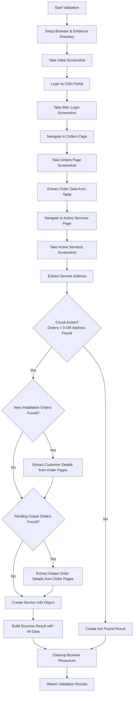
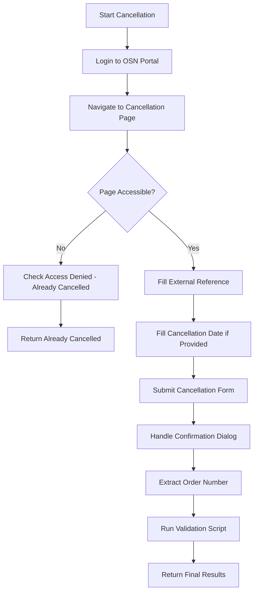

# Openserve (OSN) RPA Automation Documentation

## Overview

This documentation covers the Robotic Process Automation (RPA) system for the Openserve Network (OSN) portal, consisting of two primary automation scripts that work in sequence:

1. **Validation Script** (`validation.py`) - Service validation and status checking
2. **Cancellation Script** (`cancellation.py`) - Service cancellation processing

The system uses Selenium WebDriver for browser automation and implements a job-based architecture with comprehensive evidence collection and error handling.

---

## System Architecture

### Architectural Patterns Used

1. **Strategy Pattern** - Multiple strategies for form interaction, error detection, and confirmation handling
2. **Factory Pattern** - `OSNCancellationFactory` for creating automation instances with different strategies
3. **Page Object Model** - `LoginPage` and `CancellationPage` classes encapsulate page-specific functionality
4. **Service Layer Pattern** - `BrowserService` and `ScreenshotService` handle cross-cutting concerns
5. **Monolithic Class Design** - `OSNValidationAutomation` handles all validation operations in a single comprehensive class
6. **Retry Pattern** - Built-in resilience with configurable retry logic using tenacity decorators
7. **Data Model Pattern** - Pydantic models (`ValidationResult`, `CancellationResult`) for structured data handling

### Key Components

- **Job-based execution** with unique job IDs for tracking and evidence collection
- **Centralized configuration** via Config class for credentials and settings  
- **Strategy-based automation classes** - Pluggable strategies for different interaction methods
- **Service layer abstraction** - Browser and screenshot services for resource management
- **Page object encapsulation** - LoginPage and CancellationPage handle portal interactions
- **Evidence collection system** - Screenshots and data files for audit trails
- **Retry mechanisms** with exponential backoff using tenacity
- **Comprehensive error handling** with graceful degradation
- **Status determination logic** with granular service state analysis

### Code Organization

```python
# Validation Module (validation.py)
class OSNValidationAutomation:           # Monolithic validation functionality
class ValidationRequest:                 # Pydantic input model
class OrderData, CustomerDetails:        # Pydantic data models
class CeaseOrderDetails, ServiceInfo:    # Pydantic data models
class ValidationResult:                  # Pydantic result model
class ValidationStatus, SearchResult:    # Enums

# Cancellation Module (cancellation.py)  
class OSNCancellationAutomation:         # Cancellation orchestration
class LoginPage, CancellationPage:       # Page Object Model classes
class BrowserService, ScreenshotService: # Service Layer classes

# Strategy Interfaces
class IFormInteractionStrategy:          # Form interaction strategy interface
class IConfirmationStrategy:             # Confirmation handling strategy interface
class IErrorDetectionStrategy:           # Error detection strategy interface
class IAccessDeniedDetectionStrategy:    # Access denied detection strategy interface

# Strategy Implementations
class RobustFormInteractionStrategy:     # Multi-method form interaction
class OSNConfirmationStrategy:           # OSN-specific confirmation handling
class StandardErrorDetectionStrategy:   # Standard error detection
class OSNAccessDeniedDetectionStrategy: # OSN access denied detection

# Factory and Models
class OSNCancellationFactory:            # Factory for creating automation instances
class CancellationRequest, CancellationResult: # Pydantic models
class CancellationStatus, CancellationResultType: # Enums

# Configuration (config.py)
class Config:                            # Centralized settings and paths

# Execution Interface  
def execute(parameters):                 # Standard job execution entry point
```

**Note**: The OSN implementation uses a **modular approach** where validation and cancellation are separate, independent modules. The cancellation script integrates with validation by importing and calling the validation `execute()` function, rather than using inheritance. This provides clean separation of concerns while enabling comprehensive data collection.

---

## Configuration Requirements

### Environment Variables

```python
# Required configuration
OSEMAIL = "automation@company.com"
OSPASSWORD = "secure_password"
CHROMEDRIVER_PATH = "/path/to/chromedriver"
EVIDENCE_DIR = "/path/to/evidence/storage"

# Optional settings
HEADLESS = "true"  # Run in headless mode
OSN_PAGE_LOAD_TIMEOUT = 15  # Page load timeout
SELENIUM_IMPLICIT_WAIT = 3  # Element wait timeout
```

### Chrome Driver Requirements

- **Chrome Browser** - Latest stable version recommended
- **ChromeDriver** - Compatible version with installed Chrome
- **System Resources** - Minimum 2GB RAM for browser operations
- **Network Access** - Unrestricted access to https://partners.openserve.co.za

### Dependencies

```python
# Core automation
selenium>=4.0.0
tenacity>=8.0.0
pydantic>=1.8.0

# Data processing  
pandas>=1.3.0
python-dateutil>=2.8.0

# Utilities
pathlib
base64
json
logging
traceback
```

---

## Validation Automation (`validation.py`)

### Purpose
The validation script is the **first step** in the workflow that:
- Searches for services in the OSN portal
- Extracts customer and service data from orders and active services
- Determines current service status
- Provides foundation data for cancellation decisions

### Validation Workflow



### Parameters

| Parameter | Type | Required | Description |
|-----------|------|----------|-------------|
| `job_id` | string | Yes | Unique job identifier |
| `circuit_number` | string | Yes | Circuit number to validate (B-prefix format) |

### **Workflow Phases:**

#### **Phase 1: Setup**
**Class:** `OSNValidationAutomation`
**Method:** `_setup_browser(job_id)`

Browser initialization and evidence directory creation:
* **Chrome Driver Setup**: Uses `BrowserService` for Chrome WebDriver configuration
* **Evidence Directory**: Creates job-specific evidence directories under `/evidence/osn_validation/job_id/`
* **Screenshot Service**: Initializes `ScreenshotService` for comprehensive evidence collection
* **Browser Options**: Headless mode, window size 1920x1080, security configurations

#### **Phase 2: Authentication**
**Class:** `OSNValidationAutomation`
**Method:** `_login()`

Login to OSN portal with retry mechanisms:
* **Portal Navigation**: Navigate to `https://partners.openserve.co.za/login`
* **Credential Entry**: Fill email and password fields using Config.OSEMAIL and Config.OSPASSWORD
* **Login Verification**: Wait for `navOrders` element to confirm successful authentication
* **Evidence Capture**: Screenshots before and after login process
* **Retry Logic**: Built-in retry with tenacity decorator for authentication failures

#### **Phase 3: Orders Discovery** 
**Class:** `OSNValidationAutomation`
**Method:** `_navigate_to_orders(circuit_number)`, `_extract_orders()`

Search and extract order data from orders page:
* **Orders Navigation**: Navigate to `https://partners.openserve.co.za/orders?tabIndex=2&isps=628&serviceNumber={circuit_number}`
* **Table Processing**: Extract data from orders table using xpath `//table//tbody//tr[td[normalize-space(text())]]`
* **Order Classification**: Categorize orders as NEW_INSTALLATION, CEASE_ACTIVE_SERVICE, or MODIFICATION
* **Status Determination**: Set flags for `is_new_installation`, `is_cancellation`, `is_implemented_cease`, `is_pending_cease`
* **Data Extraction**: Extract orderNumber, type, externalRef, serviceNumber, productName, createdOn, dateImplemented, orderStatus

```python
# Extracted Order Fields
{
    "orderNumber": "Order reference number",
    "type": "OrderType enum (NEW_INSTALLATION, CEASE_ACTIVE_SERVICE, etc)",
    "orderStatus": "Current order status",
    "dateImplemented": "Implementation date if completed",
    "serviceNumber": "Circuit number",
    "externalRef": "External reference ID",
    "productName": "Service product name",
    "createdOn": "Order creation date",
    "is_new_installation": "Boolean flag for new installations",
    "is_cancellation": "Boolean flag for cancellation orders",
    "is_implemented_cease": "Boolean flag for completed cancellations",
    "is_pending_cease": "Boolean flag for pending cancellations"
}
```

#### **Phase 4: Active Services Data**
**Class:** `OSNValidationAutomation`
**Method:** `_navigate_to_active_services(circuit_number)`, `_extract_address()`

Extract service information from active services page:
* **Active Services Navigation**: Navigate to `https://partners.openserve.co.za/active-services/{circuit_number}`
* **Service Information Access**: Click Service Information button using JavaScript DOM manipulation
* **Tab Navigation**: Access "Service end points" tab for address information
* **Address Extraction**: Extract A-Side Site Address using JavaScript text parsing
* **Service Status**: Determine if service is currently active based on accessibility

#### **Phase 5: Customer Details Extraction**
**Class:** `OSNValidationAutomation`
**Method:** `_extract_customer_details(order_number)`

Extract customer information from new installation order details:
* **Order Details Navigation**: Navigate to `https://partners.openserve.co.za/orders/orders-complete/{order_number}/New%20Installation`
* **Customer Section Parsing**: JavaScript-based text extraction from "Customer Details" section
* **Pattern Matching**: Verified regex patterns for name, surname, mobile number, domicile type, address, email
* **Data Cleaning**: Whitespace normalization and mobile number digit extraction
* **Validation**: Ensure meaningful data extraction before proceeding

```python
# Extracted Customer Fields
{
    "name": "Customer first name",
    "surname": "Customer surname", 
    "contact_number": "10-digit mobile number",
    "email": "Customer email address",
    "domicile_type": "Residential/Business type",
    "address": "Customer address",
    "order_number": "Associated order number"
}
```

#### **Phase 6: Cease Order Details**
**Class:** `OSNValidationAutomation`
**Method:** `_extract_cease_order_details(order_number)`

Extract cancellation details from pending cease orders:
* **Cease Order Navigation**: Navigate to `https://partners.openserve.co.za/orders/orders-pending/{order_number}/Cease%20Active%20Service`
* **Order Details Parsing**: JavaScript extraction from "Order Details" section
* **Field Extraction**: Placed by, date submitted, requested cease date, product, order type, service/circuit number, external reference
* **Data Processing**: Clean and validate extracted cease order information

```python
# Extracted Cease Order Fields
{
    "order_number": "Cease order reference",
    "placed_by": "User who placed the order",
    "date_submitted": "Submission date",
    "requested_cease_date": "Requested cancellation date",
    "product": "Service product being cancelled",
    "order_type": "Type of cease order",
    "service_circuit_no": "Circuit number being cancelled",
    "external_ref": "External reference ID"
}
```

#### **Phase 7: Status Analysis**
**Class:** `OSNValidationAutomation`
**Method:** `_create_formatted_result_dict(result)`

Determine detailed service status for orchestrator decision-making:
* **Service Existence**: Check if circuit exists based on orders or active services data
* **Activity Status**: Determine if service is currently active based on address accessibility
* **Cancellation Analysis**: Identify pending vs implemented cancellations
* **Status Flag Generation**: Set comprehensive flags for orchestrator consumption
* **Customer Data Validation**: Verify meaningful customer data extraction

**Key Status Flags:**
```python
{
    "found": "Boolean - service exists in system",
    "service_accessible": "Boolean - active services page accessible", 
    "has_new_installation": "Boolean - has installation orders",
    "has_cancellation": "Boolean - has cancellation orders",
    "has_pending_cease": "Boolean - has pending cancellation",
    "has_implemented_cease": "Boolean - has completed cancellation",
    "customer_data_extracted": "Boolean - customer details obtained",
    "cease_order_data_extracted": "Boolean - cease order details obtained"
}
```

#### **Phase 8: Evidence Collection**
**Class:** `ScreenshotService`
**Method:** `take_screenshot(driver, name)`, `get_all_screenshots()`

Screenshots and data file generation:
* **Screenshot Management**: Automated screenshots at key workflow points with base64 encoding
* **Evidence Organization**: Structured file storage in job-specific directories
* **Metadata Collection**: Screenshot names, timestamps, paths, and descriptions
* **Results Integration**: Add evidence metadata to validation results

**Main Entry Point:**

```python
def validate_circuit(self, request: ValidationRequest) -> ValidationResult:
```
**Class:** `OSNValidationAutomation`

Orchestrates all validation phases:
* **Phase Coordination**: Execute phases 1-8 in sequence with comprehensive error handling
* **Resource Management**: Proper browser setup and cleanup using try/finally blocks
* **Results Compilation**: Build `ValidationResult` object with all extracted data
* **Evidence Integration**: Combine screenshots, customer data, and service information

**Returns:**
```python
{
    "status": "success|failure|error",
    "message": "Descriptive message",
    "details": {
        "found": bool, 
        "circuit_number": str, 
        "search_result": "found|not_found|error",
        "order_data": [OrderData objects],
        "service_info": ServiceInfo object,
        "customer_details": CustomerDetails object,
        "cease_order_details": [CeaseOrderDetails objects],
        "validation_status": "complete|failed",
        "formatted_customer_data": formatted_dict,
        "formatted_cease_order_data": formatted_list
    },
    "evidence_dir": str, 
    "screenshot_data": [ScreenshotData objects]
}
```

### Usage Example

```python
from validation import execute

# Define job parameters
parameters = {
    "job_id": "VAL_20250123_001",
    "circuit_number": "B530003043"
}

# Execute validation
result = execute(parameters)

# Check results
if result["status"] == "success":
    details = result["details"]
    if details["found"]:
        print(f"Circuit found with {details['order_count']} orders")
        if details["has_pending_cease"]:
            print("Service has pending cancellation")
    else:
        print("Circuit not found in OSN system")
```

## Complete Field Extraction Reference

The OSN validation system extracts and returns comprehensive data across multiple categories. Below is the complete JSON structure showing all fields that can be extracted and returned:

### Full Validation Response Structure

```json
{
    "status": "success|failure|error",
    "message": "Successfully validated circuit B530003043",
    "details": {
        "found": true,
        "circuit_number": "B530003043",
        "search_result": "found|not_found|error",
        "validation_status": "complete|failed",
        "order_count": 3,
        "service_accessible": true,
        
        // Service Status Flags
        "has_new_installation": true,
        "has_cancellation": false,
        "has_pending_cease": false,
        "has_implemented_cease": false,
        "customer_data_extracted": true,
        "cease_order_data_extracted": false,
        
        // Order Data Array - All orders found for the circuit
        "order_data": [
            {
                "orderNumber": "ORD123456789",
                "type": "new_installation|cease_active_service|modification|unknown",
                "orderStatus": "Accepted|Pending|In Progress|Completed",
                "dateImplemented": "2024-03-15|null",
                "is_new_installation": true,
                "is_cancellation": false,
                "is_implemented_cease": false,
                "is_pending_cease": false,
                "serviceNumber": "B530003043",
                "externalRef": "EXT_REF_12345",
                "productName": "Fibre Internet 100Mbps",
                "createdOn": "2024-03-01"
            },
            {
                "orderNumber": "ORD987654321",
                "type": "cease_active_service",
                "orderStatus": "Pending",
                "dateImplemented": null,
                "is_new_installation": false,
                "is_cancellation": true,
                "is_implemented_cease": false,
                "is_pending_cease": true,
                "serviceNumber": "B530003043",
                "externalRef": "CANCEL_REF_67890",
                "productName": "Fibre Internet 100Mbps",
                "createdOn": "2024-12-20"
            }
        ],
        
        // Service Information
        "service_info": {
            "circuit_number": "B530003043",
            "address": "123 Main Street, Cape Town, Western Cape, 8001",
            "is_active": true
        },
        
        // Customer Details (extracted from new installation orders)
        "customer_details": {
            "name": "John",
            "surname": "Smith",
            "contact_number": "0821234567",
            "email": "john.smith@example.com",
            "order_number": "ORD123456789",
            "domicile_type": "Residential",
            "address": "123 Main Street, Cape Town, Western Cape",
            "customer_address": "123 Main Street, Cape Town, Western Cape, 8001",
            "active_services_address": "123 Main Street, Cape Town, Western Cape, 8001"
        },
        
        // Formatted Customer Data (for display purposes)
        "formatted_customer_data": {
            "Name": "John",
            "Surname": "Smith", 
            "Mobile Number": "0821234567",
            "Email": "john.smith@example.com",
            "Domicile type": "Residential",
            "Address": "123 Main Street, Cape Town, Western Cape"
        },
        
        // Cease Order Details (extracted from pending cancellation orders)
        "cease_order_details": [
            {
                "order_number": "ORD987654321",
                "placed_by": "user@company.com",
                "date_submitted": "2024-12-20",
                "requested_cease_date": "2025-01-31",
                "product": "Fibre Internet 100Mbps",
                "order_type": "Cease Active Service",
                "service_circuit_no": "B530003043",
                "external_ref": "CANCEL_REF_67890"
            }
        ],
        
        // Formatted Cease Order Data (for display purposes)
        "formatted_cease_order_data": [
            {
                "Order Number": "ORD987654321",
                "Placed by": "user@company.com",
                "Date Submitted": "2024-12-20",
                "Requested Cease Date": "2025-01-31",
                "Product": "Fibre Internet 100Mbps",
                "Order type": "Cease Active Service",
                "Service/Circuit no.": "B530003043",
                "External Ref.": "CANCEL_REF_67890"
            }
        ],
        
        // Legacy compatibility fields
        "customer_address": "123 Main Street, Cape Town, Western Cape, 8001",
        "active_services_address": "123 Main Street, Cape Town, Western Cape, 8001"
    },
    
    // Evidence and Screenshots
    "evidence_dir": "/path/to/evidence/osn_validation/VAL_20250123_001",
    "screenshot_data": [
        {
            "name": "initial_state",
            "timestamp": "2025-01-23T14:30:22.123456",
            "data": "iVBORw0KGgoAAAANSUhEUgAA...",
            "path": "/path/to/evidence/VAL_20250123_001_initial_state_20250123_143022.png"
        },
        {
            "name": "after_login", 
            "timestamp": "2025-01-23T14:30:35.654321",
            "data": "iVBORw0KGgoAAAANSUhEUgBB...",
            "path": "/path/to/evidence/VAL_20250123_001_after_login_20250123_143035.png"
        },
        {
            "name": "orders_page",
            "timestamp": "2025-01-23T14:30:45.789012", 
            "data": "iVBORw0KGgoAAAANSUhEUgCC...",
            "path": "/path/to/evidence/VAL_20250123_001_orders_page_20250123_143045.png"
        },
        {
            "name": "active_services",
            "timestamp": "2025-01-23T14:31:00.234567",
            "data": "iVBORw0KGgoAAAANSUhEUgDD...",
            "path": "/path/to/evidence/VAL_20250123_001_active_services_20250123_143100.png"
        },
        {
            "name": "customer_details_ORD123456789",
            "timestamp": "2025-01-23T14:31:15.567890",
            "data": "iVBORw0KGgoAAAANSUhEUgEE...",
            "path": "/path/to/evidence/VAL_20250123_001_customer_details_ORD123456789_20250123_143115.png"
        }
    ],
    "execution_time": 45.67
}
```

### Field Categories and Descriptions

#### **Core Status Fields**
- `found` - Boolean indicating if circuit exists in OSN system
- `circuit_number` - The validated circuit number (B-prefix format)
- `search_result` - Enum: "found", "not_found", "error"
- `validation_status` - "complete" or "failed"
- `order_count` - Number of orders found for the circuit
- `service_accessible` - Boolean indicating if active services page is accessible

#### **Service Status Flags**
- `has_new_installation` - Boolean: circuit has installation orders
- `has_cancellation` - Boolean: circuit has any cancellation orders  
- `has_pending_cease` - Boolean: circuit has pending cancellation orders
- `has_implemented_cease` - Boolean: circuit has completed cancellation orders
- `customer_data_extracted` - Boolean: customer details successfully extracted
- `cease_order_data_extracted` - Boolean: cease order details successfully extracted

#### **Order Data Fields**
Each order in the `order_data` array contains:
- `orderNumber` - OSN order reference number
- `type` - Order type enum (new_installation, cease_active_service, modification, unknown)
- `orderStatus` - Current status (Accepted, Pending, In Progress, Completed)
- `dateImplemented` - Implementation date (null if not implemented)
- `is_new_installation`, `is_cancellation`, `is_implemented_cease`, `is_pending_cease` - Boolean flags
- `serviceNumber` - Circuit number associated with order
- `externalRef` - External reference ID
- `productName` - Service product description
- `createdOn` - Order creation date

#### **Customer Information Fields**
Extracted from new installation order details:
- `name`, `surname` - Customer first and last name
- `contact_number` - 10-digit mobile number
- `email` - Customer email address
- `domicile_type` - "Residential" or "Business" 
- `address` - Customer address from order
- `customer_address`, `active_services_address` - Service address from active services

#### **Cease Order Fields**
Extracted from pending cancellation orders:
- `order_number` - Cease order reference
- `placed_by` - User who submitted the cancellation
- `date_submitted` - Cancellation submission date
- `requested_cease_date` - Requested cancellation date
- `product` - Product being cancelled
- `order_type` - "Cease Active Service"
- `service_circuit_no` - Circuit being cancelled
- `external_ref` - External reference for cancellation

#### **Evidence Fields**
- `evidence_dir` - Path to job-specific evidence directory
- `screenshot_data` - Array of screenshot objects with name, timestamp, base64 data, and file path
- `execution_time` - Total validation execution time in seconds

### Not Found Response Structure

When a circuit is not found in the OSN system:

```json
{
    "status": "success",
    "message": "Circuit B999999999 not found in system",
    "details": {
        "found": false,
        "circuit_number": "B999999999",
        "search_result": "not_found",
        "validation_status": "complete",
        "order_count": 0,
        "service_accessible": false,
        "has_new_installation": false,
        "has_cancellation": false,
        "has_pending_cease": false,
        "has_implemented_cease": false,
        "customer_data_extracted": false,
        "cease_order_data_extracted": false,
        "order_data": [],
        "service_info": null,
        "customer_details": {},
        "cease_order_details": [],
        "formatted_customer_data": {},
        "formatted_cease_order_data": []
    },
    "evidence_dir": "/path/to/evidence/osn_validation/VAL_20250123_001",
    "screenshot_data": [...],
    "execution_time": 25.43
}
```

### Error Response Structure

When validation encounters an error:

```json
{
    "status": "error",
    "message": "Execution error: Login failed after 3 attempts",
    "details": {
        "error": "Login failed after 3 attempts",
        "found": false,
        "order_count": 0,
        "customer_data_extracted": false,
        "service_accessible": false,
        "formatted_customer_data": {},
        "formatted_cease_order_data": []
    },
    "evidence_dir": "/path/to/evidence/osn_validation/VAL_20250123_001",
    "screenshot_data": [...]
}
```

---

## Cancellation Automation (`cancellation.py`)

### Purpose
The cancellation script is the **second step** in the workflow that:
- Performs service cancellation operations in OSN portal
- Navigates through the cancellation workflow using strategy patterns
- Handles confirmation dialogs and form submissions
- Updates service status through validation integration

### Cancellation Workflow



### Parameters

| Parameter | Type | Required | Description |
|-----------|------|----------|-------------|
| `job_id` | string | Yes | Unique job identifier for tracking |
| `circuit_number` | string | Yes | Circuit number to be cancelled (B-prefix format) |
| `solution_id` | string | Yes | Solution ID for external reference |
| `requested_date` | string | No | Cancellation date (DD/MM/YYYY format) |

### **Workflow Phases:**

#### **Phase 1: Setup**
**Class:** `OSNCancellationAutomation`
**Method:** `_setup_services(job_id)`

Service initialization and configuration:
* **Browser Service**: Initialize `BrowserService` with Chrome WebDriver configuration
* **Screenshot Service**: Setup `ScreenshotService` for evidence collection in `/evidence/osn_cancellation/job_id/`
* **Strategy Injection**: Configure form interaction, confirmation, and error detection strategies
* **Evidence Preparation**: Create job-specific directories for screenshots and data files

#### **Phase 2: Authentication**
**Class:** `LoginPage`
**Method:** `login()`

Login to OSN portal with retry mechanisms:
* **Portal Navigation**: Navigate to `https://partners.openserve.co.za/login`
* **Credential Management**: Use Config.OSEMAIL and Config.OSPASSWORD for authentication
* **Form Interaction**: Fill email field (#email) and password field (#password)
* **Login Execution**: Click login button (#next) and wait for successful authentication
* **Verification**: Wait for navOrders element to confirm login success
* **Retry Logic**: Tenacity decorator with 3 attempts and exponential backoff

#### **Phase 3: Cancellation Navigation**
**Class:** `CancellationPage`
**Method:** `navigate_to_cancellation(circuit_number)`

Navigate to circuit-specific cancellation page:
* **Direct Navigation**: Navigate to `https://partners.openserve.co.za/active-services/{circuit_number}/cease-service`
* **Page Verification**: Wait for "Cease active service" heading to confirm page load
* **Access Control**: Check for access denied conditions using `OSNAccessDeniedDetectionStrategy`
* **Already Cancelled Detection**: Identify circuits that are already cancelled based on access patterns

#### **Phase 4: Form Interaction**
**Class:** `RobustFormInteractionStrategy`
**Methods:** `fill_external_reference()`, `fill_cancellation_date()`, `submit_cancellation()`

Multi-strategy form completion with fallback methods:

**External Reference Filling:**
* **Element Location**: Multiple selectors including `input[formcontrolname='reference']`, `#externalReference`
* **Input Methods**: Clear and send keys, JavaScript value setting, select all and replace
* **Value Verification**: Confirm input value matches expected solution_id
* **Fallback Strategy**: Try multiple interaction methods if primary approach fails

**Cancellation Date Handling:**
* **Date Processing**: Convert DD/MM/YYYY to YYYY-MM-DD format for input fields
* **Angular Component Support**: Special handling for p-calendar components
* **Input Methods**: Character-by-character typing with delays for proper Angular binding
* **Field Detection**: Multiple selectors for date inputs including `p-calendar input`, `input[formcontrolname='ceaseDate']`

**Form Submission:**
* **Button Detection**: Locate submit button using multiple selectors including PrimeNG button patterns
* **Click Strategies**: Standard click, JavaScript click, ActionChains click
* **Element Preparation**: Scroll to element and ensure visibility before interaction

#### **Phase 5: Confirmation Handling**
**Class:** `OSNConfirmationStrategy`
**Method:** `handle_confirmation_dialog()`

Process OSN-specific confirmation dialogs:
* **Dialog Detection**: Wait for p-dialog component to appear
* **Continue Button Location**: Multiple selectors for continue button including `#ceaseActiveServiceOrderSubmit`
* **Click Execution**: Standard click with JavaScript fallback
* **Dialog Processing**: Handle both modal dialogs and inline confirmations
* **Success Verification**: Confirm dialog was processed successfully

#### **Phase 6: Order Number Extraction**
**Class:** `OSNConfirmationStrategy`
**Method:** `extract_order_number()`

Extract cancellation order number from success page:
* **Success Page Detection**: Look for "Cease active service request submitted successfully" heading
* **Order Number Parsing**: Regex extraction of order number from success message
* **Multiple Selectors**: Various XPath patterns for order number text elements
* **Data Validation**: Verify extracted order number is valid numeric format

#### **Phase 7: Validation Integration**
**Integration:** Direct import and execution of validation module

Post-cancellation validation using validation.py:
* **Module Import**: Import validation_execute function from automations.osn.validation
* **Parameter Passing**: Pass job_id and circuit_number to validation
* **Data Replacement**: **COMPLETELY REPLACE** cancellation details with validation data
* **Evidence Merging**: Combine cancellation and validation screenshots
* **Status Update**: Get current service status after cancellation attempt

```python
# Critical integration pattern
validation_result = validation_execute({
    "job_id": job_id,
    "circuit_number": circuit_number
})

# COMPLETELY REPLACE details with validation data
if "details" in validation_result and validation_result["details"]:
    results["details"] = validation_result["details"]
```

#### **Phase 8: Error Detection and Recovery**
**Classes:** `StandardErrorDetectionStrategy`, `OSNAccessDeniedDetectionStrategy`
**Methods:** `has_error()`, `is_access_denied()`

Comprehensive error detection and graceful degradation:
* **Error Pattern Detection**: Look for error classes, alert-danger, p-message-error elements
* **Access Denied Recognition**: Detect "Access Denied" headers and permission messages
* **Already Cancelled Logic**: Identify services that cannot be cancelled due to prior cancellation
* **Recovery Strategies**: Continue processing with appropriate status codes even on errors

#### **Phase 9: Cleanup and Results**
**Class:** `BrowserService`
**Method:** `cleanup()`

Resource management and evidence compilation:
* **Browser Termination**: Proper WebDriver cleanup using quit() method
* **Evidence Collection**: Compile all screenshots and metadata from ScreenshotService
* **Result Building**: Create comprehensive CancellationResult with all data
* **Memory Release**: Ensure all browser resources are properly disposed

**Main Entry Point:**

```python
def cancel_service(self, request: CancellationRequest) -> CancellationResult:
```
**Class:** `OSNCancellationAutomation`

Orchestrates all cancellation phases:
* **Phase Coordination**: Execute phases 1-9 in sequence with comprehensive error handling
* **Strategy Application**: Use injected strategies for form interaction, confirmation, and error detection
* **Evidence Management**: Ensure screenshot collection throughout the process
* **Always Execute Validation**: Validation runs regardless of cancellation success/failure
* **Results Compilation**: Build final result structure with validation data

**Returns:**
```python
{
    "status": "success|failure|error",
    "message": "Descriptive status message", 
    "details": {
        # Validation data replaces cancellation details
        "found": bool,
        "circuit_number": str,
        "cancellation_submitted": bool,
        "cancellation_captured_id": str,
        "service_found": bool,
        "is_active": bool,
        "order_data": [OrderData objects],
        "customer_details": CustomerDetails object,
        "cease_order_details": [CeaseOrderDetails objects]
    },
    "evidence_dir": str,
    "screenshot_data": [ScreenshotData objects]
}
```

### Advanced Features

#### Strategy Pattern Implementation
The cancellation system uses pluggable strategies for different interaction methods:

```python
# Form interaction strategies
class RobustFormInteractionStrategy(IFormInteractionStrategy):
    # Multiple fallback methods for form filling
    def _fill_input_robustly(self, element, value):
        methods = [
            lambda: self._method_clear_and_send_keys(element, value),
            lambda: self._method_javascript_fill(element, value),
            lambda: self._method_select_all_and_type(element, value)
        ]
```

#### Factory Pattern for Automation Creation
**Class:** `OSNCancellationFactory`
**Method:** `create_standard_automation(config)`

Standardized automation creation with pre-configured strategies:
* **Strategy Assembly**: Combines StandardErrorDetectionStrategy, OSNAccessDeniedDetectionStrategy, RobustFormInteractionStrategy, OSNConfirmationStrategy
* **Configuration Injection**: Passes Config object to automation instance
* **Consistent Setup**: Ensures all automations use the same strategy combination

#### Integration with Validation
The cancellation script **always calls validation** at the end:

```python
# At the end of cancel_service method
if validation_execute:
    validation_result = validation_execute({
        "job_id": job_id,
        "circuit_number": circuit_number
    })
    
    # COMPLETELY REPLACE details with validation data
    if "details" in validation_result and validation_result["details"]:
        results["details"] = validation_result["details"]
```

### Result Structure

```python
{
    "status": "success|failure|error",
    "message": "Descriptive status message",
    "details": {
        # Validation data replaces cancellation details
        "found": bool,
        "circuit_number": str,
        "result_type": "submitted|already_deactivated|not_found|error",
        "cancellation_status": "success|already_cancelled|error",
        "cancellation_submitted": bool,
        "cancellation_captured_id": str,
        "service_found": bool,
        "is_active": bool,
        "order_data": [OrderData objects],
        "customer_details": CustomerDetails object,
        "cease_order_details": [CeaseOrderDetails objects]
    },
    "evidence_dir": str,
    "screenshot_data": [ScreenshotData objects]
}
```

### Usage Example

```python
from cancellation import execute

# Define cancellation parameters  
parameters = {
    "job_id": "CXL_20250123_001",
    "circuit_number": "B310131249",
    "solution_id": "SOL_12345",
    "requested_date": "31/01/2025"
}

# Execute cancellation
result = execute(parameters)

# Check results
if result["status"] == "success":
    print("Cancellation completed successfully")
    # Details will contain updated validation data
    details = result["details"]
    if details.get("cancellation_captured_id"):
        print(f"Cancellation Order: {details['cancellation_captured_id']}")
```

## Complete Cancellation Field Reference

The OSN cancellation system performs cancellation operations and then **automatically executes validation** to provide comprehensive, up-to-date service status. The final response combines cancellation-specific fields with complete validation data.

### Full Cancellation Response Structure

```json
{
    "status": "success|failure|error",
    "message": "Successfully submitted cancellation for circuit B310131249",
    "details": {
        // Cancellation-Specific Fields (from cancellation process)
        "cancellation_submitted": true,
        "cancellation_captured_id": "ORD789012345",
        "result_type": "submitted|already_deactivated|not_found|error",
        "cancellation_status": "success|already_cancelled|error",
        "execution_time": 67.89,
        
        // Core Validation Fields (from post-cancellation validation)
        "found": true,
        "circuit_number": "B310131249",
        "search_result": "found",
        "validation_status": "complete",
        "order_count": 4,
        "service_accessible": true,
        
        // Updated Service Status Flags (post-cancellation)
        "has_new_installation": true,
        "has_cancellation": true,
        "has_pending_cease": true,  // Now true after cancellation submission
        "has_implemented_cease": false,
        "customer_data_extracted": true,
        "cease_order_data_extracted": true,  // Now true with new cancellation
        
        // Updated Order Data (includes new cancellation order)
        "order_data": [
            {
                "orderNumber": "ORD123456789",
                "type": "new_installation",
                "orderStatus": "Accepted",
                "dateImplemented": "2024-03-15",
                "is_new_installation": true,
                "is_cancellation": false,
                "is_implemented_cease": false,
                "is_pending_cease": false,
                "serviceNumber": "B310131249",
                "externalRef": "INSTALL_REF_12345",
                "productName": "Fibre Internet 200Mbps",
                "createdOn": "2024-03-01"
            },
            {
                "orderNumber": "ORD789012345",  // NEW - from cancellation
                "type": "cease_active_service",
                "orderStatus": "Pending",
                "dateImplemented": null,
                "is_new_installation": false,
                "is_cancellation": true,
                "is_implemented_cease": false,
                "is_pending_cease": true,
                "serviceNumber": "B310131249",
                "externalRef": "SOL_12345",  // Solution ID from cancellation
                "productName": "Fibre Internet 200Mbps",
                "createdOn": "2025-01-23"  // Today's date
            }
        ],
        
        // Service Information (current status)
        "service_info": {
            "circuit_number": "B310131249",
            "address": "456 Business Park, Johannesburg, GP, 2000",
            "is_active": true  // Still active until cancellation is implemented
        },
        
        // Customer Details (from existing installation orders)
        "customer_details": {
            "name": "Jane",
            "surname": "Doe",
            "contact_number": "0839876543",
            "email": "jane.doe@company.com",
            "order_number": "ORD123456789",
            "domicile_type": "Business",
            "address": "456 Business Park, Johannesburg, GP",
            "customer_address": "456 Business Park, Johannesburg, GP, 2000",
            "active_services_address": "456 Business Park, Johannesburg, GP, 2000"
        },
        
        // Updated Cease Order Details (includes new cancellation)
        "cease_order_details": [
            {
                "order_number": "ORD789012345",  // NEW - from cancellation
                "placed_by": "automation@company.com",
                "date_submitted": "2025-01-23",
                "requested_cease_date": "2025-01-31",
                "product": "Fibre Internet 200Mbps",
                "order_type": "Cease Active Service",
                "service_circuit_no": "B310131249",
                "external_ref": "SOL_12345"
            }
        ],
        
        // Formatted Data for Display
        "formatted_customer_data": {
            "Name": "Jane",
            "Surname": "Doe",
            "Mobile Number": "0839876543",
            "Email": "jane.doe@company.com",
            "Domicile type": "Business",
            "Address": "456 Business Park, Johannesburg, GP"
        },
        
        "formatted_cease_order_data": [
            {
                "Order Number": "ORD789012345",
                "Placed by": "automation@company.com",
                "Date Submitted": "2025-01-23",
                "Requested Cease Date": "2025-01-31",
                "Product": "Fibre Internet 200Mbps",
                "Order type": "Cease Active Service",
                "Service/Circuit no.": "B310131249",
                "External Ref.": "SOL_12345"
            }
        ],
        
        // Legacy compatibility fields
        "customer_address": "456 Business Park, Johannesburg, GP, 2000",
        "active_services_address": "456 Business Park, Johannesburg, GP, 2000"
    },
    
    // Evidence from Both Cancellation and Validation
    "evidence_dir": "/path/to/evidence/osn_cancellation/CXL_20250123_001",
    "screenshot_data": [
        // Cancellation Process Screenshots
        {
            "name": "initial_state",
            "timestamp": "2025-01-23T15:10:00.123456",
            "data": "iVBORw0KGgoAAAANSUhEUgAA...",
            "path": "/path/to/evidence/CXL_20250123_001_initial_state_20250123_151000.png"
        },
        {
            "name": "after_login",
            "timestamp": "2025-01-23T15:10:15.234567",
            "data": "iVBORw0KGgoAAAANSUhEUgBB...",
            "path": "/path/to/evidence/CXL_20250123_001_after_login_20250123_151015.png"
        },
        {
            "name": "cancellation_page_loaded",
            "timestamp": "2025-01-23T15:10:30.345678",
            "data": "iVBORw0KGgoAAAANSUhEUgCC...",
            "path": "/path/to/evidence/CXL_20250123_001_cancellation_page_loaded_20250123_151030.png"
        },
        {
            "name": "cancellation_success",
            "timestamp": "2025-01-23T15:10:45.456789",
            "data": "iVBORw0KGgoAAAANSUhEUgDD...",
            "path": "/path/to/evidence/CXL_20250123_001_cancellation_success_20250123_151045.png"
        },
        // Validation Process Screenshots (merged from validation execution)
        {
            "name": "validation_orders_page",
            "timestamp": "2025-01-23T15:11:00.567890",
            "data": "iVBORw0KGgoAAAANSUhEUgEE...",
            "path": "/path/to/evidence/validation_orders_page_20250123_151100.png"
        },
        {
            "name": "validation_active_services",
            "timestamp": "2025-01-23T15:11:15.678901",
            "data": "iVBORw0KGgoAAAANSUhEUgFF...",
            "path": "/path/to/evidence/validation_active_services_20250123_151115.png"
        }
    ],
    "execution_time": 67.89
}
```

### Already Cancelled Response Structure

When attempting to cancel a circuit that is already cancelled:

```json
{
    "status": "failure",
    "message": "Service B310131249 appears to be already cancelled",
    "details": {
        // Cancellation-Specific Fields
        "cancellation_submitted": false,
        "cancellation_captured_id": null,
        "result_type": "already_deactivated",
        "cancellation_status": "already_cancelled",
        
        // Validation Data (from post-cancellation validation)
        "found": true,
        "circuit_number": "B310131249",
        "service_accessible": false,  // Access denied to cancellation page
        "has_implemented_cease": true,  // Shows previous cancellation
        "order_data": [
            {
                "orderNumber": "ORD555666777",
                "type": "cease_active_service",
                "orderStatus": "Accepted",
                "dateImplemented": "2024-12-15",  // Already implemented
                "is_implemented_cease": true,
                "serviceNumber": "B310131249"
            }
        ],
        "customer_details": {...},  // Still available from historical data
        "service_info": {
            "is_active": false  // Service no longer active
        }
    },
    "evidence_dir": "/path/to/evidence/osn_cancellation/CXL_20250123_001",
    "screenshot_data": [
        {
            "name": "access_denied",
            "timestamp": "2025-01-23T15:10:30.123456",
            "data": "iVBORw0KGgoAAAANSUhEUgAA...",
            "path": "/path/to/evidence/CXL_20250123_001_access_denied_20250123_151030.png"
        }
    ]
}
```

### Circuit Not Found Response Structure

When attempting to cancel a non-existent circuit:

```json
{
    "status": "error",
    "message": "Failed to navigate to cancellation page",
    "details": {
        // Cancellation-Specific Fields
        "cancellation_submitted": false,
        "cancellation_captured_id": null,
        "result_type": "not_found",
        "cancellation_status": "error",
        
        // Validation Data (from post-cancellation validation)
        "found": false,
        "circuit_number": "B999999999",
        "search_result": "not_found",
        "order_count": 0,
        "service_accessible": false,
        "has_new_installation": false,
        "has_cancellation": false,
        "order_data": [],
        "customer_details": {},
        "cease_order_details": [],
        "formatted_customer_data": {},
        "formatted_cease_order_data": []
    },
    "evidence_dir": "/path/to/evidence/osn_cancellation/CXL_20250123_001",
    "screenshot_data": [...]
}
```

### Cancellation Field Categories and Descriptions

#### **Cancellation-Specific Fields** (Added by cancellation process)
- `cancellation_submitted` - Boolean: whether cancellation form was successfully submitted
- `cancellation_captured_id` - String: OSN order number generated for the cancellation (e.g., "ORD789012345")
- `result_type` - Enum: "submitted", "already_deactivated", "not_found", "error"
- `cancellation_status` - Enum: "success", "already_cancelled", "error"
- `execution_time` - Float: total time for cancellation + validation process

#### **Enhanced Validation Fields** (Updated post-cancellation)
All validation fields are included (see validation reference), with these key updates:
- `has_pending_cease` - Likely `true` after successful cancellation submission
- `cease_order_data_extracted` - Likely `true` with new cancellation order details
- `order_data` - Contains new cancellation order with today's date and provided solution_id
- `cease_order_details` - Contains details of the newly submitted cancellation order

#### **Data Integration Pattern**
The cancellation system follows this critical pattern:
1. **Perform Cancellation** - Submit cancellation form and capture order number
2. **Execute Validation** - Run complete validation to get updated system state  
3. **Replace Details** - **COMPLETELY REPLACE** cancellation details with validation data
4. **Preserve Cancellation Fields** - Keep cancellation-specific fields (captured_id, submitted, etc.)
5. **Merge Evidence** - Combine screenshots from both cancellation and validation processes

This ensures the response contains:
- **Current system state** (via validation data)
- **Cancellation outcome** (via cancellation-specific fields)  
- **Complete audit trail** (via merged evidence from both processes)

### Critical Integration Notes

- **Always Runs Validation**: Validation executes regardless of cancellation success/failure
- **Data Replacement**: Validation data completely replaces most cancellation details
- **Evidence Merging**: Screenshots from both processes are combined
- **Status Accuracy**: Final status reflects current system state, not just cancellation outcome
- **Orchestrator Ready**: Response structure is designed for orchestrator decision-making with comprehensive service status

---

## Evidence Collection System

Both scripts implement comprehensive evidence collection using the service layer pattern:

### Screenshot Management
**Class:** `ScreenshotService`
- **Automatic screenshots** at key workflow points with descriptive names
- **Base64 encoding** for easy transmission and storage
- **Timestamped filenames** with job ID prefixes for easy identification
- **Error state capture** for debugging failed operations

### Data Files
Evidence files are stored in job-specific directories:

```
/evidence/
├── osn_validation/
│   └── JOB_20250123_001/
│       └── JOB_20250123_001_initial_state_20250123_143022.png
├── osn_cancellation/
│   └── JOB_20250123_002/
│       ├── JOB_20250123_002_initial_state_20250123_143100.png
│       ├── JOB_20250123_002_after_login_20250123_143115.png
│       ├── JOB_20250123_002_cancellation_page_loaded_20250123_143130.png
│       └── JOB_20250123_002_cancellation_success_20250123_143145.png
```

### Evidence Data Structure
```python
{
    "evidence_dir": "/path/to/evidence/osn_cancellation/JOB_20250123_002",
    "screenshot_data": [
        {
            "name": "cancellation_success",
            "timestamp": "2025-01-23T14:31:45.123456", 
            "data": "iVBORw0KGgoAAAANSUhEUgAA...",
            "path": "/path/to/evidence/JOB_20250123_002_cancellation_success_20250123_143145.png"
        }
    ]
}
```

---

## Error Handling & Retry Logic

### Retry Decorators
Both scripts use `tenacity` for robust retry mechanisms:

```python
@retry(
    stop=stop_after_attempt(3),
    wait=wait_fixed(3),
    retry=retry_if_exception_type((TimeoutException, WebDriverException)),
    before_sleep=before_sleep_log(logger, logging.WARNING)
)
def login(self):
    # Login implementation with automatic retry
```

### Error Categories
1. **Authentication Errors** - Invalid credentials, portal access issues
2. **Navigation Errors** - Circuit not found, access denied
3. **Element Interaction Errors** - Form elements not found, not clickable
4. **Data Extraction Errors** - Missing fields, format changes in OSN portal
5. **Network Errors** - Connection timeouts, DNS resolution issues
6. **TimeoutException**: Elements not found within configured timeout
7. **ElementClickInterceptedException**: Elements not clickable due to overlays
8. **WebDriverException**: Browser/driver compatibility issues
9. **NoSuchElementException**: Missing page elements due to portal changes

### Graceful Degradation
- Scripts continue processing even if non-critical steps fail
- **Always attempt validation** at the end of cancellation regardless of outcome
- Comprehensive error logging with stack traces
- Evidence collection continues regardless of operation success/failure
- Multiple fallback strategies for form interaction and element detection

---

## Status Determination Logic

### Service Status Types

| Status Type | Description | Validation Flags |
|------------|-------------|------------------|
| `found` | Circuit exists in OSN system | `found=True`, `order_count > 0` or `service_accessible=True` |
| `has_new_installation` | Has installation orders | `has_new_installation=True` |
| `has_pending_cease` | Active with pending cancellation | `has_pending_cease=True` |
| `has_implemented_cease` | Cancellation completed | `has_implemented_cease=True` |
| `service_accessible` | Active services page accessible | `service_accessible=True` |

### Key Decision Flags

#### `has_pending_cease`
**Critical flag** that indicates cancellation is pending:
- Set when pending cease orders exist in order data
- Determined by orders with `is_pending_cease=True`
- Used by orchestrator to determine "Cancellation Pending" status

#### `has_implemented_cease`
When cancellation was actually implemented:
- Set when implemented cease orders exist with `is_implemented_cease=True`
- Based on orders with dateImplemented and "accepted" status
- Used to determine "Already Cancelled" status

#### `service_accessible`
Indicates if active services page is accessible:
- `True`: Active services page loads and address can be extracted
- `False`: Service not accessible or not found in active services
- Combined with order data to determine overall service status

---

## Integration Patterns

### Job Queue System
Both scripts are designed for integration with job queue systems:

```python
# Execute function interface
def execute(parameters):
    job_id = parameters.get("job_id")
    circuit_number = parameters.get("circuit_number")
    # ... process job
    return results
```

### Validation-Cancellation Integration
Cancellation script integrates with validation for comprehensive data:

```python
# In cancellation.py execute function
if validation_execute:
    validation_result = validation_execute({
        "job_id": job_id,
        "circuit_number": circuit_number
    })
    
    # Replace cancellation details with validation data
    if "details" in validation_result:
        results["details"] = validation_result["details"]
```

---

## Security & Compliance

### Data Protection

- **Credential Security** - Environment-based credential storage via Config class
- **Evidence Encryption** - Base64 encoded screenshot data for secure transmission
- **PII Handling** - Secure processing of customer personal information from OSN
- **Audit Trails** - Complete operation logging for compliance with job-based tracking

### Best Practices

- **Access Control** - Restricted access to OSN automation credentials
- **Evidence Retention** - Configurable retention periods for screenshots in job directories
- **Error Logging** - Sanitized logs without sensitive customer information
- **Compliance Monitoring** - Regular audits of automation activities through evidence collection

---

## Troubleshooting

### Common Issues

#### Element Not Found
- **Symptoms**: `TimeoutException` or `NoSuchElementException`
- **Solutions**: Check OSN portal selectors, increase timeouts, verify page loading
- **OSN Specific**: Portal uses Angular/PrimeNG components that may load dynamically

#### Click Intercepted  
- **Symptoms**: `ElementClickInterceptedException`
- **Solutions**: Use JavaScript clicks, scroll to element, wait for overlays to disappear
- **OSN Specific**: Modal dialogs and p-dialog components can intercept clicks

#### Login Failures
- **Symptoms**: Authentication errors, redirect to login page
- **Solutions**: Verify Config.OSEMAIL and Config.OSPASSWORD, check for CAPTCHA
- **OSN Specific**: Portal may have session timeouts or IP restrictions

#### Missing ChromeDriver
- **Symptoms**: `WebDriverException` during BrowserService initialization
- **Solutions**: Verify Config.CHROMEDRIVER_PATH, check file permissions, update driver version

#### Cancellation Page Access Denied
```
Error: Access denied when navigating to cancellation page
Solution: Circuit may already be cancelled - check OSNAccessDeniedDetectionStrategy
```

#### Form Interaction Failures
```
Error: Could not fill external reference field
Solution: OSN portal may have changed form selectors - update RobustFormInteractionStrategy selectors
```

### Debug Mode
Enable debug mode by setting:
```python
HEADLESS = "false"  # Show browser
logging.basicConfig(level=logging.DEBUG)
```

### Evidence Review
Always review evidence files after job completion:
- Check screenshots for unexpected portal states
- Verify data extraction accuracy from customer details and orders
- Confirm cancellation completion through validation data

---

## Best Practices

### Job Execution
1. **Always run validation first** to understand current circuit state
2. **Only run cancellation** if validation indicates service exists and is active
3. **Check validation results** integrated into cancellation response for final status

### Error Handling
1. **Capture screenshots** on errors using ScreenshotService for debugging
2. **Log comprehensive error details** including stack traces with job context
3. **Continue processing** where possible using strategy pattern fallbacks

### Evidence Collection
1. **Collect evidence** regardless of success/failure using service layer
2. **Use descriptive screenshot names** for easy identification in job directories
3. **Store structured data** in validation results for orchestrator consumption

### Browser Management
1. **Use headless mode** for production environments via Config.HEADLESS
2. **Configure appropriate timeouts** for OSN's dynamic content loading
3. **Clean up resources** using BrowserService in finally blocks

---

## OSN-Specific Considerations

### Portal Characteristics
- **Loading Performance**: OSN portal uses Angular with PrimeNG components requiring dynamic waits
- **Dynamic Content**: Service data loaded via AJAX calls requiring element presence verification
- **Modal Dialogs**: Confirmation dialogs use p-dialog components with specific interaction patterns
- **Workflow Patterns**: Two-step cancellation process (form submission + confirmation) with order tracking

### Search Behavior
- **Orders Search**: Direct URL navigation with circuit number parameter filtering
- **Active Services**: Circuit-specific URLs for service details and cancellation access
- **Circuit Format**: B-prefix format (e.g., B530003043) for all circuit identifiers

### UI Interactions
- **Cancellation Flow**: Navigate to cease-service page, fill form, handle confirmation, extract order number
- **Evidence Requirements**: Comprehensive screenshot collection for audit compliance
- **Fallback Strategies**: Multiple interaction methods in RobustFormInteractionStrategy for portal changes

### Data Extraction Patterns
- **Customer Details**: JavaScript-based text extraction from order detail pages
- **Cease Orders**: Structured data extraction from pending order details
- **Service Information**: Address extraction from active services with tab navigation

---

## Support & Maintenance

For technical support, configuration assistance, or reporting issues with the OSN automation scripts, please refer to your internal RPA team documentation or contact your system administrator.

The OSN automation system provides robust service validation and cancellation workflows with:

- **Comprehensive service discovery** across orders and active services
- **Reliable cancellation processing** with strategy-based fallback mechanisms
- **Detailed status reporting** for orchestrator decision-making with granular flags
- **Complete evidence collection** for audit and debugging purposes
- **OSN-specific optimizations** for Openserve portal characteristics and workflows

The system's retry mechanisms, error handling, strategy patterns, and evidence collection make it suitable for production use in enterprise environments with full integration between validation and cancellation processes.

---

**Last Updated**: January 23, 2025  
**Version**: 1.0 (OSN Implementation)